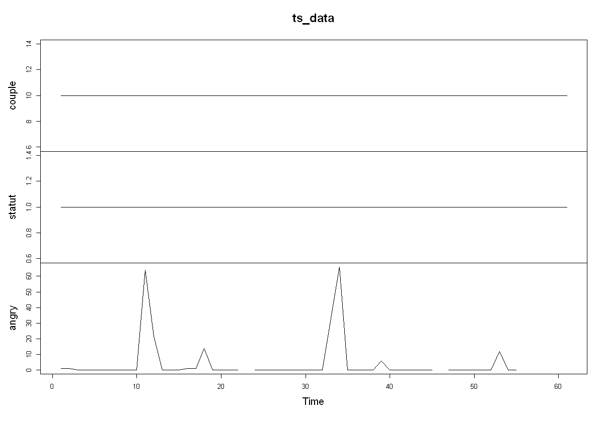

**NOTEBOOK IN PROGRESS...:** I'll continue to update and to add parts. 

<div class="toc"><ul class="toc-item"><li><span><a href="#Introduction" data-toc-modified-id="Introduction-1"><span class="toc-item-num">1&nbsp;&nbsp;</span>Introduction</a></span><ul class="toc-item"><li><span><a href="#A-step-by-step-procedure:-schema" data-toc-modified-id="A-step-by-step-procedure:-schema-1.1"><span class="toc-item-num">1.1&nbsp;&nbsp;</span>A step by step procedure: schema</a></span></li><li><span><a href="#What-are-the-questions-we-can-answer?" data-toc-modified-id="What-are-the-questions-we-can-answer?-1.2"><span class="toc-item-num">1.2&nbsp;&nbsp;</span>What are the questions we can answer?</a></span></li><li><span><a href="#Framework" data-toc-modified-id="Framework-1.3"><span class="toc-item-num">1.3&nbsp;&nbsp;</span>Framework</a></span></li><li><span><a href="#Miniguide" data-toc-modified-id="Miniguide-1.4"><span class="toc-item-num">1.4&nbsp;&nbsp;</span>Miniguide</a></span></li><li><span><a href="#Tips" data-toc-modified-id="Tips-1.5"><span class="toc-item-num">1.5&nbsp;&nbsp;</span>Tips</a></span></li></ul></li><li><span><a href="#Import-Data" data-toc-modified-id="Import-Data-2"><span class="toc-item-num">2&nbsp;&nbsp;</span>Import Data</a></span></li><li><span><a href="#Useful-Packages" data-toc-modified-id="Useful-Packages-3"><span class="toc-item-num">3&nbsp;&nbsp;</span>Useful Packages</a></span><ul class="toc-item"><li><span><a href="#Base-function" data-toc-modified-id="Base-function-3.1"><span class="toc-item-num">3.1&nbsp;&nbsp;</span>Base function</a></span></li><li><span><a href="#dplyr-and-tidyr-package-(in-tidyverse)" data-toc-modified-id="dplyr-and-tidyr-package-(in-tidyverse)-3.2"><span class="toc-item-num">3.2&nbsp;&nbsp;</span>dplyr and tidyr package (in tidyverse)</a></span></li><li><span><a href="#ggplot2" data-toc-modified-id="ggplot2-3.3"><span class="toc-item-num">3.3&nbsp;&nbsp;</span>ggplot2</a></span></li><li><span><a href="#Time-with-basis-functions-and-lubridate" data-toc-modified-id="Time-with-basis-functions-and-lubridate-3.4"><span class="toc-item-num">3.4&nbsp;&nbsp;</span>Time with basis functions and lubridate</a></span><ul class="toc-item"><li><span><a href="#Basis-functions" data-toc-modified-id="Basis-functions-3.4.1"><span class="toc-item-num">3.4.1&nbsp;&nbsp;</span>Basis functions</a></span></li><li><span><a href="#lubridate" data-toc-modified-id="lubridate-3.4.2"><span class="toc-item-num">3.4.2&nbsp;&nbsp;</span>lubridate</a></span></li></ul></li></ul></li><li><span><a href="#Block1:-General-matters" data-toc-modified-id="Block1:-General-matters-4"><span class="toc-item-num">4&nbsp;&nbsp;</span>Block1: General matters</a></span><ul class="toc-item"><li><span><a href="#Types-of-variables" data-toc-modified-id="Types-of-variables-4.1"><span class="toc-item-num">4.1&nbsp;&nbsp;</span>Types of variables</a></span></li><li><span><a href="#First-insights" data-toc-modified-id="First-insights-4.2"><span class="toc-item-num">4.2&nbsp;&nbsp;</span>First insights</a></span></li><li><span><a href="#Look-for-NA" data-toc-modified-id="Look-for-NA-4.3"><span class="toc-item-num">4.3&nbsp;&nbsp;</span>Look for NA</a></span></li><li><span><a href="#Specific-cases" data-toc-modified-id="Specific-cases-4.4"><span class="toc-item-num">4.4&nbsp;&nbsp;</span>Specific cases</a></span><ul class="toc-item"><li><span><a href="#Duplication" data-toc-modified-id="Duplication-4.4.1"><span class="toc-item-num">4.4.1&nbsp;&nbsp;</span>Duplication</a></span></li><li><span><a href="#The-case-of-branching-items" data-toc-modified-id="The-case-of-branching-items-4.4.2"><span class="toc-item-num">4.4.2&nbsp;&nbsp;</span>The case of branching items</a></span></li></ul></li><li><span><a href="#Descriptive" data-toc-modified-id="Descriptive-4.5"><span class="toc-item-num">4.5&nbsp;&nbsp;</span>Descriptive</a></span></li><li><span><a href="#Response-Frequency-and-Compliance-Rate" data-toc-modified-id="Response-Frequency-and-Compliance-Rate-4.6"><span class="toc-item-num">4.6&nbsp;&nbsp;</span>Response Frequency and Compliance Rate</a></span><ul class="toc-item"><li><span><a href="#Response-Frequency" data-toc-modified-id="Response-Frequency-4.6.1"><span class="toc-item-num">4.6.1&nbsp;&nbsp;</span>Response Frequency</a></span></li><li><span><a href="#Compliance-Rate" data-toc-modified-id="Compliance-Rate-4.6.2"><span class="toc-item-num">4.6.2&nbsp;&nbsp;</span>Compliance Rate</a></span></li><li><span><a href="#Delete-observations" data-toc-modified-id="Delete-observations-4.6.3"><span class="toc-item-num">4.6.3&nbsp;&nbsp;</span>Delete observations</a></span></li></ul></li></ul></li><li><span><a href="#Block2:-Time-series" data-toc-modified-id="Block2:-Time-series-5"><span class="toc-item-num">5&nbsp;&nbsp;</span>Block2: Time series</a></span><ul class="toc-item"><li><span><a href="#Data-and-variables-structures-in-time-series-and-Dyadic-data" data-toc-modified-id="Data-and-variables-structures-in-time-series-and-Dyadic-data-5.1"><span class="toc-item-num">5.1&nbsp;&nbsp;</span>Data and variables structures in time series and Dyadic data</a></span></li><li><span><a href="#How-to-handle-date-format?" data-toc-modified-id="How-to-handle-date-format?-5.2"><span class="toc-item-num">5.2&nbsp;&nbsp;</span>How to handle date format?</a></span></li><li><span><a href="#Beeps-matters:-an-insights-on-participants'-behaviors-and-bug-possibilities" data-toc-modified-id="Beeps-matters:-an-insights-on-participants'-behaviors-and-bug-possibilities-5.3"><span class="toc-item-num">5.3&nbsp;&nbsp;</span>Beeps matters: an insights on participants' behaviors and bug possibilities</a></span><ul class="toc-item"><li><span><a href="#About-Apps" data-toc-modified-id="About-Apps-5.3.1"><span class="toc-item-num">5.3.1&nbsp;&nbsp;</span>About Apps</a></span></li><li><span><a href="#About-participant-behaviors" data-toc-modified-id="About-participant-behaviors-5.3.2"><span class="toc-item-num">5.3.2&nbsp;&nbsp;</span>About participant behaviors</a></span></li><li><span><a href="#Exercice:-Remove-obs-based-on-plots" data-toc-modified-id="Exercice:-Remove-obs-based-on-plots-5.3.3"><span class="toc-item-num">5.3.3&nbsp;&nbsp;</span>Exercice: Remove obs based on plots</a></span><ul class="toc-item"><li><span><a href="#Solution-1:-using-filter" data-toc-modified-id="Solution-1:-using-filter-5.3.3.1"><span class="toc-item-num">5.3.3.1&nbsp;&nbsp;</span>Solution 1: using filter</a></span></li><li><span><a href="#Solution2:-time-variant-variable-as-NA" data-toc-modified-id="Solution2:-time-variant-variable-as-NA-5.3.3.2"><span class="toc-item-num">5.3.3.2&nbsp;&nbsp;</span>Solution2: time-variant variable as NA</a></span></li></ul></li></ul></li><li><span><a href="#Case:-When-missing-beeps-are-not-recorded" data-toc-modified-id="Case:-When-missing-beeps-are-not-recorded-5.4"><span class="toc-item-num">5.4&nbsp;&nbsp;</span>Case: When missing beeps are not recorded</a></span><ul class="toc-item"><li><span><a href="#When-1-beeps-/-days" data-toc-modified-id="When-1-beeps-/-days-5.4.1"><span class="toc-item-num">5.4.1&nbsp;&nbsp;</span>When 1 beeps / days</a></span></li><li><span><a href="#When-multiple-beeps-a-day." data-toc-modified-id="When-multiple-beeps-a-day.-5.4.2"><span class="toc-item-num">5.4.2&nbsp;&nbsp;</span>When multiple beeps a day.</a></span></li></ul></li><li><span><a href="#Night-Break" data-toc-modified-id="Night-Break-5.5"><span class="toc-item-num">5.5&nbsp;&nbsp;</span>Night Break</a></span><ul class="toc-item"><li><span><a href="#Solution1:-Adds-NAs" data-toc-modified-id="Solution1:-Adds-NAs-5.5.1"><span class="toc-item-num">5.5.1&nbsp;&nbsp;</span>Solution1: Adds NAs</a></span></li><li><span><a href="#Solution2:-add-variable" data-toc-modified-id="Solution2:-add-variable-5.5.2"><span class="toc-item-num">5.5.2&nbsp;&nbsp;</span>Solution2: add variable</a></span></li></ul></li><li><span><a href="#Compute-Scores" data-toc-modified-id="Compute-Scores-5.6"><span class="toc-item-num">5.6&nbsp;&nbsp;</span>Compute Scores</a></span><ul class="toc-item"><li><span><a href="#Usual-scores" data-toc-modified-id="Usual-scores-5.6.1"><span class="toc-item-num">5.6.1&nbsp;&nbsp;</span>Usual scores</a></span></li><li><span><a href="#Check-computation" data-toc-modified-id="Check-computation-5.6.2"><span class="toc-item-num">5.6.2&nbsp;&nbsp;</span>Check computation</a></span></li></ul></li><li><span><a href="#Check-Variable" data-toc-modified-id="Check-Variable-5.7"><span class="toc-item-num">5.7&nbsp;&nbsp;</span>Check Variable</a></span><ul class="toc-item"><li><span><a href="#Tables" data-toc-modified-id="Tables-5.7.1"><span class="toc-item-num">5.7.1&nbsp;&nbsp;</span>Tables</a></span></li><li><span><a href="#Plots" data-toc-modified-id="Plots-5.7.2"><span class="toc-item-num">5.7.2&nbsp;&nbsp;</span>Plots</a></span></li></ul></li><li><span><a href="#Time-series-visualization" data-toc-modified-id="Time-series-visualization-5.8"><span class="toc-item-num">5.8&nbsp;&nbsp;</span>Time series visualization</a></span><ul class="toc-item"><li><span><a href="#One-participant-example" data-toc-modified-id="One-participant-example-5.8.1"><span class="toc-item-num">5.8.1&nbsp;&nbsp;</span>One participant example</a></span></li><li><span><a href="#Multiple-participants-over-one-variables" data-toc-modified-id="Multiple-participants-over-one-variables-5.8.2"><span class="toc-item-num">5.8.2&nbsp;&nbsp;</span>Multiple participants over one variables</a></span></li><li><span><a href="#Multiples-participants,-over-variables" data-toc-modified-id="Multiples-participants,-over-variables-5.8.3"><span class="toc-item-num">5.8.3&nbsp;&nbsp;</span>Multiples participants, over variables</a></span></li></ul></li><li><span><a href="#Stationarity-introduction" data-toc-modified-id="Stationarity-introduction-5.9"><span class="toc-item-num">5.9&nbsp;&nbsp;</span>Stationarity introduction</a></span><ul class="toc-item"><li><span><a href="#Trends" data-toc-modified-id="Trends-5.9.1"><span class="toc-item-num">5.9.1&nbsp;&nbsp;</span>Trends</a></span></li><li><span><a href="#Seasonality" data-toc-modified-id="Seasonality-5.9.2"><span class="toc-item-num">5.9.2&nbsp;&nbsp;</span>Seasonality</a></span></li><li><span><a href="#Solutions" data-toc-modified-id="Solutions-5.9.3"><span class="toc-item-num">5.9.3&nbsp;&nbsp;</span>Solutions</a></span></li></ul></li></ul></li><li><span><a href="#Block3:-Dyadic-specification" data-toc-modified-id="Block3:-Dyadic-specification-6"><span class="toc-item-num">6&nbsp;&nbsp;</span>Block3: Dyadic specification</a></span><ul class="toc-item"><li><span><a href="#Beeps-matters:-:-an-insights-on-participants'-behaviors-and-bug-possibilities" data-toc-modified-id="Beeps-matters:-:-an-insights-on-participants'-behaviors-and-bug-possibilities-6.1"><span class="toc-item-num">6.1&nbsp;&nbsp;</span>Beeps matters: : an insights on participants' behaviors and bug possibilities</a></span><ul class="toc-item"><li><span><a href="#App" data-toc-modified-id="App-6.1.1"><span class="toc-item-num">6.1.1&nbsp;&nbsp;</span>App</a></span></li><li><span><a href="#Participants" data-toc-modified-id="Participants-6.1.2"><span class="toc-item-num">6.1.2&nbsp;&nbsp;</span>Participants</a></span></li></ul></li><li><span><a href="#Complete-observation-and-Compliance-rate" data-toc-modified-id="Complete-observation-and-Compliance-rate-6.2"><span class="toc-item-num">6.2&nbsp;&nbsp;</span>Complete observation and Compliance rate</a></span><ul class="toc-item"><li><span><a href="#at-T-time" data-toc-modified-id="at-T-time-6.2.1"><span class="toc-item-num">6.2.1&nbsp;&nbsp;</span>at T time</a></span></li><li><span><a href="#between-t-and-t-1-time" data-toc-modified-id="between-t-and-t-1-time-6.2.2"><span class="toc-item-num">6.2.2&nbsp;&nbsp;</span>between t and t-1 time</a></span></li></ul></li><li><span><a href="#Time-series-visualization:-per-pp-or-dyads-and-overall" data-toc-modified-id="Time-series-visualization:-per-pp-or-dyads-and-overall-6.3"><span class="toc-item-num">6.3&nbsp;&nbsp;</span>Time series visualization: per pp or dyads and overall</a></span><ul class="toc-item"><li><span><a href="#One-participant-example" data-toc-modified-id="One-participant-example-6.3.1"><span class="toc-item-num">6.3.1&nbsp;&nbsp;</span>One participant example</a></span></li><li><span><a href="#Multiple-participants-over-one-variables" data-toc-modified-id="Multiple-participants-over-one-variables-6.3.2"><span class="toc-item-num">6.3.2&nbsp;&nbsp;</span>Multiple participants over one variables</a></span></li><li><span><a href="#Multiples-participants,-over-variables" data-toc-modified-id="Multiples-participants,-over-variables-6.3.3"><span class="toc-item-num">6.3.3&nbsp;&nbsp;</span>Multiples participants, over variables</a></span></li><li><span><a href="#The-ultimate-plot" data-toc-modified-id="The-ultimate-plot-6.3.4"><span class="toc-item-num">6.3.4&nbsp;&nbsp;</span>The ultimate plot</a></span></li></ul></li><li><span><a href="#Compute-Score" data-toc-modified-id="Compute-Score-6.4"><span class="toc-item-num">6.4&nbsp;&nbsp;</span>Compute Score</a></span><ul class="toc-item"><li><span><a href="#Dyad-centering" data-toc-modified-id="Dyad-centering-6.4.1"><span class="toc-item-num">6.4.1&nbsp;&nbsp;</span>Dyad centering</a></span></li><li><span><a href="#Intraclass-correlation" data-toc-modified-id="Intraclass-correlation-6.4.2"><span class="toc-item-num">6.4.2&nbsp;&nbsp;</span>Intraclass correlation</a></span></li></ul></li><li><span><a href="#Final-data-management-for-models" data-toc-modified-id="Final-data-management-for-models-6.5"><span class="toc-item-num">6.5&nbsp;&nbsp;</span>Final data management for models</a></span><ul class="toc-item"><li><span><a href="#Complete-obs" data-toc-modified-id="Complete-obs-6.5.1"><span class="toc-item-num">6.5.1&nbsp;&nbsp;</span>Complete obs</a></span></li><li><span><a href="#Prepare-data-for-models" data-toc-modified-id="Prepare-data-for-models-6.5.2"><span class="toc-item-num">6.5.2&nbsp;&nbsp;</span>Prepare data for models</a></span></li></ul></li></ul></li><li><span><a href="#Outro" data-toc-modified-id="Outro-7"><span class="toc-item-num">7&nbsp;&nbsp;</span>Outro</a></span><ul class="toc-item"><li><span><a href="#Take-away:-step-by-step-procedure-(schema)" data-toc-modified-id="Take-away:-step-by-step-procedure-(schema)-7.1"><span class="toc-item-num">7.1&nbsp;&nbsp;</span>Take away: step by step procedure (schema)</a></span></li><li><span><a href="#Some-litterature" data-toc-modified-id="Some-litterature-7.2"><span class="toc-item-num">7.2&nbsp;&nbsp;</span>Some litterature</a></span></li></ul></li></ul></div>


```R
# For data management:
library(dplyr)
library(tidyr)
library(data.table)

# For plots: 
library(ggplot2)
library(plotly) 
# library(patchwork)

library(stringr)

# Dates
library(lubridate)
```

    
    Attaching package: 'dplyr'
    
    
    The following objects are masked from 'package:stats':
    
        filter, lag
    
    
    The following objects are masked from 'package:base':
    
        intersect, setdiff, setequal, union
    
    
    
    Attaching package: 'data.table'
    
    
    The following objects are masked from 'package:dplyr':
    
        between, first, last
    
    
    
    Attaching package: 'plotly'
    
    
    The following object is masked from 'package:ggplot2':
    
        last_plot
    
    
    The following object is masked from 'package:stats':
    
        filter
    
    
    The following object is masked from 'package:graphics':
    
        layout
    
    
    
    Attaching package: 'lubridate'
    
    
    The following objects are masked from 'package:data.table':
    
        hour, isoweek, mday, minute, month, quarter, second, wday, week,
        yday, year
    
    
    The following objects are masked from 'package:base':
    
        date, intersect, setdiff, union
    
    
    


```R
options(repr.matrix.max.cols=50, repr.matrix.max.rows=50)
```

# Introduction

In this notebook, I will broadly explained the different steps and I will highlight some recurrent issues when preprocessing data. We will start with some general considerations (type of variables, missing values, useful packages, etc.). Then, we will focus on time series data. Finally, the approach of time series data will be extended to dyadic data.

One important thing is that you should always take the time to clean and check your data before any descriptive or statistical analysis. In fact, most of the time cleaning the data takes the vast majority of your time and statistical modeling only a very little part. Cleaning is important and is a challenge in itself, even more on dyadic data where you have to create partner's variables, joins many times the data, etc. Next, cleaning and checking your database, allow you to have an insight on the quality of your data. In consequence, you can have an insight about what type of statistical models you can use, the generability of the models and issues that you will have to encounter. Finally and more important, failure to clean or repairing the data may lead to inaccurate results and models. 

Think at this process like a investigation. You will find issues, or things that is incoherent. You will then follow tracks and find proofs of what is going on. Most of the time you can't determine what is going one with only one or two clues, you need more information. You can also find issues by luck when looking for something else. At the end, the more you know your database and you gather information using descriptive functions and plots, the more you you will be sure to have face every possible issues. In this purpose, you can follow, more or less, steps to cover every topics when preprocessing data.

## A step by step procedure: schema

Here is a none exhaustive schema of the step you can follow when cleaning, checking and preparing your data. Be careful, the steps are not exhaustives and are not linear as you will have to go back to previous steps many times. Moreover, it is partly dependant on the model. In other words, the modifications (e.g., missings value, dataframe format, decision to suppress particular rows) are determined based on the statistical model you will apply.


## Framework

In order to be efficient and thorough, you must be organized. You must find your own organization. I'll quickly explain mine as an example.

First, take care of your folder organization. In my case, it is organized as displayed below. The data is stored in its own folder. Secondly I always have a Notebook (Jupyter or Rmarkdown) and a R scripts open at the same time. The notebook allows me to explore the data and find issues using functions and plots. Moreover, it helps me to keep a track of what I have done. When I spot an issue I fix it in the R script. More specifically, the R script has this structure:
 1. Import data
 2. Cleaning data: from general to specific issues. 
 3. Save data in the data folder.
When I run the script it apply the corrections and export a new version of the database. Afterwards, I import this new version in my notebook and check that the issue is solved. I progress over all possible issues using this method. Finally, I report every errors spotted in another file or at the top of the notebook to keep a track of the issues found.

Be careful! When you clean your data in the R script, you must clean the data from very general issues to more specific ones and finish with specific modifications (e.g., inclusion / exclusion of NAs, night break issues) link to the model you would like to use. The R script that clean your data must be organized in that specific order otherwise you may create new issues.

## Tips

Some quick tips and advices:
  - Look at your data! Open it in Excel and have a first insight of its organisation.
  - When modification: always have an idea of what precisely will do the line of code AND always check the result!
  - Double check information/issues found (using 2 methods or 2 variables in function of the information). Because data, plots and descriptive functions are not trustworthy! 
  - Comment your code both for you and others collaborators. 
  - You must be organized to clean well your data.
  - Have a code buddy: someone that can check what you have done (so comment your code to help him).
  - Use the cheat sheet of the packages (e.g., https://www.rstudio.com/resources/cheatsheets/)
  - Have a backup of your data and never overwrite you raw data file.
  - Keep as much as possible of information you can when adapting the database to your future statistical analysis

# Some R basis

## Import Data

The data come from Sels and al., 2021. However it has been modified to fit with this notebook. Many missing data, errors, participants, etc. have been added so it is no longer exploitable to run statistical analysis. 

The first step is to import the data. To do so we can use: read.csv() or read.csv2(). Those two functions are the same one excepting that they have different defaults arguments. Either of the arguments (display below) can be changed manually to adapt them to your file (e.g., read.csv("file_name.csv", header=FALSE, sep=".")). 

| Argument | read.csv | read.csv2 | Description |
| --- | --- | --- | --- |
| header | TRUE | TRUE | First row will be the collumn's names |
| sep | "," | ";" | Specify the collumns separator in csv file |
| dec | "." | "," | Specify the decimal marker |

The first argument of those functions are the file itself (e.g., "my_data.csv). You must be careful with the path which can be:
 - relative: "data/my_data.csv"
 - absolute: "C:/storage/my_folder/data/my_data.csv

If you want to use the relative one (and do not specify everytime the absolute path) your environement must be set up using setwd() function (e.g., setwd("C:/storage/my_folder")). To have an insight on what is the absolute path of your environment you should use getwd() function. 


```R
data = read.csv2("data/data_mod.csv") %>%
    mutate_at(vars(launchTime, answer, finish), as.character) %>%
    mutate_at(vars(launchTime, answer, finish), ~as.POSIXct(.,origin = "1970-01-01 ", format='%Y-%m-%d %H:%M:%S', tz="CET"))
```

In case you want to import other type of file, here is some functions:

| Function | Type of file | Package | Description |
| --- | --- | --- | --- |
| read.delim | .txt ; .csv | . | If separator character that is different from a tab, a comma or a semicolon | 
| read.table | .txt ; .csv ; .dat | . | Allow to specify more arguments | 
| read_sas | .sas | haven | SAS data  | 
| read_stata | .dta | haven | Stata data  | 
| read_spss | .spss | haven | SPSS file  | 
| read_excel | .xls ; .xlsx | readxl | Excel files | 

You should always inspect the data after importing it:
 - dim(): check the number of rows and columns 
 - head(): allows to visualize the first 5 rows. Another number can be specified (e.g., head(data, 10))
 - tail(): displayed the last rows of your data. Important, because sometimes issues are specifically present at the bottom of it. 
 - str(): display the column format and their first values. Particularly, inspect if every variables are in the good format (e.g., integer, character, POSIXct, etc.). 
 
Taking in account this information, you should consider using different arguments of the function if the data are not well displayed.


```R
dim(data)
```


<style>
.list-inline {list-style: none; margin:0; padding: 0}
.list-inline>li {display: inline-block}
.list-inline>li:not(:last-child)::after {content: "\00b7"; padding: 0 .5ex}
</style>
<ol class=list-inline><li>12382</li><li>32</li></ol>


```R
head(data)
```


<table class="dataframe">
<caption>A data.frame: 6 × 32</caption>
<thead>
	<tr><th></th><th scope=col>couple</th><th scope=col>beepnr</th><th scope=col>statut</th><th scope=col>ppnr</th><th scope=col>launchTime</th><th scope=col>answer</th><th scope=col>finish</th><th scope=col>triggerId</th><th scope=col>angry</th><th scope=col>sad</th><th scope=col>anxiety</th><th scope=col>relaxed</th><th scope=col>happy</th><th scope=col>lonely</th><th scope=col>perceived_neglect</th><th scope=col>perceived_threat</th><th scope=col>sex_arousal</th><th scope=col>expect</th><th scope=col>rumination_relation</th><th scope=col>pos_thought_rel</th><th scope=col>perc_respons</th><th scope=col>enact_respons</th><th scope=col>contact</th><th scope=col>together</th><th scope=col>expres_emot</th><th scope=col>partner_expr</th><th scope=col>conflict</th><th scope=col>nice_sit</th><th scope=col>depres</th><th scope=col>YN_work</th><th scope=col>rwork</th><th scope=col>complete</th></tr>
	<tr><th></th><th scope=col>&lt;int&gt;</th><th scope=col>&lt;int&gt;</th><th scope=col>&lt;chr&gt;</th><th scope=col>&lt;int&gt;</th><th scope=col>&lt;dttm&gt;</th><th scope=col>&lt;dttm&gt;</th><th scope=col>&lt;dttm&gt;</th><th scope=col>&lt;int&gt;</th><th scope=col>&lt;int&gt;</th><th scope=col>&lt;int&gt;</th><th scope=col>&lt;int&gt;</th><th scope=col>&lt;int&gt;</th><th scope=col>&lt;int&gt;</th><th scope=col>&lt;int&gt;</th><th scope=col>&lt;int&gt;</th><th scope=col>&lt;int&gt;</th><th scope=col>&lt;int&gt;</th><th scope=col>&lt;int&gt;</th><th scope=col>&lt;int&gt;</th><th scope=col>&lt;int&gt;</th><th scope=col>&lt;int&gt;</th><th scope=col>&lt;int&gt;</th><th scope=col>&lt;int&gt;</th><th scope=col>&lt;int&gt;</th><th scope=col>&lt;int&gt;</th><th scope=col>&lt;int&gt;</th><th scope=col>&lt;int&gt;</th><th scope=col>&lt;int&gt;</th><th scope=col>&lt;dbl&gt;</th><th scope=col>&lt;int&gt;</th><th scope=col>&lt;dbl&gt;</th><th scope=col>&lt;int&gt;</th></tr>
</thead>
<tbody>
	<tr><th scope=row>1</th><td>1</td><td>1</td><td>f</td><td>701</td><td>2016-03-03 17:46:50</td><td>2016-03-03 17:46:59</td><td>2016-03-03 17:48:16</td><td>0</td><td>15</td><td>15</td><td>16</td><td>66</td><td>59</td><td>15</td><td>30</td><td>14</td><td>52</td><td>37</td><td>26</td><td>57</td><td>60</td><td>66</td><td>3</td><td>1</td><td>1</td><td>1</td><td>0</td><td>1</td><td>4.48067</td><td>1</td><td>50.87541</td><td>1</td></tr>
	<tr><th scope=row>2</th><td>1</td><td>2</td><td>f</td><td>701</td><td>2016-03-03 19:03:24</td><td>2016-03-03 19:03:35</td><td>2016-03-03 19:03:56</td><td>2</td><td>32</td><td>30</td><td>20</td><td>67</td><td>58</td><td>24</td><td>47</td><td>38</td><td>32</td><td>40</td><td>40</td><td>49</td><td>56</td><td>49</td><td>3</td><td>1</td><td>1</td><td>1</td><td>0</td><td>1</td><td>4.48067</td><td>0</td><td>      NA</td><td>1</td></tr>
	<tr><th scope=row>3</th><td>1</td><td>3</td><td>f</td><td>701</td><td>2016-03-03 20:01:40</td><td>2016-03-03 20:01:53</td><td>2016-03-03 20:02:49</td><td>3</td><td>21</td><td>22</td><td>11</td><td>71</td><td>60</td><td>27</td><td>17</td><td>35</td><td>20</td><td>39</td><td>52</td><td>34</td><td>65</td><td>37</td><td>3</td><td>0</td><td>1</td><td>1</td><td>0</td><td>1</td><td>4.48067</td><td>1</td><td>50.84848</td><td>1</td></tr>
	<tr><th scope=row>4</th><td>1</td><td>3</td><td>f</td><td>701</td><td>2016-03-03 20:01:40</td><td>2016-03-03 20:01:53</td><td>2016-03-03 20:02:49</td><td>3</td><td>21</td><td>22</td><td>11</td><td>71</td><td>60</td><td>27</td><td>17</td><td>35</td><td>20</td><td>39</td><td>52</td><td>34</td><td>65</td><td>37</td><td>3</td><td>0</td><td>1</td><td>1</td><td>0</td><td>1</td><td>4.48067</td><td>1</td><td>46.61223</td><td>1</td></tr>
	<tr><th scope=row>5</th><td>1</td><td>4</td><td>f</td><td>701</td><td>2016-03-03 20:21:44</td><td>2016-03-03 20:21:53</td><td>2016-03-03 20:22:19</td><td>4</td><td> 8</td><td>10</td><td>11</td><td>62</td><td>56</td><td>19</td><td>19</td><td>21</td><td>44</td><td>11</td><td>16</td><td>46</td><td>57</td><td>54</td><td>3</td><td>1</td><td>1</td><td>2</td><td>0</td><td>1</td><td>4.48067</td><td>1</td><td>56.47795</td><td>1</td></tr>
	<tr><th scope=row>6</th><td>1</td><td>5</td><td>f</td><td>701</td><td>2016-03-03 21:11:30</td><td>2016-03-03 21:11:37</td><td>2016-03-03 21:12:23</td><td>5</td><td>13</td><td>18</td><td> 8</td><td>65</td><td>59</td><td>31</td><td>43</td><td>19</td><td>30</td><td>25</td><td>13</td><td>20</td><td>30</td><td>61</td><td>3</td><td>1</td><td>0</td><td>0</td><td>0</td><td>0</td><td>4.48067</td><td>0</td><td>      NA</td><td>1</td></tr>
</tbody>
</table>


```R
tail(data)
```


<table class="dataframe">
<caption>A data.frame: 6 × 32</caption>
<thead>
	<tr><th></th><th scope=col>couple</th><th scope=col>beepnr</th><th scope=col>statut</th><th scope=col>ppnr</th><th scope=col>launchTime</th><th scope=col>answer</th><th scope=col>finish</th><th scope=col>triggerId</th><th scope=col>angry</th><th scope=col>sad</th><th scope=col>anxiety</th><th scope=col>relaxed</th><th scope=col>happy</th><th scope=col>lonely</th><th scope=col>perceived_neglect</th><th scope=col>perceived_threat</th><th scope=col>sex_arousal</th><th scope=col>expect</th><th scope=col>rumination_relation</th><th scope=col>pos_thought_rel</th><th scope=col>perc_respons</th><th scope=col>enact_respons</th><th scope=col>contact</th><th scope=col>together</th><th scope=col>expres_emot</th><th scope=col>partner_expr</th><th scope=col>conflict</th><th scope=col>nice_sit</th><th scope=col>depres</th><th scope=col>YN_work</th><th scope=col>rwork</th><th scope=col>complete</th></tr>
	<tr><th></th><th scope=col>&lt;int&gt;</th><th scope=col>&lt;int&gt;</th><th scope=col>&lt;chr&gt;</th><th scope=col>&lt;int&gt;</th><th scope=col>&lt;dttm&gt;</th><th scope=col>&lt;dttm&gt;</th><th scope=col>&lt;dttm&gt;</th><th scope=col>&lt;int&gt;</th><th scope=col>&lt;int&gt;</th><th scope=col>&lt;int&gt;</th><th scope=col>&lt;int&gt;</th><th scope=col>&lt;int&gt;</th><th scope=col>&lt;int&gt;</th><th scope=col>&lt;int&gt;</th><th scope=col>&lt;int&gt;</th><th scope=col>&lt;int&gt;</th><th scope=col>&lt;int&gt;</th><th scope=col>&lt;int&gt;</th><th scope=col>&lt;int&gt;</th><th scope=col>&lt;int&gt;</th><th scope=col>&lt;int&gt;</th><th scope=col>&lt;int&gt;</th><th scope=col>&lt;int&gt;</th><th scope=col>&lt;int&gt;</th><th scope=col>&lt;int&gt;</th><th scope=col>&lt;int&gt;</th><th scope=col>&lt;int&gt;</th><th scope=col>&lt;int&gt;</th><th scope=col>&lt;dbl&gt;</th><th scope=col>&lt;int&gt;</th><th scope=col>&lt;dbl&gt;</th><th scope=col>&lt;int&gt;</th></tr>
</thead>
<tbody>
	<tr><th scope=row>12377</th><td>NA</td><td>15</td><td>f</td><td>790</td><td>2016-07-22 20:39:44</td><td>2016-07-22 20:40:47</td><td>2016-07-22 20:41:21</td><td>16</td><td>0</td><td>0</td><td>0</td><td> 94</td><td>86</td><td>0</td><td>0</td><td>0</td><td>69</td><td>0</td><td>0</td><td>68</td><td> 99</td><td>100</td><td>3</td><td>1</td><td>0</td><td>0</td><td>0</td><td>1</td><td>5.269922</td><td>1</td><td>43.39325</td><td>1</td></tr>
	<tr><th scope=row>12378</th><td>NA</td><td>16</td><td>f</td><td>790</td><td>2016-07-22 21:55:21</td><td>2016-07-22 21:57:38</td><td>2016-07-22 21:58:27</td><td>17</td><td>0</td><td>0</td><td>0</td><td>100</td><td>94</td><td>1</td><td>0</td><td>0</td><td>65</td><td>0</td><td>0</td><td>72</td><td>100</td><td>100</td><td>3</td><td>1</td><td>0</td><td>0</td><td>0</td><td>1</td><td>5.269922</td><td>1</td><td>50.95985</td><td>1</td></tr>
	<tr><th scope=row>12379</th><td>NA</td><td>17</td><td>f</td><td>790</td><td>2016-07-23 10:28:37</td><td>2016-07-23 10:31:26</td><td>2016-07-23 10:32:12</td><td>18</td><td>0</td><td>0</td><td>0</td><td> 94</td><td>72</td><td>0</td><td>0</td><td>0</td><td>79</td><td>0</td><td>0</td><td>68</td><td>100</td><td>100</td><td>3</td><td>1</td><td>0</td><td>0</td><td>0</td><td>0</td><td>5.269922</td><td>1</td><td>63.08019</td><td>1</td></tr>
	<tr><th scope=row>12380</th><td>NA</td><td>18</td><td>f</td><td>790</td><td>2016-07-23 11:35:21</td><td>2016-07-23 11:37:07</td><td>2016-07-23 11:38:04</td><td>19</td><td>0</td><td>0</td><td>0</td><td> 62</td><td>70</td><td>0</td><td>0</td><td>0</td><td>64</td><td>0</td><td>0</td><td>65</td><td>100</td><td>100</td><td>3</td><td>1</td><td>0</td><td>0</td><td>0</td><td>0</td><td>5.269922</td><td>0</td><td>      NA</td><td>1</td></tr>
	<tr><th scope=row>12381</th><td>NA</td><td>19</td><td>f</td><td>790</td><td>2016-07-23 12:32:13</td><td>2016-07-23 12:33:26</td><td>2016-07-23 12:33:49</td><td>20</td><td>0</td><td>0</td><td>0</td><td> 77</td><td>73</td><td>0</td><td>0</td><td>0</td><td>64</td><td>0</td><td>0</td><td>60</td><td>100</td><td>100</td><td>3</td><td>1</td><td>0</td><td>0</td><td>0</td><td>0</td><td>5.269922</td><td>1</td><td>54.73861</td><td>1</td></tr>
	<tr><th scope=row>12382</th><td>NA</td><td>20</td><td>f</td><td>790</td><td>2016-07-23 13:03:57</td><td>2016-07-23 13:07:01</td><td>2016-07-23 13:07:50</td><td>21</td><td>0</td><td>0</td><td>0</td><td> 56</td><td>72</td><td>0</td><td>0</td><td>0</td><td>57</td><td>0</td><td>0</td><td>62</td><td> 83</td><td> 90</td><td>3</td><td>1</td><td>0</td><td>0</td><td>0</td><td>0</td><td>5.269922</td><td>1</td><td>37.17413</td><td>1</td></tr>
</tbody>
</table>


```R
str(data)
```

    'data.frame':	12382 obs. of  32 variables:
     $ couple             : int  1 1 1 1 1 1 1 1 1 1 ...
     $ beepnr             : int  1 2 3 3 4 5 6 7 8 9 ...
     $ statut             : chr  "f" "f" "f" "f" ...
     $ ppnr               : int  701 701 701 701 701 701 701 701 701 701 ...
     $ launchTime         : POSIXct, format: "2016-03-03 17:46:50" "2016-03-03 19:03:24" ...
     $ answer             : POSIXct, format: "2016-03-03 17:46:59" "2016-03-03 19:03:35" ...
     $ finish             : POSIXct, format: "2016-03-03 17:48:16" "2016-03-03 19:03:56" ...
     $ triggerId          : int  0 2 3 3 4 5 6 7 8 9 ...
     $ angry              : int  15 32 21 21 8 13 11 11 NA 10 ...
     $ sad                : int  15 30 22 22 10 18 9 12 NA 11 ...
     $ anxiety            : int  16 20 11 11 11 8 6 10 NA 3 ...
     $ relaxed            : int  66 67 71 71 62 65 47 45 NA 55 ...
     $ happy              : int  59 58 60 60 56 59 52 54 NA 49 ...
     $ lonely             : int  15 24 27 27 19 31 24 20 NA 27 ...
     $ perceived_neglect  : int  30 47 17 17 19 43 26 36 NA 7 ...
     $ perceived_threat   : int  14 38 35 35 21 19 20 19 NA 2 ...
     $ sex_arousal        : int  52 32 20 20 44 30 56 35 NA 39 ...
     $ expect             : int  37 40 39 39 11 25 25 7 NA 11 ...
     $ rumination_relation: int  26 40 52 52 16 13 18 5 NA 11 ...
     $ pos_thought_rel    : int  57 49 34 34 46 20 50 25 NA 17 ...
     $ perc_respons       : int  60 56 65 65 57 30 58 57 NA 64 ...
     $ enact_respons      : int  66 49 37 37 54 61 37 38 NA 60 ...
     $ contact            : int  3 3 3 3 3 3 1 0 NA 1 ...
     $ together           : int  1 1 0 0 1 1 0 0 NA 0 ...
     $ expres_emot        : int  1 1 1 1 1 0 0 0 NA 0 ...
     $ partner_expr       : int  1 1 1 1 2 0 0 0 NA 0 ...
     $ conflict           : int  0 0 0 0 0 0 0 0 NA 0 ...
     $ nice_sit           : int  1 1 1 1 1 0 0 0 NA 1 ...
     $ depres             : num  4.48 4.48 4.48 4.48 4.48 ...
     $ YN_work            : int  1 0 1 1 1 0 1 1 1 1 ...
     $ rwork              : num  50.9 NA 50.8 46.6 56.5 ...
     $ complete           : int  1 1 1 1 1 1 1 1 NA 1 ...
    

Here we can see that the statut variable and the time variables are not in there good format. Using mutate_at we will change the format (we will come back later to this function).


```R
data = data %>% 
    mutate_at(vars(launchTime, answer,finish), ~as.POSIXct(.,origin = "1970-01-01", tz="CET")) %>%
    mutate_at(vars(statut), as.character)
```

# Useful Packages

## Base function

I'll broadly present two functions:
  - which() function will help you find and select part of the data based on a logical test. More specifically, as output it gives you the position number whose value is TRUE in the logical test. Then, using those position numbers, we can select the rows associated. Notably, it is very helpful when spotting errors.
  - ifelse() that will be presented in the next part.


```R
which(data$ppnr == 1)
```


<style>
.list-inline {list-style: none; margin:0; padding: 0}
.list-inline>li {display: inline-block}
.list-inline>li:not(:last-child)::after {content: "\00b7"; padding: 0 .5ex}
</style>
<ol class=list-inline><li>65</li><li>66</li><li>67</li><li>68</li><li>69</li><li>70</li><li>71</li><li>72</li><li>73</li><li>74</li><li>75</li><li>76</li><li>77</li><li>78</li><li>79</li><li>80</li><li>81</li><li>82</li><li>83</li><li>84</li><li>85</li><li>86</li><li>87</li><li>88</li><li>89</li><li>90</li><li>91</li><li>92</li><li>93</li><li>94</li><li>95</li><li>96</li><li>97</li><li>98</li><li>99</li><li>100</li><li>101</li><li>102</li><li>103</li><li>104</li><li>105</li><li>106</li><li>107</li><li>108</li><li>109</li><li>110</li><li>111</li><li>112</li><li>113</li><li>114</li><li>115</li><li>116</li><li>117</li><li>118</li><li>119</li><li>120</li><li>121</li><li>122</li><li>123</li><li>124</li><li>125</li><li>126</li><li>127</li><li>128</li></ol>


```R
data[which(data$ppnr == 1),] %>% head()
```


<table class="dataframe">
<caption>A data.frame: 6 × 32</caption>
<thead>
	<tr><th></th><th scope=col>couple</th><th scope=col>beepnr</th><th scope=col>statut</th><th scope=col>ppnr</th><th scope=col>launchTime</th><th scope=col>answer</th><th scope=col>finish</th><th scope=col>triggerId</th><th scope=col>angry</th><th scope=col>sad</th><th scope=col>anxiety</th><th scope=col>relaxed</th><th scope=col>happy</th><th scope=col>lonely</th><th scope=col>perceived_neglect</th><th scope=col>perceived_threat</th><th scope=col>sex_arousal</th><th scope=col>expect</th><th scope=col>rumination_relation</th><th scope=col>pos_thought_rel</th><th scope=col>perc_respons</th><th scope=col>enact_respons</th><th scope=col>contact</th><th scope=col>together</th><th scope=col>expres_emot</th><th scope=col>partner_expr</th><th scope=col>conflict</th><th scope=col>nice_sit</th><th scope=col>depres</th><th scope=col>YN_work</th><th scope=col>rwork</th><th scope=col>complete</th></tr>
	<tr><th></th><th scope=col>&lt;int&gt;</th><th scope=col>&lt;int&gt;</th><th scope=col>&lt;chr&gt;</th><th scope=col>&lt;int&gt;</th><th scope=col>&lt;dttm&gt;</th><th scope=col>&lt;dttm&gt;</th><th scope=col>&lt;dttm&gt;</th><th scope=col>&lt;int&gt;</th><th scope=col>&lt;int&gt;</th><th scope=col>&lt;int&gt;</th><th scope=col>&lt;int&gt;</th><th scope=col>&lt;int&gt;</th><th scope=col>&lt;int&gt;</th><th scope=col>&lt;int&gt;</th><th scope=col>&lt;int&gt;</th><th scope=col>&lt;int&gt;</th><th scope=col>&lt;int&gt;</th><th scope=col>&lt;int&gt;</th><th scope=col>&lt;int&gt;</th><th scope=col>&lt;int&gt;</th><th scope=col>&lt;int&gt;</th><th scope=col>&lt;int&gt;</th><th scope=col>&lt;int&gt;</th><th scope=col>&lt;int&gt;</th><th scope=col>&lt;int&gt;</th><th scope=col>&lt;int&gt;</th><th scope=col>&lt;int&gt;</th><th scope=col>&lt;int&gt;</th><th scope=col>&lt;dbl&gt;</th><th scope=col>&lt;int&gt;</th><th scope=col>&lt;dbl&gt;</th><th scope=col>&lt;int&gt;</th></tr>
</thead>
<tbody>
	<tr><th scope=row>65</th><td>1</td><td>1</td><td>m</td><td>1</td><td>2016-03-03 17:46:45</td><td>2016-03-03 17:46:56</td><td>2016-03-03 17:47:19</td><td>0</td><td>100</td><td>70</td><td>76</td><td> 64</td><td>74</td><td>70</td><td>68</td><td>73</td><td>66</td><td>72</td><td>76</td><td>73</td><td>69</td><td>76</td><td>3</td><td>1</td><td>1</td><td>2</td><td>1</td><td>1</td><td>5.798267</td><td>1</td><td>54.19168</td><td>1</td></tr>
	<tr><th scope=row>66</th><td>1</td><td>2</td><td>m</td><td>1</td><td>2016-03-03 19:03:14</td><td>2016-03-03 19:03:47</td><td>2016-03-03 19:05:22</td><td>2</td><td> 42</td><td>26</td><td> 6</td><td> 62</td><td>47</td><td> 8</td><td>29</td><td>49</td><td> 9</td><td>60</td><td>24</td><td> 2</td><td>22</td><td>38</td><td>3</td><td>1</td><td>1</td><td>1</td><td>1</td><td>0</td><td>5.798267</td><td>0</td><td>      NA</td><td>1</td></tr>
	<tr><th scope=row>67</th><td>1</td><td>3</td><td>m</td><td>1</td><td>2016-03-03 20:01:38</td><td>2016-03-03 20:01:44</td><td>2016-03-03 20:02:15</td><td>3</td><td>  9</td><td> 6</td><td> 5</td><td> 76</td><td>68</td><td> 1</td><td>28</td><td>71</td><td> 5</td><td>10</td><td>41</td><td>52</td><td>54</td><td>54</td><td>3</td><td>0</td><td>1</td><td>1</td><td>0</td><td>0</td><td>5.798267</td><td>1</td><td>56.75018</td><td>1</td></tr>
	<tr><th scope=row>68</th><td>1</td><td>4</td><td>m</td><td>1</td><td>2016-03-03 20:21:41</td><td>2016-03-03 20:21:59</td><td>2016-03-03 20:23:41</td><td>4</td><td>  8</td><td> 5</td><td> 3</td><td>100</td><td>66</td><td> 3</td><td>31</td><td>55</td><td> 5</td><td>23</td><td>50</td><td>50</td><td>43</td><td>44</td><td>3</td><td>1</td><td>1</td><td>3</td><td>0</td><td>1</td><td>5.798267</td><td>1</td><td>46.74424</td><td>1</td></tr>
	<tr><th scope=row>69</th><td>1</td><td>5</td><td>m</td><td>1</td><td>2016-03-03 21:11:21</td><td>2016-03-03 21:11:30</td><td>2016-03-03 21:12:39</td><td>5</td><td>  4</td><td> 4</td><td> 2</td><td> 76</td><td>48</td><td> 4</td><td>16</td><td> 9</td><td>47</td><td> 1</td><td> 6</td><td>52</td><td>60</td><td>73</td><td>3</td><td>1</td><td>1</td><td>1</td><td>0</td><td>1</td><td>5.798267</td><td>0</td><td>      NA</td><td>1</td></tr>
	<tr><th scope=row>70</th><td>1</td><td>6</td><td>m</td><td>1</td><td>2016-03-04 17:24:53</td><td>2016-03-04 17:25:06</td><td>2016-03-04 17:26:35</td><td>6</td><td>  3</td><td> 5</td><td> 2</td><td> 74</td><td>57</td><td> 4</td><td>22</td><td>16</td><td>15</td><td>16</td><td>14</td><td>54</td><td>59</td><td>53</td><td>0</td><td>0</td><td>0</td><td>0</td><td>0</td><td>0</td><td>5.798267</td><td>1</td><td>47.54616</td><td>1</td></tr>
</tbody>
</table>


## dplyr and tidyr package (in tidyverse)

This two packages, dplyr and tidyr, are part of the tidyverse. They are used to manage your data using very high level function. In other words, with few lines of codes you can do many things with very understandable code. Here is the function that we will help us: 
 - select, filter
 - case_when, ifelse
 - group_by in combinaison with summarize and mutate
 - Joins functions
 - gather and spread
 - mutate_at to change variable type
 
Function reference and sheet cheat: 
 - dplyr: https://dplyr.tidyverse.org/
 - tidyr: https://tidyr.tidyverse.org/
 
But first, those packages allow to use the symbole %>%. It allows to go directly from one transformation to the next one. In other words, it takes the result of a first function and put it in the next function. It follows this logic until the last function. For instance, using only one time %>%, we put the data into the head() function.  


```R
data %>% head()
```


<table class="dataframe">
<caption>A data.frame: 6 × 32</caption>
<thead>
	<tr><th></th><th scope=col>couple</th><th scope=col>beepnr</th><th scope=col>statut</th><th scope=col>ppnr</th><th scope=col>launchTime</th><th scope=col>answer</th><th scope=col>finish</th><th scope=col>triggerId</th><th scope=col>angry</th><th scope=col>sad</th><th scope=col>anxiety</th><th scope=col>relaxed</th><th scope=col>happy</th><th scope=col>lonely</th><th scope=col>perceived_neglect</th><th scope=col>perceived_threat</th><th scope=col>sex_arousal</th><th scope=col>expect</th><th scope=col>rumination_relation</th><th scope=col>pos_thought_rel</th><th scope=col>perc_respons</th><th scope=col>enact_respons</th><th scope=col>contact</th><th scope=col>together</th><th scope=col>expres_emot</th><th scope=col>partner_expr</th><th scope=col>conflict</th><th scope=col>nice_sit</th><th scope=col>depres</th><th scope=col>YN_work</th><th scope=col>rwork</th><th scope=col>complete</th></tr>
	<tr><th></th><th scope=col>&lt;int&gt;</th><th scope=col>&lt;int&gt;</th><th scope=col>&lt;chr&gt;</th><th scope=col>&lt;int&gt;</th><th scope=col>&lt;dttm&gt;</th><th scope=col>&lt;dttm&gt;</th><th scope=col>&lt;dttm&gt;</th><th scope=col>&lt;int&gt;</th><th scope=col>&lt;int&gt;</th><th scope=col>&lt;int&gt;</th><th scope=col>&lt;int&gt;</th><th scope=col>&lt;int&gt;</th><th scope=col>&lt;int&gt;</th><th scope=col>&lt;int&gt;</th><th scope=col>&lt;int&gt;</th><th scope=col>&lt;int&gt;</th><th scope=col>&lt;int&gt;</th><th scope=col>&lt;int&gt;</th><th scope=col>&lt;int&gt;</th><th scope=col>&lt;int&gt;</th><th scope=col>&lt;int&gt;</th><th scope=col>&lt;int&gt;</th><th scope=col>&lt;int&gt;</th><th scope=col>&lt;int&gt;</th><th scope=col>&lt;int&gt;</th><th scope=col>&lt;int&gt;</th><th scope=col>&lt;int&gt;</th><th scope=col>&lt;int&gt;</th><th scope=col>&lt;dbl&gt;</th><th scope=col>&lt;int&gt;</th><th scope=col>&lt;dbl&gt;</th><th scope=col>&lt;int&gt;</th></tr>
</thead>
<tbody>
	<tr><th scope=row>1</th><td>1</td><td>1</td><td>f</td><td>701</td><td>2016-03-03 17:46:50</td><td>2016-03-03 17:46:59</td><td>2016-03-03 17:48:16</td><td>0</td><td>15</td><td>15</td><td>16</td><td>66</td><td>59</td><td>15</td><td>30</td><td>14</td><td>52</td><td>37</td><td>26</td><td>57</td><td>60</td><td>66</td><td>3</td><td>1</td><td>1</td><td>1</td><td>0</td><td>1</td><td>4.48067</td><td>1</td><td>50.87541</td><td>1</td></tr>
	<tr><th scope=row>2</th><td>1</td><td>2</td><td>f</td><td>701</td><td>2016-03-03 19:03:24</td><td>2016-03-03 19:03:35</td><td>2016-03-03 19:03:56</td><td>2</td><td>32</td><td>30</td><td>20</td><td>67</td><td>58</td><td>24</td><td>47</td><td>38</td><td>32</td><td>40</td><td>40</td><td>49</td><td>56</td><td>49</td><td>3</td><td>1</td><td>1</td><td>1</td><td>0</td><td>1</td><td>4.48067</td><td>0</td><td>      NA</td><td>1</td></tr>
	<tr><th scope=row>3</th><td>1</td><td>3</td><td>f</td><td>701</td><td>2016-03-03 20:01:40</td><td>2016-03-03 20:01:53</td><td>2016-03-03 20:02:49</td><td>3</td><td>21</td><td>22</td><td>11</td><td>71</td><td>60</td><td>27</td><td>17</td><td>35</td><td>20</td><td>39</td><td>52</td><td>34</td><td>65</td><td>37</td><td>3</td><td>0</td><td>1</td><td>1</td><td>0</td><td>1</td><td>4.48067</td><td>1</td><td>50.84848</td><td>1</td></tr>
	<tr><th scope=row>4</th><td>1</td><td>3</td><td>f</td><td>701</td><td>2016-03-03 20:01:40</td><td>2016-03-03 20:01:53</td><td>2016-03-03 20:02:49</td><td>3</td><td>21</td><td>22</td><td>11</td><td>71</td><td>60</td><td>27</td><td>17</td><td>35</td><td>20</td><td>39</td><td>52</td><td>34</td><td>65</td><td>37</td><td>3</td><td>0</td><td>1</td><td>1</td><td>0</td><td>1</td><td>4.48067</td><td>1</td><td>46.61223</td><td>1</td></tr>
	<tr><th scope=row>5</th><td>1</td><td>4</td><td>f</td><td>701</td><td>2016-03-03 20:21:44</td><td>2016-03-03 20:21:53</td><td>2016-03-03 20:22:19</td><td>4</td><td> 8</td><td>10</td><td>11</td><td>62</td><td>56</td><td>19</td><td>19</td><td>21</td><td>44</td><td>11</td><td>16</td><td>46</td><td>57</td><td>54</td><td>3</td><td>1</td><td>1</td><td>2</td><td>0</td><td>1</td><td>4.48067</td><td>1</td><td>56.47795</td><td>1</td></tr>
	<tr><th scope=row>6</th><td>1</td><td>5</td><td>f</td><td>701</td><td>2016-03-03 21:11:30</td><td>2016-03-03 21:11:37</td><td>2016-03-03 21:12:23</td><td>5</td><td>13</td><td>18</td><td> 8</td><td>65</td><td>59</td><td>31</td><td>43</td><td>19</td><td>30</td><td>25</td><td>13</td><td>20</td><td>30</td><td>61</td><td>3</td><td>1</td><td>0</td><td>0</td><td>0</td><td>0</td><td>4.48067</td><td>0</td><td>      NA</td><td>1</td></tr>
</tbody>
</table>


Using %>%, we will first filter the data and secondly select some variable:
 - filter: based on a logical test (==, !=, >, <, etc.) it applies a filter on the data, keeping every rows that leads the logical test to TRUE.
 - select: keep only the columns that correspond to the names entered. Using select(), you can also reorganize the order of the columns.
Be careful, the data filtered or not selected is lost.


```R
data_ex = data %>% 
    filter(couple == 1) %>% 
    select(couple, beepnr, statut,answer, angry:anxiety)
head(data_ex)
```


<table class="dataframe">
<caption>A data.frame: 6 × 7</caption>
<thead>
	<tr><th></th><th scope=col>couple</th><th scope=col>beepnr</th><th scope=col>statut</th><th scope=col>answer</th><th scope=col>angry</th><th scope=col>sad</th><th scope=col>anxiety</th></tr>
	<tr><th></th><th scope=col>&lt;int&gt;</th><th scope=col>&lt;int&gt;</th><th scope=col>&lt;chr&gt;</th><th scope=col>&lt;dttm&gt;</th><th scope=col>&lt;int&gt;</th><th scope=col>&lt;int&gt;</th><th scope=col>&lt;int&gt;</th></tr>
</thead>
<tbody>
	<tr><th scope=row>1</th><td>1</td><td>1</td><td>f</td><td>2016-03-03 17:46:59</td><td>15</td><td>15</td><td>16</td></tr>
	<tr><th scope=row>2</th><td>1</td><td>2</td><td>f</td><td>2016-03-03 19:03:35</td><td>32</td><td>30</td><td>20</td></tr>
	<tr><th scope=row>3</th><td>1</td><td>3</td><td>f</td><td>2016-03-03 20:01:53</td><td>21</td><td>22</td><td>11</td></tr>
	<tr><th scope=row>4</th><td>1</td><td>3</td><td>f</td><td>2016-03-03 20:01:53</td><td>21</td><td>22</td><td>11</td></tr>
	<tr><th scope=row>5</th><td>1</td><td>4</td><td>f</td><td>2016-03-03 20:21:53</td><td> 8</td><td>10</td><td>11</td></tr>
	<tr><th scope=row>6</th><td>1</td><td>5</td><td>f</td><td>2016-03-03 21:11:37</td><td>13</td><td>18</td><td> 8</td></tr>
</tbody>
</table>


You can use everything() in combinaison of select() to displaying columns at the very beginning without loosing any variables. It is sometimes useful when you create new columns that are put, by default, at the very end of your data.


```R
data_ex %>%
    select(statut, couple, everything()) %>%
    head()
```


<table class="dataframe">
<caption>A data.frame: 6 × 7</caption>
<thead>
	<tr><th></th><th scope=col>statut</th><th scope=col>couple</th><th scope=col>beepnr</th><th scope=col>answer</th><th scope=col>angry</th><th scope=col>sad</th><th scope=col>anxiety</th></tr>
	<tr><th></th><th scope=col>&lt;chr&gt;</th><th scope=col>&lt;int&gt;</th><th scope=col>&lt;int&gt;</th><th scope=col>&lt;dttm&gt;</th><th scope=col>&lt;int&gt;</th><th scope=col>&lt;int&gt;</th><th scope=col>&lt;int&gt;</th></tr>
</thead>
<tbody>
	<tr><th scope=row>1</th><td>f</td><td>1</td><td>1</td><td>2016-03-03 17:46:59</td><td>15</td><td>15</td><td>16</td></tr>
	<tr><th scope=row>2</th><td>f</td><td>1</td><td>2</td><td>2016-03-03 19:03:35</td><td>32</td><td>30</td><td>20</td></tr>
	<tr><th scope=row>3</th><td>f</td><td>1</td><td>3</td><td>2016-03-03 20:01:53</td><td>21</td><td>22</td><td>11</td></tr>
	<tr><th scope=row>4</th><td>f</td><td>1</td><td>3</td><td>2016-03-03 20:01:53</td><td>21</td><td>22</td><td>11</td></tr>
	<tr><th scope=row>5</th><td>f</td><td>1</td><td>4</td><td>2016-03-03 20:21:53</td><td> 8</td><td>10</td><td>11</td></tr>
	<tr><th scope=row>6</th><td>f</td><td>1</td><td>5</td><td>2016-03-03 21:11:37</td><td>13</td><td>18</td><td> 8</td></tr>
</tbody>
</table>


When you want to compute a new variable use mutate(). Every new variables computated should be separated by a comma. 


```R
data_ex %>% 
    mutate(score = (angry + sad + anxiety),
           mean_score = (angry + sad + anxiety) / 3) %>%
    head()
```


<table class="dataframe">
<caption>A data.frame: 6 × 9</caption>
<thead>
	<tr><th></th><th scope=col>couple</th><th scope=col>beepnr</th><th scope=col>statut</th><th scope=col>answer</th><th scope=col>angry</th><th scope=col>sad</th><th scope=col>anxiety</th><th scope=col>score</th><th scope=col>mean_score</th></tr>
	<tr><th></th><th scope=col>&lt;int&gt;</th><th scope=col>&lt;int&gt;</th><th scope=col>&lt;chr&gt;</th><th scope=col>&lt;dttm&gt;</th><th scope=col>&lt;int&gt;</th><th scope=col>&lt;int&gt;</th><th scope=col>&lt;int&gt;</th><th scope=col>&lt;int&gt;</th><th scope=col>&lt;dbl&gt;</th></tr>
</thead>
<tbody>
	<tr><th scope=row>1</th><td>1</td><td>1</td><td>f</td><td>2016-03-03 17:46:59</td><td>15</td><td>15</td><td>16</td><td>46</td><td>15.333333</td></tr>
	<tr><th scope=row>2</th><td>1</td><td>2</td><td>f</td><td>2016-03-03 19:03:35</td><td>32</td><td>30</td><td>20</td><td>82</td><td>27.333333</td></tr>
	<tr><th scope=row>3</th><td>1</td><td>3</td><td>f</td><td>2016-03-03 20:01:53</td><td>21</td><td>22</td><td>11</td><td>54</td><td>18.000000</td></tr>
	<tr><th scope=row>4</th><td>1</td><td>3</td><td>f</td><td>2016-03-03 20:01:53</td><td>21</td><td>22</td><td>11</td><td>54</td><td>18.000000</td></tr>
	<tr><th scope=row>5</th><td>1</td><td>4</td><td>f</td><td>2016-03-03 20:21:53</td><td> 8</td><td>10</td><td>11</td><td>29</td><td> 9.666667</td></tr>
	<tr><th scope=row>6</th><td>1</td><td>5</td><td>f</td><td>2016-03-03 21:11:37</td><td>13</td><td>18</td><td> 8</td><td>39</td><td>13.000000</td></tr>
</tbody>
</table>


Be careful, any NA in the calcul will end up with an NA has output. To avoid this, different functions exist. As an example, you can compute a mean using rowMeans() and adding the argument na.rm=TRUE.


```R
data_ex %>% 
    mutate(score = rowMeans(.[,c("angry", "sad", "anxiety")],na.rm=TRUE)) %>%
    head()
```


<table class="dataframe">
<caption>A data.frame: 6 × 8</caption>
<thead>
	<tr><th></th><th scope=col>couple</th><th scope=col>beepnr</th><th scope=col>statut</th><th scope=col>answer</th><th scope=col>angry</th><th scope=col>sad</th><th scope=col>anxiety</th><th scope=col>score</th></tr>
	<tr><th></th><th scope=col>&lt;int&gt;</th><th scope=col>&lt;int&gt;</th><th scope=col>&lt;chr&gt;</th><th scope=col>&lt;dttm&gt;</th><th scope=col>&lt;int&gt;</th><th scope=col>&lt;int&gt;</th><th scope=col>&lt;int&gt;</th><th scope=col>&lt;dbl&gt;</th></tr>
</thead>
<tbody>
	<tr><th scope=row>1</th><td>1</td><td>1</td><td>f</td><td>2016-03-03 17:46:59</td><td>15</td><td>15</td><td>16</td><td>15.333333</td></tr>
	<tr><th scope=row>2</th><td>1</td><td>2</td><td>f</td><td>2016-03-03 19:03:35</td><td>32</td><td>30</td><td>20</td><td>27.333333</td></tr>
	<tr><th scope=row>3</th><td>1</td><td>3</td><td>f</td><td>2016-03-03 20:01:53</td><td>21</td><td>22</td><td>11</td><td>18.000000</td></tr>
	<tr><th scope=row>4</th><td>1</td><td>3</td><td>f</td><td>2016-03-03 20:01:53</td><td>21</td><td>22</td><td>11</td><td>18.000000</td></tr>
	<tr><th scope=row>5</th><td>1</td><td>4</td><td>f</td><td>2016-03-03 20:21:53</td><td> 8</td><td>10</td><td>11</td><td> 9.666667</td></tr>
	<tr><th scope=row>6</th><td>1</td><td>5</td><td>f</td><td>2016-03-03 21:11:37</td><td>13</td><td>18</td><td> 8</td><td>13.000000</td></tr>
</tbody>
</table>


Two functions that are useful in combinaison with mutate. Both of them will use a logical test to determine which value will be selected/computed:
 - ifelse: if the logical test in the first part of the function is TRUE (FALSE), then it displays the first (second) value. In other words: ifelse(logical_test, value_if_yes, value_if_false)
 - case_when: for every logical test (first part), a value will be selected/computed (after the ~).
Be careful, those function outcome are factor type by default. 


```R
data_ex %>% 
    mutate(new_variable2 = ifelse(angry > 20, 1, 0),
           new_variable3 = ifelse(angry > 20, 1, 0) + ifelse(sad > 20, 1, 0) + ifelse(anxiety > 20, 1, 0)) %>%
    mutate(new_variable1 = case_when(angry > 20 & statut == "f" ~ "fHigh",
                                      angry <= 20 & statut == "f" ~ "fLow",
                                      angry > 20 & statut == "m" ~ "mHigh",
                                      angry <= 20 & statut == "m" ~ "mLow")) %>%
    head()
```


<table class="dataframe">
<caption>A data.frame: 6 × 10</caption>
<thead>
	<tr><th></th><th scope=col>couple</th><th scope=col>beepnr</th><th scope=col>statut</th><th scope=col>answer</th><th scope=col>angry</th><th scope=col>sad</th><th scope=col>anxiety</th><th scope=col>new_variable2</th><th scope=col>new_variable3</th><th scope=col>new_variable1</th></tr>
	<tr><th></th><th scope=col>&lt;int&gt;</th><th scope=col>&lt;int&gt;</th><th scope=col>&lt;chr&gt;</th><th scope=col>&lt;dttm&gt;</th><th scope=col>&lt;int&gt;</th><th scope=col>&lt;int&gt;</th><th scope=col>&lt;int&gt;</th><th scope=col>&lt;dbl&gt;</th><th scope=col>&lt;dbl&gt;</th><th scope=col>&lt;chr&gt;</th></tr>
</thead>
<tbody>
	<tr><th scope=row>1</th><td>1</td><td>1</td><td>f</td><td>2016-03-03 17:46:59</td><td>15</td><td>15</td><td>16</td><td>0</td><td>0</td><td>fLow </td></tr>
	<tr><th scope=row>2</th><td>1</td><td>2</td><td>f</td><td>2016-03-03 19:03:35</td><td>32</td><td>30</td><td>20</td><td>1</td><td>2</td><td>fHigh</td></tr>
	<tr><th scope=row>3</th><td>1</td><td>3</td><td>f</td><td>2016-03-03 20:01:53</td><td>21</td><td>22</td><td>11</td><td>1</td><td>2</td><td>fHigh</td></tr>
	<tr><th scope=row>4</th><td>1</td><td>3</td><td>f</td><td>2016-03-03 20:01:53</td><td>21</td><td>22</td><td>11</td><td>1</td><td>2</td><td>fHigh</td></tr>
	<tr><th scope=row>5</th><td>1</td><td>4</td><td>f</td><td>2016-03-03 20:21:53</td><td> 8</td><td>10</td><td>11</td><td>0</td><td>0</td><td>fLow </td></tr>
	<tr><th scope=row>6</th><td>1</td><td>5</td><td>f</td><td>2016-03-03 21:11:37</td><td>13</td><td>18</td><td> 8</td><td>0</td><td>0</td><td>fLow </td></tr>
</tbody>
</table>


Next, to compute score (mean, standard deviation, etc.) taking account a identifier variable we can use summarize() in combinaison with group_by(). If we want this value to be display as a invariant variable in the dataframe, instead of using summarize(), we should use mutate().
 - group_by(): group the data according to a variable. In other words, it splits the data based on identifier variable and allows to compute a score independantly for every split database. For example, you can group the data based on the couple identifier.
 - summarize(): give a table with mean, standard deviation, mode, quantile, etc. 
 - mutate(): instead of wrapping the value in a table, it displays the value in a new variable.


```R
data_ex %>% 
    group_by(couple, statut) %>%
    summarize(mean_pp = (angry + sad + anxiety) / 3,
              n = n()) %>%
    head()
```

    `summarise()` has grouped output by 'couple', 'statut'. You can override using the `.groups` argument.
    
    


<table class="dataframe">
<caption>A grouped_df: 6 × 4</caption>
<thead>
	<tr><th scope=col>couple</th><th scope=col>statut</th><th scope=col>mean_pp</th><th scope=col>n</th></tr>
	<tr><th scope=col>&lt;int&gt;</th><th scope=col>&lt;chr&gt;</th><th scope=col>&lt;dbl&gt;</th><th scope=col>&lt;int&gt;</th></tr>
</thead>
<tbody>
	<tr><td>1</td><td>f</td><td>15.333333</td><td>64</td></tr>
	<tr><td>1</td><td>f</td><td>27.333333</td><td>64</td></tr>
	<tr><td>1</td><td>f</td><td>18.000000</td><td>64</td></tr>
	<tr><td>1</td><td>f</td><td>18.000000</td><td>64</td></tr>
	<tr><td>1</td><td>f</td><td> 9.666667</td><td>64</td></tr>
	<tr><td>1</td><td>f</td><td>13.000000</td><td>64</td></tr>
</tbody>
</table>


```R
data_ex %>% 
    group_by(couple, statut) %>%
    mutate(mean_pp = (angry + sad + anxiety) / 3,
           n = n()) %>% 
    head()
```


<table class="dataframe">
<caption>A grouped_df: 6 × 9</caption>
<thead>
	<tr><th scope=col>couple</th><th scope=col>beepnr</th><th scope=col>statut</th><th scope=col>answer</th><th scope=col>angry</th><th scope=col>sad</th><th scope=col>anxiety</th><th scope=col>mean_pp</th><th scope=col>n</th></tr>
	<tr><th scope=col>&lt;int&gt;</th><th scope=col>&lt;int&gt;</th><th scope=col>&lt;chr&gt;</th><th scope=col>&lt;dttm&gt;</th><th scope=col>&lt;int&gt;</th><th scope=col>&lt;int&gt;</th><th scope=col>&lt;int&gt;</th><th scope=col>&lt;dbl&gt;</th><th scope=col>&lt;int&gt;</th></tr>
</thead>
<tbody>
	<tr><td>1</td><td>1</td><td>f</td><td>2016-03-03 17:46:59</td><td>15</td><td>15</td><td>16</td><td>15.333333</td><td>64</td></tr>
	<tr><td>1</td><td>2</td><td>f</td><td>2016-03-03 19:03:35</td><td>32</td><td>30</td><td>20</td><td>27.333333</td><td>64</td></tr>
	<tr><td>1</td><td>3</td><td>f</td><td>2016-03-03 20:01:53</td><td>21</td><td>22</td><td>11</td><td>18.000000</td><td>64</td></tr>
	<tr><td>1</td><td>3</td><td>f</td><td>2016-03-03 20:01:53</td><td>21</td><td>22</td><td>11</td><td>18.000000</td><td>64</td></tr>
	<tr><td>1</td><td>4</td><td>f</td><td>2016-03-03 20:21:53</td><td> 8</td><td>10</td><td>11</td><td> 9.666667</td><td>64</td></tr>
	<tr><td>1</td><td>5</td><td>f</td><td>2016-03-03 21:11:37</td><td>13</td><td>18</td><td> 8</td><td>13.000000</td><td>64</td></tr>
</tbody>
</table>


Join functions allow to merge two dataframes, row by row, according to key variables (below it is the "by" argument). For a detail tutorial, you can see: https://craig.rbind.io/post/2020-03-29-asgr-2-2-joining-data/. As an introduction, we will use the most basic one, left_join(). This function merges the elements of the second dataframe (the right dataframe) if the key values correspond to a row in the first one (the left dataframe). 


```R
dt_to_join = data[,c("couple","beepnr","statut","contact")]
data_ex %>% left_join(dt_to_join, by=c("couple","beepnr","statut")) %>% head()
```


<table class="dataframe">
<caption>A data.frame: 6 × 8</caption>
<thead>
	<tr><th></th><th scope=col>couple</th><th scope=col>beepnr</th><th scope=col>statut</th><th scope=col>answer</th><th scope=col>angry</th><th scope=col>sad</th><th scope=col>anxiety</th><th scope=col>contact</th></tr>
	<tr><th></th><th scope=col>&lt;int&gt;</th><th scope=col>&lt;int&gt;</th><th scope=col>&lt;chr&gt;</th><th scope=col>&lt;dttm&gt;</th><th scope=col>&lt;int&gt;</th><th scope=col>&lt;int&gt;</th><th scope=col>&lt;int&gt;</th><th scope=col>&lt;int&gt;</th></tr>
</thead>
<tbody>
	<tr><th scope=row>1</th><td>1</td><td>1</td><td>f</td><td>2016-03-03 17:46:59</td><td>15</td><td>15</td><td>16</td><td>3</td></tr>
	<tr><th scope=row>2</th><td>1</td><td>2</td><td>f</td><td>2016-03-03 19:03:35</td><td>32</td><td>30</td><td>20</td><td>3</td></tr>
	<tr><th scope=row>3</th><td>1</td><td>3</td><td>f</td><td>2016-03-03 20:01:53</td><td>21</td><td>22</td><td>11</td><td>3</td></tr>
	<tr><th scope=row>4</th><td>1</td><td>3</td><td>f</td><td>2016-03-03 20:01:53</td><td>21</td><td>22</td><td>11</td><td>3</td></tr>
	<tr><th scope=row>5</th><td>1</td><td>3</td><td>f</td><td>2016-03-03 20:01:53</td><td>21</td><td>22</td><td>11</td><td>3</td></tr>
	<tr><th scope=row>6</th><td>1</td><td>3</td><td>f</td><td>2016-03-03 20:01:53</td><td>21</td><td>22</td><td>11</td><td>3</td></tr>
</tbody>
</table>


The next two functions are:
 - Gather: gather multiples variables in two (i.e., key and value). The key variable specify the name and the second one the value.  
 - Spread: is the opposite of gather. It spreads two variables (i.e., key and value) in multiple ones according to the number of unique name that are in the key variable.


```R
data_ex %>% gather(variables, values, angry:anxiety) %>% head()
```


<table class="dataframe">
<caption>A data.frame: 6 × 6</caption>
<thead>
	<tr><th></th><th scope=col>couple</th><th scope=col>beepnr</th><th scope=col>statut</th><th scope=col>answer</th><th scope=col>variables</th><th scope=col>values</th></tr>
	<tr><th></th><th scope=col>&lt;int&gt;</th><th scope=col>&lt;int&gt;</th><th scope=col>&lt;chr&gt;</th><th scope=col>&lt;dttm&gt;</th><th scope=col>&lt;chr&gt;</th><th scope=col>&lt;int&gt;</th></tr>
</thead>
<tbody>
	<tr><th scope=row>1</th><td>1</td><td>1</td><td>f</td><td>2016-03-03 17:46:59</td><td>angry</td><td>15</td></tr>
	<tr><th scope=row>2</th><td>1</td><td>2</td><td>f</td><td>2016-03-03 19:03:35</td><td>angry</td><td>32</td></tr>
	<tr><th scope=row>3</th><td>1</td><td>3</td><td>f</td><td>2016-03-03 20:01:53</td><td>angry</td><td>21</td></tr>
	<tr><th scope=row>4</th><td>1</td><td>3</td><td>f</td><td>2016-03-03 20:01:53</td><td>angry</td><td>21</td></tr>
	<tr><th scope=row>5</th><td>1</td><td>4</td><td>f</td><td>2016-03-03 20:21:53</td><td>angry</td><td> 8</td></tr>
	<tr><th scope=row>6</th><td>1</td><td>5</td><td>f</td><td>2016-03-03 21:11:37</td><td>angry</td><td>13</td></tr>
</tbody>
</table>


```R
unique(data_ex) %>% select(couple, beepnr, statut, angry) %>%
    spread(statut, angry) %>% head()
```


<table class="dataframe">
<caption>A data.frame: 6 × 4</caption>
<thead>
	<tr><th></th><th scope=col>couple</th><th scope=col>beepnr</th><th scope=col>f</th><th scope=col>m</th></tr>
	<tr><th></th><th scope=col>&lt;int&gt;</th><th scope=col>&lt;int&gt;</th><th scope=col>&lt;int&gt;</th><th scope=col>&lt;int&gt;</th></tr>
</thead>
<tbody>
	<tr><th scope=row>1</th><td>1</td><td>1</td><td>15</td><td>100</td></tr>
	<tr><th scope=row>2</th><td>1</td><td>2</td><td>32</td><td> 42</td></tr>
	<tr><th scope=row>3</th><td>1</td><td>3</td><td>21</td><td>  9</td></tr>
	<tr><th scope=row>4</th><td>1</td><td>4</td><td> 8</td><td>  8</td></tr>
	<tr><th scope=row>5</th><td>1</td><td>5</td><td>13</td><td>  4</td></tr>
	<tr><th scope=row>6</th><td>1</td><td>6</td><td>11</td><td>  3</td></tr>
</tbody>
</table>


An usual way to change a format of a variable is as....() like as.character, as.factor. However, it is sometimes more convenient to using mutate_at(). Basically, there is two ways to do it. Unlike the first method, the second one allows to specify arguments in the function.


```R
data_ex %>% mutate_at(vars(couple, beepnr, statut), as.factor) %>% str()
```

    'data.frame':	128 obs. of  7 variables:
     $ couple : Factor w/ 1 level "1": 1 1 1 1 1 1 1 1 1 1 ...
     $ beepnr : Factor w/ 63 levels "1","2","3","4",..: 1 2 3 3 4 5 6 7 8 9 ...
     $ statut : Factor w/ 2 levels "f","m": 1 1 1 1 1 1 1 1 1 1 ...
     $ answer : POSIXct, format: "2016-03-03 17:46:59" "2016-03-03 19:03:35" ...
     $ angry  : int  15 32 21 21 8 13 11 11 NA 10 ...
     $ sad    : int  15 30 22 22 10 18 9 12 NA 11 ...
     $ anxiety: int  16 20 11 11 11 8 6 10 NA 3 ...
    


```R
data_ex %>% mutate_at(vars(answer), ~as.POSIXct(., origin="1970-01-01", tz = "UTC")) %>% str()
```

    'data.frame':	128 obs. of  7 variables:
     $ couple : int  1 1 1 1 1 1 1 1 1 1 ...
     $ beepnr : int  1 2 3 3 4 5 6 7 8 9 ...
     $ statut : chr  "f" "f" "f" "f" ...
     $ answer : POSIXct, format: "2016-03-03 17:46:59" "2016-03-03 19:03:35" ...
     $ angry  : int  15 32 21 21 8 13 11 11 NA 10 ...
     $ sad    : int  15 30 22 22 10 18 9 12 NA 11 ...
     $ anxiety: int  16 20 11 11 11 8 6 10 NA 3 ...
    

## ggplot2

ggplot2 is a package that allows to easily create graphics and to modulate every parameters of it to give then very good display. Functions references and sheet cheat here: https://ggplot2.tidyverse.org/

How works ggplot2? First you specify a database and an aesthetic mapping using aes(). The aesthetic is: "how variables in the data are mapped to visual properties (aesthetics) of geoms". It is where you specify the x-axis (x=), y-axis (y=) and the the grouping variables (e.g., color differenciation using color=). Then you can add multiple layers taht will specify the type of graph you want such as histogram (geom_histogram()), bar (geom_bar()), scatter plot (geom_point()), etc. Every part of the ggplot should be linked using '+'. Finally every of these function have multiple argument to personnalize (such as alpha that specify the transparancy). 

As an example, here is a scatter plot:


```R
options(repr.plot.width=5, repr.plot.height=5)
ggplot(data=data_ex, aes(x=sad, y=angry)) +
    geom_point()
```

    Warning message:
    "Removed 37 rows containing missing values (geom_point)."
    


    

    


As we have multiple participants and couple in the dataset, we would like to plot data taking in account those grouping variables. In order to do so, we can use
 - facet_grid(): display a grid of plots. You can specify what would be the x-axis and the y-axis of this grid.
 - facet_wrap(): The variable of grouping will be mixted and the plots will be displayed on by one, side by side. You can choose how many plots will be displayed on rows and columns using nrows= or ncols=. 


```R
options(repr.plot.width=10, repr.plot.height=5)
ggplot(data=data_ex, aes(x=sad, y=angry)) +
    geom_point() +
    facet_grid(cols=vars(statut)) # Can also be specify using: .~statut
```

    Warning message:
    "Removed 37 rows containing missing values (geom_point)."
    


    

    


```R
# Using two variables
options(repr.plot.width=10, repr.plot.height=7)
data %>% filter(couple < 8) %>%
    ggplot(aes(x=sad, y=angry)) +
        geom_point() +
        facet_grid(cols=vars(statut), rows=vars(couple)) # Can also be specify using: statut~couple
```

    Warning message:
    "Removed 58 rows containing missing values (geom_point)."
    


    

    


```R
options(repr.plot.width=12, repr.plot.height=8)
data %>% filter(couple < 10) %>%
    ggplot(aes(x=sad, y=angry)) +
        geom_point() +
        facet_wrap(statut~couple) 
```

    Warning message:
    "Removed 67 rows containing missing values (geom_point)."
    


    

    


## Time with basis functions and lubridate

### Basis functions

At some point, we will have to handle the time variable. To do so, some basic function can be used without installing any packages.
It exists three format of date: 
 - Date: stores only the the date.
 - POSIXct: stores the time at once (e.g., "2022-03-18 10:01:41"). We can also choose to only store the date without the time (e.g., "2022-03-18"). 
 - POSIXlt: store a list of day, month, year, hour, etc. In our case, POSIXct will be more efficient. 

For every of those format we can do some algebra. We can add or soustract an amont of time, compute the time different between two timepoint. Let's start with Date format:


```R
as.Date("2004-02-27")
```


<time datetime="2004-02-27">2004-02-27</time>


```R
as.Date("2004-02-27") - as.Date("2003-02-27")
```


    Time difference of 365 days


```R
as.Date("2004-02-27") + 1 
```


<time datetime="2004-02-28">2004-02-28</time>


```R
as.Date("2004-02-27") - 34
```


<time datetime="2004-01-24">2004-01-24</time>


As you may have seen, with Date format you add or soustract days by default. With the POSIXct and POXIXlt format you will add seconds. Let's see


```R
as.POSIXct("2022-03-18 10:12:39 CET") + 1
```


    [1] "2022-03-18 10:12:40 CET"


```R
as.POSIXct("2022-03-18 10:12:39 CET") - 30
```


    [1] "2022-03-18 10:12:09 CET"


```R
as.POSIXct("2022-03-18 10:12:39 CET") - as.POSIXct("2022-03-13 09:10:31 CET")
```


    Time difference of 5.043148 days


Sometime it is more convenient to implement the data type transformation into a pipeline. For time, it can be done using mutate_at():


```R
data_ex %>% 
    mutate_at(vars(answer), ~as.POSIXct(.,origin = "1970-01-01 UTC")) %>% 
    head()
```


<table class="dataframe">
<caption>A data.frame: 6 × 7</caption>
<thead>
	<tr><th></th><th scope=col>couple</th><th scope=col>beepnr</th><th scope=col>statut</th><th scope=col>answer</th><th scope=col>angry</th><th scope=col>sad</th><th scope=col>anxiety</th></tr>
	<tr><th></th><th scope=col>&lt;int&gt;</th><th scope=col>&lt;int&gt;</th><th scope=col>&lt;chr&gt;</th><th scope=col>&lt;dttm&gt;</th><th scope=col>&lt;int&gt;</th><th scope=col>&lt;int&gt;</th><th scope=col>&lt;int&gt;</th></tr>
</thead>
<tbody>
	<tr><th scope=row>1</th><td>1</td><td>1</td><td>f</td><td>2016-03-03 17:46:59</td><td>15</td><td>15</td><td>16</td></tr>
	<tr><th scope=row>2</th><td>1</td><td>2</td><td>f</td><td>2016-03-03 19:03:35</td><td>32</td><td>30</td><td>20</td></tr>
	<tr><th scope=row>3</th><td>1</td><td>3</td><td>f</td><td>2016-03-03 20:01:53</td><td>21</td><td>22</td><td>11</td></tr>
	<tr><th scope=row>4</th><td>1</td><td>3</td><td>f</td><td>2016-03-03 20:01:53</td><td>21</td><td>22</td><td>11</td></tr>
	<tr><th scope=row>5</th><td>1</td><td>4</td><td>f</td><td>2016-03-03 20:21:53</td><td> 8</td><td>10</td><td>11</td></tr>
	<tr><th scope=row>6</th><td>1</td><td>5</td><td>f</td><td>2016-03-03 21:11:37</td><td>13</td><td>18</td><td> 8</td></tr>
</tbody>
</table>


Interestingly, behind the POSIXct and POSIXlt format there is a number, an origin and a timezone. So when you convert an element of this type to a integer, it gives you a number. This number isn't meaningless. You need to add an origin (e.g., "1989-01-01"). In other words, the interger is just the "distance" from the origin. By default, the time origin is "1970-01-01".

It often occures that your time variable is displayed as number. No worries, you just have to change the type of the variable, specifying the time zone and the origin. However, be careful to have the good ones! Check after any transformation.


```R
as.numeric(as.POSIXct("2022-03-18 10:12:39 UTC"))
```


1647594759


```R
as.POSIXct(1647594759, origin = "1970-01-01", tz = "UTC")
```


    [1] "2022-03-18 09:12:39 UTC"


```R
# with another origin
as.POSIXct(1647594759, origin = "1985-02-03", tz = "UTC")
```


    [1] "2037-04-20 09:12:39 UTC"


How can we obtain the "original" origin so we can apply it when types are (unfortunatly) transform? Using "x - as.numeric (x)". 


```R
as.POSIXct("2022-03-18 10:12:39 UTC") - as.numeric (as.POSIXct("2022-03-18 10:12:39 UTC"))
```


    [1] "1970-01-01 01:00:00 CET"


Commun issue is loosing the variable type after using a function (such as ifelse()). In that case, we have to set up again the type of the variable.


```R
data_ex %>% 
    mutate(new_variable = ifelse(couple == 1, answer + 30, answer)) %>%
    head()
```


<table class="dataframe">
<caption>A data.frame: 6 × 8</caption>
<thead>
	<tr><th></th><th scope=col>couple</th><th scope=col>beepnr</th><th scope=col>statut</th><th scope=col>answer</th><th scope=col>angry</th><th scope=col>sad</th><th scope=col>anxiety</th><th scope=col>new_variable</th></tr>
	<tr><th></th><th scope=col>&lt;int&gt;</th><th scope=col>&lt;int&gt;</th><th scope=col>&lt;chr&gt;</th><th scope=col>&lt;dttm&gt;</th><th scope=col>&lt;int&gt;</th><th scope=col>&lt;int&gt;</th><th scope=col>&lt;int&gt;</th><th scope=col>&lt;dbl&gt;</th></tr>
</thead>
<tbody>
	<tr><th scope=row>1</th><td>1</td><td>1</td><td>f</td><td>2016-03-03 17:46:59</td><td>15</td><td>15</td><td>16</td><td>1457023649</td></tr>
	<tr><th scope=row>2</th><td>1</td><td>2</td><td>f</td><td>2016-03-03 19:03:35</td><td>32</td><td>30</td><td>20</td><td>1457028245</td></tr>
	<tr><th scope=row>3</th><td>1</td><td>3</td><td>f</td><td>2016-03-03 20:01:53</td><td>21</td><td>22</td><td>11</td><td>1457031743</td></tr>
	<tr><th scope=row>4</th><td>1</td><td>3</td><td>f</td><td>2016-03-03 20:01:53</td><td>21</td><td>22</td><td>11</td><td>1457031743</td></tr>
	<tr><th scope=row>5</th><td>1</td><td>4</td><td>f</td><td>2016-03-03 20:21:53</td><td> 8</td><td>10</td><td>11</td><td>1457032943</td></tr>
	<tr><th scope=row>6</th><td>1</td><td>5</td><td>f</td><td>2016-03-03 21:11:37</td><td>13</td><td>18</td><td> 8</td><td>1457035927</td></tr>
</tbody>
</table>


Deux solutions are possible:


```R
# Solution 1 using mutate_at()
data_ex %>% 
    mutate(new_variable = ifelse(couple == 1, answer + 30, answer)) %>%
    mutate_at(vars(new_variable), ~as.POSIXct(.,origin = "1970-01-01 UTC")) %>% 
    head()
```


<table class="dataframe">
<caption>A data.frame: 6 × 8</caption>
<thead>
	<tr><th></th><th scope=col>couple</th><th scope=col>beepnr</th><th scope=col>statut</th><th scope=col>answer</th><th scope=col>angry</th><th scope=col>sad</th><th scope=col>anxiety</th><th scope=col>new_variable</th></tr>
	<tr><th></th><th scope=col>&lt;int&gt;</th><th scope=col>&lt;int&gt;</th><th scope=col>&lt;chr&gt;</th><th scope=col>&lt;dttm&gt;</th><th scope=col>&lt;int&gt;</th><th scope=col>&lt;int&gt;</th><th scope=col>&lt;int&gt;</th><th scope=col>&lt;dttm&gt;</th></tr>
</thead>
<tbody>
	<tr><th scope=row>1</th><td>1</td><td>1</td><td>f</td><td>2016-03-03 17:46:59</td><td>15</td><td>15</td><td>16</td><td>2016-03-03 17:47:29</td></tr>
	<tr><th scope=row>2</th><td>1</td><td>2</td><td>f</td><td>2016-03-03 19:03:35</td><td>32</td><td>30</td><td>20</td><td>2016-03-03 19:04:05</td></tr>
	<tr><th scope=row>3</th><td>1</td><td>3</td><td>f</td><td>2016-03-03 20:01:53</td><td>21</td><td>22</td><td>11</td><td>2016-03-03 20:02:23</td></tr>
	<tr><th scope=row>4</th><td>1</td><td>3</td><td>f</td><td>2016-03-03 20:01:53</td><td>21</td><td>22</td><td>11</td><td>2016-03-03 20:02:23</td></tr>
	<tr><th scope=row>5</th><td>1</td><td>4</td><td>f</td><td>2016-03-03 20:21:53</td><td> 8</td><td>10</td><td>11</td><td>2016-03-03 20:22:23</td></tr>
	<tr><th scope=row>6</th><td>1</td><td>5</td><td>f</td><td>2016-03-03 21:11:37</td><td>13</td><td>18</td><td> 8</td><td>2016-03-03 21:12:07</td></tr>
</tbody>
</table>


```R
# Solution 2 using as.POSIXct() directly
data_ex %>% 
    mutate(new_variable = as.POSIXct(ifelse(couple == 1, answer + 30, answer),origin = "1970-01-01 UTC")) %>%
    head()
```


<table class="dataframe">
<caption>A data.frame: 6 × 8</caption>
<thead>
	<tr><th></th><th scope=col>couple</th><th scope=col>beepnr</th><th scope=col>statut</th><th scope=col>answer</th><th scope=col>angry</th><th scope=col>sad</th><th scope=col>anxiety</th><th scope=col>new_variable</th></tr>
	<tr><th></th><th scope=col>&lt;int&gt;</th><th scope=col>&lt;int&gt;</th><th scope=col>&lt;chr&gt;</th><th scope=col>&lt;dttm&gt;</th><th scope=col>&lt;int&gt;</th><th scope=col>&lt;int&gt;</th><th scope=col>&lt;int&gt;</th><th scope=col>&lt;dttm&gt;</th></tr>
</thead>
<tbody>
	<tr><th scope=row>1</th><td>1</td><td>1</td><td>f</td><td>2016-03-03 17:46:59</td><td>15</td><td>15</td><td>16</td><td>2016-03-03 17:47:29</td></tr>
	<tr><th scope=row>2</th><td>1</td><td>2</td><td>f</td><td>2016-03-03 19:03:35</td><td>32</td><td>30</td><td>20</td><td>2016-03-03 19:04:05</td></tr>
	<tr><th scope=row>3</th><td>1</td><td>3</td><td>f</td><td>2016-03-03 20:01:53</td><td>21</td><td>22</td><td>11</td><td>2016-03-03 20:02:23</td></tr>
	<tr><th scope=row>4</th><td>1</td><td>3</td><td>f</td><td>2016-03-03 20:01:53</td><td>21</td><td>22</td><td>11</td><td>2016-03-03 20:02:23</td></tr>
	<tr><th scope=row>5</th><td>1</td><td>4</td><td>f</td><td>2016-03-03 20:21:53</td><td> 8</td><td>10</td><td>11</td><td>2016-03-03 20:22:23</td></tr>
	<tr><th scope=row>6</th><td>1</td><td>5</td><td>f</td><td>2016-03-03 21:11:37</td><td>13</td><td>18</td><td> 8</td><td>2016-03-03 21:12:07</td></tr>
</tbody>
</table>


```R

```

### lubridate

Why use a package to handle data? Why lubridate? It works well with dplyr and tidyr and other tidyverse packages, the output is consistant whatever the time object used. The principal reason is that it have some high level functions that make things easier to apply and understand.

Function reference and sheet cheat here: https://lubridate.tidyverse.org/


```R
library(lubridate)
```

Here is some function that may be usefull:
 - %within% with interval: interval is a type of variable introduce by lubridate. It as a start time and an end time. %within% allow to test if a time is in or out of that interval.
 - floor_date(): floor to the lower boundarie taking in account the unit of time used.
 - round_date(): round the date taking in account the unit of time used.


```R
d2 = as.POSIXct("2017-11-28 14:30:56 UTC")
```


```R
d2 %within% interval(as.POSIXct("2017-11-28 12:00:00 UTC"), as.POSIXct("2017-11-28 20:00:00 UTC"))
```


TRUE


```R
floor_date(d2, unit = "day")
```


    [1] "2017-11-28 CET"


```R
floor_date(d2, unit = "hour")
```


    [1] "2017-11-28 14:00:00 CET"


```R
round_date(d2, unit = "hour")
```


    [1] "2017-11-28 15:00:00 CET"


Finally, you can easilly extract the different parameters of a time.

| function | parameters |
| --- | --- |
| date() | Date part | 
| year() | Year | 
| month() | Month |
| week() | week of the year | 
| day() | Day of the month | 
| wday() | Day of the week | 
| hour() | Hour | 
| minute() | Minutes | 
| second() | Seconds | 
| am() | Is it in the am? | 
| pm() | Is it in the pm? | 
| ... | ... |  

Sometimes, it is very convenient to have those information to group data according to some of them:


```R
data["year"] = year(data$answer)
data["month"] = month(data$answer)
data["day"] = day(data$answer)
data["hour"] = hour(data$answer)
data["minute"] = minute(data$answer)
```

# Block1: General matters

Before taking care of the time configuration of the data, let's approach genral issues and topics when preprocessing data. It's not an exhaustive summary, because each type of data have it's own issue. For instance, big data gather on website or social networks will have specific matters in term of wrangling and cleaning data. On the contrary, topics and issues presented will be link to what you may encounter in ESM study or more broadly in intensive longitudinal data.

## First insights

A first insights will help us to see if the importation works well, the structure of the data, to consider complexity of the data, etc. On the different variables itself, we will gather a lot of information in term of their type, their range, their type in ESM study (time invariant, etc.). It also allows to spot some furst issues. We will use:
 - str(): display the type of variables and first obsvervation.
 - head() and tail(): using not only head() but also tail() is important, because some specific issues (e.g., incomplete rows, data joining that create errors, bad ordering of the database) can happen at the bottom of databases.
 - Add some randomness using sample(): it is not precotionnous to use only head() or tail() to see if your opperation works. In fact, the first rows of your data represent less than 1% of your data and can be very stable and with less variability in term of values and issues. Adding randomness, reduce this bias. 
 - skim(): a very good descriptive function that display type, means, quantile, min and max, number of missing data, etc. and even histograms of variables. Below, the histograms are not displayed because of an issue when using it in jupyter notebook. 


```R
head(data, 20)
```


<table class="dataframe">
<caption>A data.frame: 20 × 37</caption>
<thead>
	<tr><th></th><th scope=col>couple</th><th scope=col>beepnr</th><th scope=col>statut</th><th scope=col>ppnr</th><th scope=col>launchTime</th><th scope=col>answer</th><th scope=col>finish</th><th scope=col>triggerId</th><th scope=col>angry</th><th scope=col>sad</th><th scope=col>anxiety</th><th scope=col>relaxed</th><th scope=col>happy</th><th scope=col>lonely</th><th scope=col>perceived_neglect</th><th scope=col>perceived_threat</th><th scope=col>sex_arousal</th><th scope=col>expect</th><th scope=col>rumination_relation</th><th scope=col>pos_thought_rel</th><th scope=col>perc_respons</th><th scope=col>enact_respons</th><th scope=col>contact</th><th scope=col>together</th><th scope=col>expres_emot</th><th scope=col>partner_expr</th><th scope=col>conflict</th><th scope=col>nice_sit</th><th scope=col>depres</th><th scope=col>YN_work</th><th scope=col>rwork</th><th scope=col>complete</th><th scope=col>year</th><th scope=col>month</th><th scope=col>day</th><th scope=col>hour</th><th scope=col>minute</th></tr>
	<tr><th></th><th scope=col>&lt;int&gt;</th><th scope=col>&lt;int&gt;</th><th scope=col>&lt;chr&gt;</th><th scope=col>&lt;int&gt;</th><th scope=col>&lt;dttm&gt;</th><th scope=col>&lt;dttm&gt;</th><th scope=col>&lt;dttm&gt;</th><th scope=col>&lt;int&gt;</th><th scope=col>&lt;int&gt;</th><th scope=col>&lt;int&gt;</th><th scope=col>&lt;int&gt;</th><th scope=col>&lt;int&gt;</th><th scope=col>&lt;int&gt;</th><th scope=col>&lt;int&gt;</th><th scope=col>&lt;int&gt;</th><th scope=col>&lt;int&gt;</th><th scope=col>&lt;int&gt;</th><th scope=col>&lt;int&gt;</th><th scope=col>&lt;int&gt;</th><th scope=col>&lt;int&gt;</th><th scope=col>&lt;int&gt;</th><th scope=col>&lt;int&gt;</th><th scope=col>&lt;int&gt;</th><th scope=col>&lt;int&gt;</th><th scope=col>&lt;int&gt;</th><th scope=col>&lt;int&gt;</th><th scope=col>&lt;int&gt;</th><th scope=col>&lt;int&gt;</th><th scope=col>&lt;dbl&gt;</th><th scope=col>&lt;int&gt;</th><th scope=col>&lt;dbl&gt;</th><th scope=col>&lt;int&gt;</th><th scope=col>&lt;dbl&gt;</th><th scope=col>&lt;dbl&gt;</th><th scope=col>&lt;int&gt;</th><th scope=col>&lt;int&gt;</th><th scope=col>&lt;int&gt;</th></tr>
</thead>
<tbody>
	<tr><th scope=row>1</th><td>1</td><td> 1</td><td>f</td><td>701</td><td>2016-03-03 17:46:50</td><td>2016-03-03 17:46:59</td><td>2016-03-03 17:48:16</td><td> 0</td><td>15</td><td>15</td><td>16</td><td>66</td><td>59</td><td>15</td><td>30</td><td>14</td><td>52</td><td>37</td><td>26</td><td>57</td><td>60</td><td>66</td><td> 3</td><td> 1</td><td> 1</td><td> 1</td><td> 0</td><td> 1</td><td>4.48067</td><td>1</td><td>50.87541</td><td> 1</td><td>2016</td><td> 3</td><td> 3</td><td>17</td><td>46</td></tr>
	<tr><th scope=row>2</th><td>1</td><td> 2</td><td>f</td><td>701</td><td>2016-03-03 19:03:24</td><td>2016-03-03 19:03:35</td><td>2016-03-03 19:03:56</td><td> 2</td><td>32</td><td>30</td><td>20</td><td>67</td><td>58</td><td>24</td><td>47</td><td>38</td><td>32</td><td>40</td><td>40</td><td>49</td><td>56</td><td>49</td><td> 3</td><td> 1</td><td> 1</td><td> 1</td><td> 0</td><td> 1</td><td>4.48067</td><td>0</td><td>      NA</td><td> 1</td><td>2016</td><td> 3</td><td> 3</td><td>19</td><td> 3</td></tr>
	<tr><th scope=row>3</th><td>1</td><td> 3</td><td>f</td><td>701</td><td>2016-03-03 20:01:40</td><td>2016-03-03 20:01:53</td><td>2016-03-03 20:02:49</td><td> 3</td><td>21</td><td>22</td><td>11</td><td>71</td><td>60</td><td>27</td><td>17</td><td>35</td><td>20</td><td>39</td><td>52</td><td>34</td><td>65</td><td>37</td><td> 3</td><td> 0</td><td> 1</td><td> 1</td><td> 0</td><td> 1</td><td>4.48067</td><td>1</td><td>50.84848</td><td> 1</td><td>2016</td><td> 3</td><td> 3</td><td>20</td><td> 1</td></tr>
	<tr><th scope=row>4</th><td>1</td><td> 3</td><td>f</td><td>701</td><td>2016-03-03 20:01:40</td><td>2016-03-03 20:01:53</td><td>2016-03-03 20:02:49</td><td> 3</td><td>21</td><td>22</td><td>11</td><td>71</td><td>60</td><td>27</td><td>17</td><td>35</td><td>20</td><td>39</td><td>52</td><td>34</td><td>65</td><td>37</td><td> 3</td><td> 0</td><td> 1</td><td> 1</td><td> 0</td><td> 1</td><td>4.48067</td><td>1</td><td>46.61223</td><td> 1</td><td>2016</td><td> 3</td><td> 3</td><td>20</td><td> 1</td></tr>
	<tr><th scope=row>5</th><td>1</td><td> 4</td><td>f</td><td>701</td><td>2016-03-03 20:21:44</td><td>2016-03-03 20:21:53</td><td>2016-03-03 20:22:19</td><td> 4</td><td> 8</td><td>10</td><td>11</td><td>62</td><td>56</td><td>19</td><td>19</td><td>21</td><td>44</td><td>11</td><td>16</td><td>46</td><td>57</td><td>54</td><td> 3</td><td> 1</td><td> 1</td><td> 2</td><td> 0</td><td> 1</td><td>4.48067</td><td>1</td><td>56.47795</td><td> 1</td><td>2016</td><td> 3</td><td> 3</td><td>20</td><td>21</td></tr>
	<tr><th scope=row>6</th><td>1</td><td> 5</td><td>f</td><td>701</td><td>2016-03-03 21:11:30</td><td>2016-03-03 21:11:37</td><td>2016-03-03 21:12:23</td><td> 5</td><td>13</td><td>18</td><td> 8</td><td>65</td><td>59</td><td>31</td><td>43</td><td>19</td><td>30</td><td>25</td><td>13</td><td>20</td><td>30</td><td>61</td><td> 3</td><td> 1</td><td> 0</td><td> 0</td><td> 0</td><td> 0</td><td>4.48067</td><td>0</td><td>      NA</td><td> 1</td><td>2016</td><td> 3</td><td> 3</td><td>21</td><td>11</td></tr>
	<tr><th scope=row>7</th><td>1</td><td> 6</td><td>f</td><td>701</td><td>2016-03-04 17:24:40</td><td>2016-03-04 17:24:53</td><td>2016-03-04 17:25:24</td><td> 6</td><td>11</td><td> 9</td><td> 6</td><td>47</td><td>52</td><td>24</td><td>26</td><td>20</td><td>56</td><td>25</td><td>18</td><td>50</td><td>58</td><td>37</td><td> 1</td><td> 0</td><td> 0</td><td> 0</td><td> 0</td><td> 0</td><td>4.48067</td><td>1</td><td>47.16986</td><td> 1</td><td>2016</td><td> 3</td><td> 4</td><td>17</td><td>24</td></tr>
	<tr><th scope=row>8</th><td>1</td><td> 7</td><td>f</td><td>701</td><td>2016-03-04 18:14:16</td><td>2016-03-04 18:14:36</td><td>2016-03-04 18:15:01</td><td> 7</td><td>11</td><td>12</td><td>10</td><td>45</td><td>54</td><td>20</td><td>36</td><td>19</td><td>35</td><td> 7</td><td> 5</td><td>25</td><td>57</td><td>38</td><td> 0</td><td> 0</td><td> 0</td><td> 0</td><td> 0</td><td> 0</td><td>4.48067</td><td>1</td><td>57.34103</td><td> 1</td><td>2016</td><td> 3</td><td> 4</td><td>18</td><td>14</td></tr>
	<tr><th scope=row>9</th><td>1</td><td> 8</td><td>f</td><td>701</td><td>2016-03-04 19:09:57</td><td>NA</td><td>NA</td><td> 8</td><td>NA</td><td>NA</td><td>NA</td><td>NA</td><td>NA</td><td>NA</td><td>NA</td><td>NA</td><td>NA</td><td>NA</td><td>NA</td><td>NA</td><td>NA</td><td>NA</td><td>NA</td><td>NA</td><td>NA</td><td>NA</td><td>NA</td><td>NA</td><td>4.48067</td><td>1</td><td>49.25546</td><td>NA</td><td>  NA</td><td>NA</td><td>NA</td><td>NA</td><td>NA</td></tr>
	<tr><th scope=row>10</th><td>1</td><td> 9</td><td>f</td><td>701</td><td>2016-03-04 20:02:06</td><td>2016-03-04 20:02:35</td><td>2016-03-04 20:02:54</td><td> 9</td><td>10</td><td>11</td><td> 3</td><td>55</td><td>49</td><td>27</td><td> 7</td><td> 2</td><td>39</td><td>11</td><td>11</td><td>17</td><td>64</td><td>60</td><td> 1</td><td> 0</td><td> 0</td><td> 0</td><td> 0</td><td> 1</td><td>4.48067</td><td>1</td><td>60.94540</td><td> 1</td><td>2016</td><td> 3</td><td> 4</td><td>20</td><td> 2</td></tr>
	<tr><th scope=row>11</th><td>1</td><td>10</td><td>f</td><td>701</td><td>2016-03-04 21:02:21</td><td>2016-03-04 21:02:37</td><td>2016-03-04 21:03:27</td><td>10</td><td>13</td><td>11</td><td>12</td><td>51</td><td>49</td><td>14</td><td>23</td><td> 9</td><td>42</td><td>27</td><td>15</td><td>17</td><td>56</td><td>53</td><td> 1</td><td> 0</td><td> 0</td><td> 0</td><td> 0</td><td> 0</td><td>4.48067</td><td>1</td><td>46.58567</td><td> 1</td><td>2016</td><td> 3</td><td> 4</td><td>21</td><td> 2</td></tr>
	<tr><th scope=row>12</th><td>1</td><td>11</td><td>f</td><td>701</td><td>2016-03-04 21:56:42</td><td>2016-03-04 21:56:49</td><td>2016-03-04 21:57:20</td><td>11</td><td> 5</td><td> 3</td><td> 3</td><td>49</td><td>50</td><td>15</td><td>30</td><td> 8</td><td>34</td><td>18</td><td> 7</td><td>14</td><td>44</td><td>43</td><td> 1</td><td> 0</td><td> 0</td><td> 0</td><td> 0</td><td> 0</td><td>4.48067</td><td>0</td><td>      NA</td><td> 1</td><td>2016</td><td> 3</td><td> 4</td><td>21</td><td>56</td></tr>
	<tr><th scope=row>13</th><td>1</td><td>12</td><td>f</td><td>701</td><td>2016-03-05 10:04:08</td><td>2016-03-05 10:04:29</td><td>2016-03-05 10:05:35</td><td>12</td><td> 7</td><td> 6</td><td>10</td><td>11</td><td>57</td><td>12</td><td>21</td><td>11</td><td>35</td><td>20</td><td>33</td><td>31</td><td>49</td><td>53</td><td> 3</td><td> 1</td><td> 0</td><td> 0</td><td> 0</td><td> 0</td><td>4.48067</td><td>1</td><td>40.10555</td><td> 1</td><td>2016</td><td> 3</td><td> 5</td><td>10</td><td> 4</td></tr>
	<tr><th scope=row>14</th><td>1</td><td>13</td><td>f</td><td>701</td><td>2016-03-05 11:01:43</td><td>2016-03-05 11:02:36</td><td>2016-03-05 11:03:41</td><td>13</td><td>12</td><td>12</td><td> 6</td><td>60</td><td>53</td><td>31</td><td>38</td><td>18</td><td>44</td><td>14</td><td>24</td><td>23</td><td>56</td><td>45</td><td> 3</td><td> 0</td><td> 0</td><td> 0</td><td> 0</td><td> 1</td><td>4.48067</td><td>1</td><td>51.37648</td><td> 1</td><td>2016</td><td> 3</td><td> 5</td><td>11</td><td> 2</td></tr>
	<tr><th scope=row>15</th><td>1</td><td>14</td><td>f</td><td>701</td><td>2016-03-05 12:09:08</td><td>NA</td><td>NA</td><td>14</td><td>NA</td><td>NA</td><td>NA</td><td>NA</td><td>NA</td><td>NA</td><td>NA</td><td>NA</td><td>NA</td><td>NA</td><td>NA</td><td>NA</td><td>NA</td><td>NA</td><td>NA</td><td>NA</td><td>NA</td><td>NA</td><td>NA</td><td>NA</td><td>4.48067</td><td>1</td><td>41.83695</td><td>NA</td><td>  NA</td><td>NA</td><td>NA</td><td>NA</td><td>NA</td></tr>
	<tr><th scope=row>16</th><td>1</td><td>15</td><td>f</td><td>701</td><td>2016-03-05 13:09:13</td><td>2016-03-05 13:09:39</td><td>2016-03-05 13:10:14</td><td>15</td><td>18</td><td>13</td><td>15</td><td>53</td><td>50</td><td>14</td><td>19</td><td>13</td><td>40</td><td>13</td><td>16</td><td>27</td><td>42</td><td>39</td><td> 0</td><td> 0</td><td> 0</td><td> 0</td><td> 0</td><td> 0</td><td>4.48067</td><td>1</td><td>35.85271</td><td> 1</td><td>2016</td><td> 3</td><td> 5</td><td>13</td><td> 9</td></tr>
	<tr><th scope=row>17</th><td>1</td><td>16</td><td>f</td><td>701</td><td>2016-03-05 14:15:32</td><td>2016-03-05 14:15:38</td><td>2016-03-05 14:16:29</td><td>16</td><td> 6</td><td> 5</td><td> 6</td><td>55</td><td>59</td><td>13</td><td>30</td><td>14</td><td>37</td><td>15</td><td>21</td><td>39</td><td>40</td><td>55</td><td> 3</td><td> 0</td><td> 0</td><td> 0</td><td> 0</td><td> 0</td><td>4.48067</td><td>1</td><td>41.25066</td><td> 1</td><td>2016</td><td> 3</td><td> 5</td><td>14</td><td>15</td></tr>
	<tr><th scope=row>18</th><td>1</td><td>17</td><td>f</td><td>701</td><td>2016-03-05 14:29:23</td><td>2016-03-05 14:29:36</td><td>2016-03-05 14:30:43</td><td>17</td><td>11</td><td> 3</td><td>14</td><td>50</td><td>52</td><td>26</td><td>19</td><td>26</td><td>27</td><td>10</td><td>19</td><td>14</td><td>41</td><td>45</td><td> 0</td><td> 0</td><td> 0</td><td> 0</td><td> 0</td><td> 0</td><td>4.48067</td><td>1</td><td>48.66999</td><td> 1</td><td>2016</td><td> 3</td><td> 5</td><td>14</td><td>29</td></tr>
	<tr><th scope=row>19</th><td>1</td><td>18</td><td>f</td><td>701</td><td>2016-03-05 15:44:03</td><td>2016-03-05 15:44:32</td><td>2016-03-05 15:44:49</td><td>18</td><td>14</td><td>12</td><td>10</td><td>57</td><td>49</td><td>17</td><td>25</td><td>10</td><td>45</td><td>13</td><td>18</td><td>42</td><td>53</td><td>52</td><td> 3</td><td> 0</td><td> 0</td><td> 0</td><td> 0</td><td> 1</td><td>4.48067</td><td>1</td><td>59.85128</td><td> 1</td><td>2016</td><td> 3</td><td> 5</td><td>15</td><td>44</td></tr>
	<tr><th scope=row>20</th><td>1</td><td>19</td><td>f</td><td>701</td><td>2016-03-05 16:43:02</td><td>2016-03-05 16:43:22</td><td>2016-03-05 16:44:43</td><td>19</td><td> 4</td><td> 4</td><td> 2</td><td>55</td><td>47</td><td> 8</td><td>23</td><td>16</td><td>38</td><td>22</td><td>17</td><td>56</td><td>52</td><td>40</td><td> 3</td><td> 0</td><td> 1</td><td> 1</td><td> 0</td><td> 1</td><td>4.48067</td><td>1</td><td>50.85963</td><td> 1</td><td>2016</td><td> 3</td><td> 5</td><td>16</td><td>43</td></tr>
</tbody>
</table>


```R
tail(data)
```


<table class="dataframe">
<caption>A data.frame: 6 × 37</caption>
<thead>
	<tr><th></th><th scope=col>couple</th><th scope=col>beepnr</th><th scope=col>statut</th><th scope=col>ppnr</th><th scope=col>launchTime</th><th scope=col>answer</th><th scope=col>finish</th><th scope=col>triggerId</th><th scope=col>angry</th><th scope=col>sad</th><th scope=col>anxiety</th><th scope=col>relaxed</th><th scope=col>happy</th><th scope=col>lonely</th><th scope=col>perceived_neglect</th><th scope=col>perceived_threat</th><th scope=col>sex_arousal</th><th scope=col>expect</th><th scope=col>rumination_relation</th><th scope=col>pos_thought_rel</th><th scope=col>perc_respons</th><th scope=col>enact_respons</th><th scope=col>contact</th><th scope=col>together</th><th scope=col>expres_emot</th><th scope=col>partner_expr</th><th scope=col>conflict</th><th scope=col>nice_sit</th><th scope=col>depres</th><th scope=col>YN_work</th><th scope=col>rwork</th><th scope=col>complete</th><th scope=col>year</th><th scope=col>month</th><th scope=col>day</th><th scope=col>hour</th><th scope=col>minute</th></tr>
	<tr><th></th><th scope=col>&lt;int&gt;</th><th scope=col>&lt;int&gt;</th><th scope=col>&lt;chr&gt;</th><th scope=col>&lt;int&gt;</th><th scope=col>&lt;dttm&gt;</th><th scope=col>&lt;dttm&gt;</th><th scope=col>&lt;dttm&gt;</th><th scope=col>&lt;int&gt;</th><th scope=col>&lt;int&gt;</th><th scope=col>&lt;int&gt;</th><th scope=col>&lt;int&gt;</th><th scope=col>&lt;int&gt;</th><th scope=col>&lt;int&gt;</th><th scope=col>&lt;int&gt;</th><th scope=col>&lt;int&gt;</th><th scope=col>&lt;int&gt;</th><th scope=col>&lt;int&gt;</th><th scope=col>&lt;int&gt;</th><th scope=col>&lt;int&gt;</th><th scope=col>&lt;int&gt;</th><th scope=col>&lt;int&gt;</th><th scope=col>&lt;int&gt;</th><th scope=col>&lt;int&gt;</th><th scope=col>&lt;int&gt;</th><th scope=col>&lt;int&gt;</th><th scope=col>&lt;int&gt;</th><th scope=col>&lt;int&gt;</th><th scope=col>&lt;int&gt;</th><th scope=col>&lt;dbl&gt;</th><th scope=col>&lt;int&gt;</th><th scope=col>&lt;dbl&gt;</th><th scope=col>&lt;int&gt;</th><th scope=col>&lt;dbl&gt;</th><th scope=col>&lt;dbl&gt;</th><th scope=col>&lt;int&gt;</th><th scope=col>&lt;int&gt;</th><th scope=col>&lt;int&gt;</th></tr>
</thead>
<tbody>
	<tr><th scope=row>12377</th><td>NA</td><td>15</td><td>f</td><td>790</td><td>2016-07-22 20:39:44</td><td>2016-07-22 20:40:47</td><td>2016-07-22 20:41:21</td><td>16</td><td>0</td><td>0</td><td>0</td><td> 94</td><td>86</td><td>0</td><td>0</td><td>0</td><td>69</td><td>0</td><td>0</td><td>68</td><td> 99</td><td>100</td><td>3</td><td>1</td><td>0</td><td>0</td><td>0</td><td>1</td><td>5.269922</td><td>1</td><td>43.39325</td><td>1</td><td>2016</td><td>7</td><td>22</td><td>20</td><td>40</td></tr>
	<tr><th scope=row>12378</th><td>NA</td><td>16</td><td>f</td><td>790</td><td>2016-07-22 21:55:21</td><td>2016-07-22 21:57:38</td><td>2016-07-22 21:58:27</td><td>17</td><td>0</td><td>0</td><td>0</td><td>100</td><td>94</td><td>1</td><td>0</td><td>0</td><td>65</td><td>0</td><td>0</td><td>72</td><td>100</td><td>100</td><td>3</td><td>1</td><td>0</td><td>0</td><td>0</td><td>1</td><td>5.269922</td><td>1</td><td>50.95985</td><td>1</td><td>2016</td><td>7</td><td>22</td><td>21</td><td>57</td></tr>
	<tr><th scope=row>12379</th><td>NA</td><td>17</td><td>f</td><td>790</td><td>2016-07-23 10:28:37</td><td>2016-07-23 10:31:26</td><td>2016-07-23 10:32:12</td><td>18</td><td>0</td><td>0</td><td>0</td><td> 94</td><td>72</td><td>0</td><td>0</td><td>0</td><td>79</td><td>0</td><td>0</td><td>68</td><td>100</td><td>100</td><td>3</td><td>1</td><td>0</td><td>0</td><td>0</td><td>0</td><td>5.269922</td><td>1</td><td>63.08019</td><td>1</td><td>2016</td><td>7</td><td>23</td><td>10</td><td>31</td></tr>
	<tr><th scope=row>12380</th><td>NA</td><td>18</td><td>f</td><td>790</td><td>2016-07-23 11:35:21</td><td>2016-07-23 11:37:07</td><td>2016-07-23 11:38:04</td><td>19</td><td>0</td><td>0</td><td>0</td><td> 62</td><td>70</td><td>0</td><td>0</td><td>0</td><td>64</td><td>0</td><td>0</td><td>65</td><td>100</td><td>100</td><td>3</td><td>1</td><td>0</td><td>0</td><td>0</td><td>0</td><td>5.269922</td><td>0</td><td>      NA</td><td>1</td><td>2016</td><td>7</td><td>23</td><td>11</td><td>37</td></tr>
	<tr><th scope=row>12381</th><td>NA</td><td>19</td><td>f</td><td>790</td><td>2016-07-23 12:32:13</td><td>2016-07-23 12:33:26</td><td>2016-07-23 12:33:49</td><td>20</td><td>0</td><td>0</td><td>0</td><td> 77</td><td>73</td><td>0</td><td>0</td><td>0</td><td>64</td><td>0</td><td>0</td><td>60</td><td>100</td><td>100</td><td>3</td><td>1</td><td>0</td><td>0</td><td>0</td><td>0</td><td>5.269922</td><td>1</td><td>54.73861</td><td>1</td><td>2016</td><td>7</td><td>23</td><td>12</td><td>33</td></tr>
	<tr><th scope=row>12382</th><td>NA</td><td>20</td><td>f</td><td>790</td><td>2016-07-23 13:03:57</td><td>2016-07-23 13:07:01</td><td>2016-07-23 13:07:50</td><td>21</td><td>0</td><td>0</td><td>0</td><td> 56</td><td>72</td><td>0</td><td>0</td><td>0</td><td>57</td><td>0</td><td>0</td><td>62</td><td> 83</td><td> 90</td><td>3</td><td>1</td><td>0</td><td>0</td><td>0</td><td>0</td><td>5.269922</td><td>1</td><td>37.17413</td><td>1</td><td>2016</td><td>7</td><td>23</td><td>13</td><td> 7</td></tr>
</tbody>
</table>


```R
rand = sample(c(1:nrow(data)),1)
N = 20
data[rand:(rand+N),]
```


<table class="dataframe">
<caption>A data.frame: 21 × 37</caption>
<thead>
	<tr><th></th><th scope=col>couple</th><th scope=col>beepnr</th><th scope=col>statut</th><th scope=col>ppnr</th><th scope=col>launchTime</th><th scope=col>answer</th><th scope=col>finish</th><th scope=col>triggerId</th><th scope=col>angry</th><th scope=col>sad</th><th scope=col>anxiety</th><th scope=col>relaxed</th><th scope=col>happy</th><th scope=col>lonely</th><th scope=col>perceived_neglect</th><th scope=col>perceived_threat</th><th scope=col>sex_arousal</th><th scope=col>expect</th><th scope=col>rumination_relation</th><th scope=col>pos_thought_rel</th><th scope=col>perc_respons</th><th scope=col>enact_respons</th><th scope=col>contact</th><th scope=col>together</th><th scope=col>expres_emot</th><th scope=col>partner_expr</th><th scope=col>conflict</th><th scope=col>nice_sit</th><th scope=col>depres</th><th scope=col>YN_work</th><th scope=col>rwork</th><th scope=col>complete</th><th scope=col>year</th><th scope=col>month</th><th scope=col>day</th><th scope=col>hour</th><th scope=col>minute</th></tr>
	<tr><th></th><th scope=col>&lt;int&gt;</th><th scope=col>&lt;int&gt;</th><th scope=col>&lt;chr&gt;</th><th scope=col>&lt;int&gt;</th><th scope=col>&lt;dttm&gt;</th><th scope=col>&lt;dttm&gt;</th><th scope=col>&lt;dttm&gt;</th><th scope=col>&lt;int&gt;</th><th scope=col>&lt;int&gt;</th><th scope=col>&lt;int&gt;</th><th scope=col>&lt;int&gt;</th><th scope=col>&lt;int&gt;</th><th scope=col>&lt;int&gt;</th><th scope=col>&lt;int&gt;</th><th scope=col>&lt;int&gt;</th><th scope=col>&lt;int&gt;</th><th scope=col>&lt;int&gt;</th><th scope=col>&lt;int&gt;</th><th scope=col>&lt;int&gt;</th><th scope=col>&lt;int&gt;</th><th scope=col>&lt;int&gt;</th><th scope=col>&lt;int&gt;</th><th scope=col>&lt;int&gt;</th><th scope=col>&lt;int&gt;</th><th scope=col>&lt;int&gt;</th><th scope=col>&lt;int&gt;</th><th scope=col>&lt;int&gt;</th><th scope=col>&lt;int&gt;</th><th scope=col>&lt;dbl&gt;</th><th scope=col>&lt;int&gt;</th><th scope=col>&lt;dbl&gt;</th><th scope=col>&lt;int&gt;</th><th scope=col>&lt;dbl&gt;</th><th scope=col>&lt;dbl&gt;</th><th scope=col>&lt;int&gt;</th><th scope=col>&lt;int&gt;</th><th scope=col>&lt;int&gt;</th></tr>
</thead>
<tbody>
	<tr><th scope=row>12330</th><td>117</td><td>27</td><td>m</td><td>117</td><td>2016-09-06 20:16:47</td><td>2016-09-06 20:18:05</td><td>2016-09-06 20:18:57</td><td>37</td><td> 9</td><td> 6</td><td> 5</td><td> 83</td><td>79</td><td> 0</td><td> 8</td><td> 6</td><td>61</td><td> 2</td><td> 2</td><td>88</td><td>87</td><td>84</td><td> 3</td><td> 1</td><td> 1</td><td> 1</td><td> 0</td><td> 1</td><td>6.642046</td><td>1</td><td>44.79368</td><td> 1</td><td>2016</td><td> 9</td><td> 6</td><td>20</td><td>18</td></tr>
	<tr><th scope=row>12331</th><td>117</td><td>28</td><td>m</td><td>117</td><td>2016-09-06 20:55:02</td><td>2016-09-06 20:55:22</td><td>2016-09-06 20:56:14</td><td>38</td><td>10</td><td>11</td><td> 0</td><td> 70</td><td>72</td><td> 6</td><td>36</td><td> 8</td><td>55</td><td> 0</td><td> 7</td><td>75</td><td>59</td><td>66</td><td> 3</td><td> 1</td><td> 1</td><td> 1</td><td> 0</td><td> 1</td><td>6.642046</td><td>1</td><td>46.17695</td><td> 1</td><td>2016</td><td> 9</td><td> 6</td><td>20</td><td>55</td></tr>
	<tr><th scope=row>12332</th><td>117</td><td>29</td><td>m</td><td>117</td><td>2016-09-06 21:48:55</td><td>2016-09-06 21:49:09</td><td>2016-09-06 21:49:33</td><td>39</td><td> 9</td><td> 3</td><td> 5</td><td> 67</td><td>74</td><td> 4</td><td> 8</td><td> 4</td><td>53</td><td> 2</td><td> 9</td><td>85</td><td>84</td><td>85</td><td> 3</td><td> 1</td><td> 1</td><td> 1</td><td> 0</td><td> 1</td><td>6.642046</td><td>1</td><td>55.23844</td><td> 1</td><td>2016</td><td> 9</td><td> 6</td><td>21</td><td>49</td></tr>
	<tr><th scope=row>12333</th><td>117</td><td>30</td><td>m</td><td>117</td><td>2016-09-07 17:35:09</td><td>2016-09-07 17:36:02</td><td>2016-09-07 17:36:50</td><td>40</td><td> 3</td><td> 7</td><td> 6</td><td>100</td><td>89</td><td> 1</td><td> 9</td><td>10</td><td>53</td><td>10</td><td>20</td><td>85</td><td>87</td><td>86</td><td> 3</td><td> 0</td><td> 1</td><td> 1</td><td> 1</td><td> 1</td><td>6.642046</td><td>1</td><td>53.98653</td><td> 1</td><td>2016</td><td> 9</td><td> 7</td><td>17</td><td>36</td></tr>
	<tr><th scope=row>12334</th><td>117</td><td>31</td><td>m</td><td>117</td><td>2016-09-07 18:36:06</td><td>2016-09-07 18:36:19</td><td>2016-09-07 18:36:42</td><td>41</td><td> 8</td><td> 4</td><td> 4</td><td> 96</td><td>94</td><td> 0</td><td> 8</td><td> 4</td><td>54</td><td> 7</td><td> 2</td><td>95</td><td>88</td><td>88</td><td> 0</td><td> 0</td><td> 0</td><td> 0</td><td> 0</td><td> 0</td><td>6.642046</td><td>1</td><td>43.30648</td><td> 1</td><td>2016</td><td> 9</td><td> 7</td><td>18</td><td>36</td></tr>
	<tr><th scope=row>12335</th><td>117</td><td>32</td><td>m</td><td>117</td><td>2016-09-07 19:25:30</td><td>2016-09-07 19:26:30</td><td>2016-09-07 19:26:54</td><td>42</td><td> 3</td><td> 5</td><td> 2</td><td> 93</td><td>86</td><td> 5</td><td> 6</td><td> 4</td><td>52</td><td> 3</td><td> 4</td><td>83</td><td>84</td><td>83</td><td> 0</td><td> 0</td><td> 0</td><td> 0</td><td> 0</td><td> 0</td><td>6.642046</td><td>1</td><td>44.32882</td><td> 1</td><td>2016</td><td> 9</td><td> 7</td><td>19</td><td>26</td></tr>
	<tr><th scope=row>12336</th><td>117</td><td>33</td><td>m</td><td>117</td><td>2016-09-07 19:31:06</td><td>2016-09-07 19:31:28</td><td>2016-09-07 19:32:14</td><td>43</td><td> 3</td><td> 4</td><td> 6</td><td> 88</td><td>94</td><td> 3</td><td> 6</td><td> 5</td><td>55</td><td> 6</td><td>10</td><td>90</td><td>83</td><td>88</td><td> 0</td><td> 0</td><td> 0</td><td> 0</td><td> 0</td><td> 0</td><td>6.642046</td><td>1</td><td>48.63550</td><td> 1</td><td>2016</td><td> 9</td><td> 7</td><td>19</td><td>31</td></tr>
	<tr><th scope=row>12337</th><td>117</td><td>34</td><td>m</td><td>117</td><td>2016-09-07 20:36:59</td><td>2016-09-07 20:37:15</td><td>2016-09-07 20:38:33</td><td>44</td><td> 7</td><td> 4</td><td> 0</td><td> 89</td><td>86</td><td> 4</td><td> 2</td><td> 2</td><td>65</td><td> 2</td><td> 0</td><td>88</td><td>91</td><td>87</td><td> 1</td><td> 0</td><td> 0</td><td> 0</td><td> 0</td><td> 0</td><td>6.642046</td><td>1</td><td>49.05703</td><td> 1</td><td>2016</td><td> 9</td><td> 7</td><td>20</td><td>37</td></tr>
	<tr><th scope=row>12338</th><td>117</td><td>35</td><td>m</td><td>117</td><td>2016-09-07 21:29:46</td><td>2016-09-07 21:30:30</td><td>2016-09-07 21:31:10</td><td>45</td><td> 3</td><td> 4</td><td> 4</td><td> 96</td><td>87</td><td> 1</td><td> 8</td><td> 2</td><td>73</td><td> 7</td><td> 5</td><td>91</td><td>89</td><td>92</td><td> 3</td><td> 1</td><td> 1</td><td> 1</td><td> 0</td><td> 1</td><td>6.642046</td><td>1</td><td>57.78263</td><td> 1</td><td>2016</td><td> 9</td><td> 7</td><td>21</td><td>30</td></tr>
	<tr><th scope=row>12339</th><td>117</td><td>36</td><td>m</td><td>117</td><td>2016-09-08 17:24:56</td><td>2016-09-08 17:25:41</td><td>2016-09-08 17:26:07</td><td>46</td><td> 4</td><td> 6</td><td> 6</td><td> 73</td><td>95</td><td> 3</td><td> 8</td><td> 2</td><td>53</td><td> 4</td><td> 3</td><td>96</td><td>96</td><td>90</td><td> 3</td><td> 0</td><td> 1</td><td> 1</td><td> 0</td><td> 1</td><td>6.642046</td><td>0</td><td>      NA</td><td> 1</td><td>2016</td><td> 9</td><td> 8</td><td>17</td><td>25</td></tr>
	<tr><th scope=row>12340</th><td>117</td><td>37</td><td>m</td><td>117</td><td>2016-09-08 17:53:44</td><td>2016-09-08 17:53:59</td><td>2016-09-08 17:54:25</td><td>47</td><td> 7</td><td> 8</td><td> 6</td><td> 90</td><td>93</td><td> 7</td><td> 5</td><td> 6</td><td>58</td><td> 5</td><td> 3</td><td>96</td><td>90</td><td>89</td><td> 0</td><td> 0</td><td> 0</td><td> 0</td><td> 0</td><td> 0</td><td>6.642046</td><td>1</td><td>70.91659</td><td> 1</td><td>2016</td><td> 9</td><td> 8</td><td>17</td><td>53</td></tr>
	<tr><th scope=row>12341</th><td>117</td><td>38</td><td>m</td><td>117</td><td>2016-09-08 19:00:11</td><td>2016-09-08 19:00:32</td><td>2016-09-08 19:01:46</td><td>48</td><td> 8</td><td> 4</td><td> 0</td><td> 60</td><td>76</td><td> 0</td><td> 0</td><td> 0</td><td>52</td><td> 0</td><td> 2</td><td>91</td><td>91</td><td>88</td><td> 1</td><td> 0</td><td> 0</td><td> 0</td><td> 0</td><td> 0</td><td>6.642046</td><td>1</td><td>49.78043</td><td> 1</td><td>2016</td><td> 9</td><td> 8</td><td>19</td><td> 0</td></tr>
	<tr><th scope=row>12342</th><td>117</td><td>39</td><td>m</td><td>117</td><td>2016-09-08 19:43:19</td><td>2016-09-08 19:44:04</td><td>2016-09-08 19:46:10</td><td>49</td><td> 2</td><td> 4</td><td> 3</td><td> 84</td><td>88</td><td> 6</td><td> 9</td><td> 1</td><td>52</td><td> 4</td><td> 6</td><td>87</td><td>87</td><td>86</td><td> 0</td><td> 0</td><td> 0</td><td> 0</td><td> 0</td><td> 0</td><td>6.642046</td><td>1</td><td>51.15867</td><td> 1</td><td>2016</td><td> 9</td><td> 8</td><td>19</td><td>44</td></tr>
	<tr><th scope=row>12343</th><td>117</td><td>40</td><td>m</td><td>117</td><td>2016-09-08 21:05:32</td><td>2016-09-08 21:06:12</td><td>2016-09-08 21:07:50</td><td>50</td><td> 1</td><td> 1</td><td> 0</td><td> 78</td><td>74</td><td> 0</td><td>16</td><td> 6</td><td>54</td><td> 6</td><td> 8</td><td>70</td><td>64</td><td>70</td><td> 3</td><td> 1</td><td> 1</td><td> 1</td><td> 0</td><td> 1</td><td>6.642046</td><td>1</td><td>55.08175</td><td> 1</td><td>2016</td><td> 9</td><td> 8</td><td>21</td><td> 6</td></tr>
	<tr><th scope=row>12344</th><td>117</td><td>41</td><td>m</td><td>117</td><td>2016-09-08 21:58:38</td><td>2016-09-08 21:59:53</td><td>2016-09-08 22:00:38</td><td>51</td><td> 5</td><td> 6</td><td> 6</td><td> 76</td><td>75</td><td> 1</td><td> 9</td><td> 7</td><td>52</td><td> 1</td><td>10</td><td>69</td><td>86</td><td>82</td><td> 3</td><td> 1</td><td> 1</td><td> 1</td><td> 0</td><td> 1</td><td>6.642046</td><td>1</td><td>57.52079</td><td> 1</td><td>2016</td><td> 9</td><td> 8</td><td>21</td><td>59</td></tr>
	<tr><th scope=row>12345</th><td>117</td><td>42</td><td>m</td><td>117</td><td>2016-09-09 17:49:00</td><td>NA</td><td>NA</td><td>52</td><td>NA</td><td>NA</td><td>NA</td><td> NA</td><td>NA</td><td>NA</td><td>NA</td><td>NA</td><td>NA</td><td>NA</td><td>NA</td><td>NA</td><td>NA</td><td>NA</td><td>NA</td><td>NA</td><td>NA</td><td>NA</td><td>NA</td><td>NA</td><td>6.642046</td><td>1</td><td>59.62395</td><td>NA</td><td>  NA</td><td>NA</td><td>NA</td><td>NA</td><td>NA</td></tr>
	<tr><th scope=row>12346</th><td>117</td><td>43</td><td>m</td><td>117</td><td>2016-09-09 17:53:29</td><td>NA</td><td>NA</td><td>53</td><td>NA</td><td>NA</td><td>NA</td><td> NA</td><td>NA</td><td>NA</td><td>NA</td><td>NA</td><td>NA</td><td>NA</td><td>NA</td><td>NA</td><td>NA</td><td>NA</td><td>NA</td><td>NA</td><td>NA</td><td>NA</td><td>NA</td><td>NA</td><td>6.642046</td><td>1</td><td>49.69854</td><td>NA</td><td>  NA</td><td>NA</td><td>NA</td><td>NA</td><td>NA</td></tr>
	<tr><th scope=row>12347</th><td>117</td><td>44</td><td>m</td><td>117</td><td>2016-09-09 19:21:46</td><td>NA</td><td>NA</td><td>54</td><td>NA</td><td>NA</td><td>NA</td><td> NA</td><td>NA</td><td>NA</td><td>NA</td><td>NA</td><td>NA</td><td>NA</td><td>NA</td><td>NA</td><td>NA</td><td>NA</td><td>NA</td><td>NA</td><td>NA</td><td>NA</td><td>NA</td><td>NA</td><td>6.642046</td><td>1</td><td>43.24684</td><td>NA</td><td>  NA</td><td>NA</td><td>NA</td><td>NA</td><td>NA</td></tr>
	<tr><th scope=row>12348</th><td>117</td><td>45</td><td>m</td><td>117</td><td>2016-09-09 19:39:28</td><td>NA</td><td>NA</td><td>55</td><td>NA</td><td>NA</td><td>NA</td><td> NA</td><td>NA</td><td>NA</td><td>NA</td><td>NA</td><td>NA</td><td>NA</td><td>NA</td><td>NA</td><td>NA</td><td>NA</td><td>NA</td><td>NA</td><td>NA</td><td>NA</td><td>NA</td><td>NA</td><td>6.642046</td><td>1</td><td>57.36937</td><td>NA</td><td>  NA</td><td>NA</td><td>NA</td><td>NA</td><td>NA</td></tr>
	<tr><th scope=row>12349</th><td>117</td><td>46</td><td>m</td><td>117</td><td>2016-09-09 21:08:17</td><td>NA</td><td>NA</td><td>56</td><td>NA</td><td>NA</td><td>NA</td><td> NA</td><td>NA</td><td>NA</td><td>NA</td><td>NA</td><td>NA</td><td>NA</td><td>NA</td><td>NA</td><td>NA</td><td>NA</td><td>NA</td><td>NA</td><td>NA</td><td>NA</td><td>NA</td><td>NA</td><td>6.642046</td><td>1</td><td>58.83246</td><td>NA</td><td>  NA</td><td>NA</td><td>NA</td><td>NA</td><td>NA</td></tr>
	<tr><th scope=row>12350</th><td>117</td><td>47</td><td>m</td><td>117</td><td>2016-09-09 21:29:19</td><td>NA</td><td>NA</td><td>57</td><td>NA</td><td>NA</td><td>NA</td><td> NA</td><td>NA</td><td>NA</td><td>NA</td><td>NA</td><td>NA</td><td>NA</td><td>NA</td><td>NA</td><td>NA</td><td>NA</td><td>NA</td><td>NA</td><td>NA</td><td>NA</td><td>NA</td><td>NA</td><td>6.642046</td><td>1</td><td>40.39307</td><td>NA</td><td>  NA</td><td>NA</td><td>NA</td><td>NA</td><td>NA</td></tr>
</tbody>
</table>


```R
# percentage of NA in some variables + look min-max + or too many occurence of 0 (which could be NA in reality)
library(skimr)
skim(data)
```

    -- Data Summary ------------------------
                               Values
    Name                       data  
    Number of rows             12382 
    Number of columns          37    
    _______________________          
    Column type frequency:           
      character                1     
      numeric                  33    
      POSIXct                  3     
    ________________________         
    Group variables            None  
    
    -- Variable type: character ----------------------------------------------------
    # A tibble: 1 x 8
      skim_variable n_missing complete_rate   min   max empty n_unique whitespace
    * <chr>             <int>         <dbl> <int> <int> <int>    <int>      <int>
    1 statut                0             1     1     1     0        2          0
    
    -- Variable type: numeric ------------------------------------------------------
    # A tibble: 33 x 11
       skim_variable       n_missing complete_rate     mean      sd      p0     p25
     * <chr>                   <int>         <dbl>    <dbl>   <dbl>   <dbl>   <dbl>
     1 couple                     18         0.999   58.2    33.4      1      29   
     2 beepnr                      0         1       31.6    18.1      1      16   
     3 ppnr                       33         0.997  402.    342.       1      62   
     4 triggerId                 454         0.963   27.3    85.5   -999      18   
     5 angry                    1271         0.897    1.98   85.8   -999       0   
     6 sad                      1271         0.897    2.21   85.9   -999       0   
     7 anxiety                  1271         0.897    0.156  85.2   -999       0   
     8 relaxed                  1271         0.897   56.5    91.7   -999      50   
     9 happy                    1271         0.897   55.6    91.3   -999      50   
    10 lonely                   1271         0.897    3.97   86.5   -999       0   
    11 perceived_neglect        1271         0.897    3.89   86.1   -999       0   
    12 perceived_threat         1271         0.897    3.72   86.2   -999       0   
    13 sex_arousal              1271         0.897   36.9    91.5   -999      20   
    14 expect                   1271         0.897    2.11   86.0   -999       0   
    15 rumination_relation      1271         0.897    2.91   85.9   -999       0   
    16 pos_thought_rel          1271         0.897   48.0    92.1   -999      39   
    17 perc_respons             1271         0.897   65.3    92.4   -999      61   
    18 enact_respons            1271         0.897   67.1    91.9   -999      63   
    19 contact                  1271         0.897   -4.86   83.6   -999       1   
    20 together                 1271         0.897   -6.43   83.5   -999       0   
    21 expres_emot              1416         0.886   -6.71   84.0   -999       0   
    22 partner_expr             1271         0.897   -6.53   83.5   -999       0   
    23 conflict                 1271         0.897   -6.96   83.4   -999       0   
    24 nice_sit                 1271         0.897   -6.51   83.5   -999       0   
    25 depres                     30         0.998    5.06    0.922    2.22    4.46
    26 YN_work                     0         1        0.805   0.397    0       1   
    27 rwork                    2420         0.805   50.1    10.1      3      43.4 
    28 complete                 1271         0.897    1       0        1       1   
    29 year                     1350         0.891 2016       0     2016    2016   
    30 month                    1350         0.891    5.96    1.77     3       4   
    31 day                      1350         0.891   14.5     9.65     1       5   
    32 hour                     1350         0.891   17.4     3.23     0      16   
    33 minute                   1350         0.891   29.7    17.3      0      15   
           p50     p75    p100 hist 
     *   <dbl>   <dbl>   <dbl> <chr>
     1   57      85     117    <U+2587><U+2587><U+2587><U+2586><U+2587>
     2   31      47      72    <U+2587><U+2587><U+2587><U+2587><U+2583>
     3  306     755     817    <U+2587><U+2581><U+2581><U+2581><U+2587>
     4   33      49     100    <U+2581><U+2581><U+2581><U+2581><U+2587>
     5    4      10     100    <U+2581><U+2581><U+2581><U+2581><U+2587>
     6    4      10     100    <U+2581><U+2581><U+2581><U+2581><U+2587>
     7    3       8     100    <U+2581><U+2581><U+2581><U+2581><U+2587>
     8   66      81     100    <U+2581><U+2581><U+2581><U+2581><U+2587>
     9   64      78     100    <U+2581><U+2581><U+2581><U+2581><U+2587>
    10    4      11     100    <U+2581><U+2581><U+2581><U+2581><U+2587>
    11    6      12     100    <U+2581><U+2581><U+2581><U+2581><U+2587>
    12    5      12     100    <U+2581><U+2581><U+2581><U+2581><U+2587>
    13   45      64     100    <U+2581><U+2581><U+2581><U+2581><U+2587>
    14    3      10     100    <U+2581><U+2581><U+2581><U+2581><U+2587>
    15    4      11     100    <U+2581><U+2581><U+2581><U+2581><U+2587>
    16   58      75     100    <U+2581><U+2581><U+2581><U+2581><U+2587>
    17   76      89     100    <U+2581><U+2581><U+2581><U+2581><U+2587>
    18   76      90     100    <U+2581><U+2581><U+2581><U+2581><U+2587>
    19    3       3       3    <U+2581><U+2581><U+2581><U+2581><U+2587>
    20    1       1       1    <U+2581><U+2581><U+2581><U+2581><U+2587>
    21    0       1       1    <U+2581><U+2581><U+2581><U+2581><U+2587>
    22    0       1       3    <U+2581><U+2581><U+2581><U+2581><U+2587>
    23    0       0       1    <U+2581><U+2581><U+2581><U+2581><U+2587>
    24    1       1       1    <U+2581><U+2581><U+2581><U+2581><U+2587>
    25    5.00    5.72    8.62 <U+2581><U+2587><U+2587><U+2582><U+2581>
    26    1       1       1    <U+2582><U+2581><U+2581><U+2581><U+2587>
    27   50.2    57.0    89.6  <U+2581><U+2582><U+2587><U+2585><U+2581>
    28    1       1       1    <U+2581><U+2581><U+2587><U+2581><U+2581>
    29 2016    2016    2016    <U+2581><U+2581><U+2587><U+2581><U+2581>
    30    6       7       9    <U+2587><U+2585><U+2583><U+2586><U+2586>
    31   13      23      31    <U+2587><U+2585><U+2583><U+2583><U+2585>
    32   18      20      23    <U+2581><U+2581><U+2583><U+2587><U+2587>
    33   30      45      59    <U+2587><U+2587><U+2587><U+2587><U+2587>
    
    -- Variable type: POSIXct ------------------------------------------------------
    # A tibble: 3 x 7
      skim_variable n_missing complete_rate min                 max                
    * <chr>             <int>         <dbl> <dttm>              <dttm>             
    1 launchTime           12         0.999 2016-03-03 17:46:45 2016-09-11 02:27:40
    2 answer             1350         0.891 2016-03-03 17:46:56 2016-09-10 21:57:03
    3 finish             1350         0.891 2016-03-03 17:47:19 2016-09-10 21:57:31
      median              n_unique
    * <dttm>                 <int>
    1 2016-06-18 19:04:46    11047
    2 2016-06-11 19:42:00    10937
    3 2016-06-11 19:42:53    10976
    

## Look for NA 

**IN PROGRESS**

## Specific cases

Many special cases exist. Here I will just introduce two of them: duplicated rows and branching items.

### Duplication

Duplication of rows is more common than people think and easily happens independently of any will. For instance, it can easily happen when you join or merge data. It easy quick easy to check and to solve if the duplication is not associated to another issue (e.g., value changed after row duplication). You can either use duplicated() that gives the number of duplicated rows or use the group_by() function (which id more flexible). Afterward, the easiest way to solved it is to use unique(). However, duplicated() and unique() will detect rows that are exactly the same. However, some rows are, by nature, identical (e.g., missing beeps). Sometimes, you will need more flexible solutions using group_by().


```R
# The number of duplicated rows
print(duplicated(data) %>% head())
sum(duplicated(data))
```

    [1] FALSE FALSE FALSE FALSE FALSE FALSE
    


1


```R
head(data)
```


<table class="dataframe">
<caption>A data.frame: 6 × 37</caption>
<thead>
	<tr><th></th><th scope=col>couple</th><th scope=col>beepnr</th><th scope=col>statut</th><th scope=col>ppnr</th><th scope=col>launchTime</th><th scope=col>answer</th><th scope=col>finish</th><th scope=col>triggerId</th><th scope=col>angry</th><th scope=col>sad</th><th scope=col>anxiety</th><th scope=col>relaxed</th><th scope=col>happy</th><th scope=col>lonely</th><th scope=col>perceived_neglect</th><th scope=col>perceived_threat</th><th scope=col>sex_arousal</th><th scope=col>expect</th><th scope=col>rumination_relation</th><th scope=col>pos_thought_rel</th><th scope=col>perc_respons</th><th scope=col>enact_respons</th><th scope=col>contact</th><th scope=col>together</th><th scope=col>expres_emot</th><th scope=col>partner_expr</th><th scope=col>conflict</th><th scope=col>nice_sit</th><th scope=col>depres</th><th scope=col>YN_work</th><th scope=col>rwork</th><th scope=col>complete</th><th scope=col>year</th><th scope=col>month</th><th scope=col>day</th><th scope=col>hour</th><th scope=col>minute</th></tr>
	<tr><th></th><th scope=col>&lt;int&gt;</th><th scope=col>&lt;int&gt;</th><th scope=col>&lt;chr&gt;</th><th scope=col>&lt;int&gt;</th><th scope=col>&lt;dttm&gt;</th><th scope=col>&lt;dttm&gt;</th><th scope=col>&lt;dttm&gt;</th><th scope=col>&lt;int&gt;</th><th scope=col>&lt;int&gt;</th><th scope=col>&lt;int&gt;</th><th scope=col>&lt;int&gt;</th><th scope=col>&lt;int&gt;</th><th scope=col>&lt;int&gt;</th><th scope=col>&lt;int&gt;</th><th scope=col>&lt;int&gt;</th><th scope=col>&lt;int&gt;</th><th scope=col>&lt;int&gt;</th><th scope=col>&lt;int&gt;</th><th scope=col>&lt;int&gt;</th><th scope=col>&lt;int&gt;</th><th scope=col>&lt;int&gt;</th><th scope=col>&lt;int&gt;</th><th scope=col>&lt;int&gt;</th><th scope=col>&lt;int&gt;</th><th scope=col>&lt;int&gt;</th><th scope=col>&lt;int&gt;</th><th scope=col>&lt;int&gt;</th><th scope=col>&lt;int&gt;</th><th scope=col>&lt;dbl&gt;</th><th scope=col>&lt;int&gt;</th><th scope=col>&lt;dbl&gt;</th><th scope=col>&lt;dbl&gt;</th><th scope=col>&lt;dbl&gt;</th><th scope=col>&lt;dbl&gt;</th><th scope=col>&lt;int&gt;</th><th scope=col>&lt;int&gt;</th><th scope=col>&lt;int&gt;</th></tr>
</thead>
<tbody>
	<tr><th scope=row>1</th><td>1</td><td>1</td><td>f</td><td>701</td><td>2016-03-03 17:46:50</td><td>2016-03-03 17:46:59</td><td>2016-03-03 17:48:16</td><td>0</td><td>15</td><td>15</td><td>16</td><td>66</td><td>59</td><td>15</td><td>30</td><td>14</td><td>52</td><td>37</td><td>26</td><td>57</td><td>60</td><td>66</td><td>3</td><td>1</td><td>1</td><td>1</td><td>0</td><td>1</td><td>4.48067</td><td>1</td><td>50.87541</td><td>15</td><td>2016</td><td>3</td><td>3</td><td>17</td><td>46</td></tr>
	<tr><th scope=row>2</th><td>1</td><td>2</td><td>f</td><td>701</td><td>2016-03-03 19:03:24</td><td>2016-03-03 19:03:35</td><td>2016-03-03 19:03:56</td><td>2</td><td>32</td><td>30</td><td>20</td><td>67</td><td>58</td><td>24</td><td>47</td><td>38</td><td>32</td><td>40</td><td>40</td><td>49</td><td>56</td><td>49</td><td>3</td><td>1</td><td>1</td><td>1</td><td>0</td><td>1</td><td>4.48067</td><td>0</td><td>      NA</td><td>15</td><td>2016</td><td>3</td><td>3</td><td>19</td><td> 3</td></tr>
	<tr><th scope=row>3</th><td>1</td><td>3</td><td>f</td><td>701</td><td>2016-03-03 20:01:40</td><td>2016-03-03 20:01:53</td><td>2016-03-03 20:02:49</td><td>3</td><td>21</td><td>22</td><td>11</td><td>71</td><td>60</td><td>27</td><td>17</td><td>35</td><td>20</td><td>39</td><td>52</td><td>34</td><td>65</td><td>37</td><td>3</td><td>0</td><td>1</td><td>1</td><td>0</td><td>1</td><td>4.48067</td><td>1</td><td>50.84848</td><td>15</td><td>2016</td><td>3</td><td>3</td><td>20</td><td> 1</td></tr>
	<tr><th scope=row>4</th><td>1</td><td>3</td><td>f</td><td>701</td><td>2016-03-03 20:01:40</td><td>2016-03-03 20:01:53</td><td>2016-03-03 20:02:49</td><td>3</td><td>21</td><td>22</td><td>11</td><td>71</td><td>60</td><td>27</td><td>17</td><td>35</td><td>20</td><td>39</td><td>52</td><td>34</td><td>65</td><td>37</td><td>3</td><td>0</td><td>1</td><td>1</td><td>0</td><td>1</td><td>4.48067</td><td>1</td><td>46.61223</td><td>15</td><td>2016</td><td>3</td><td>3</td><td>20</td><td> 1</td></tr>
	<tr><th scope=row>5</th><td>1</td><td>4</td><td>f</td><td>701</td><td>2016-03-03 20:21:44</td><td>2016-03-03 20:21:53</td><td>2016-03-03 20:22:19</td><td>4</td><td> 8</td><td>10</td><td>11</td><td>62</td><td>56</td><td>19</td><td>19</td><td>21</td><td>44</td><td>11</td><td>16</td><td>46</td><td>57</td><td>54</td><td>3</td><td>1</td><td>1</td><td>2</td><td>0</td><td>1</td><td>4.48067</td><td>1</td><td>56.47795</td><td>15</td><td>2016</td><td>3</td><td>3</td><td>20</td><td>21</td></tr>
	<tr><th scope=row>6</th><td>1</td><td>5</td><td>f</td><td>701</td><td>2016-03-03 21:11:30</td><td>2016-03-03 21:11:37</td><td>2016-03-03 21:12:23</td><td>5</td><td>13</td><td>18</td><td> 8</td><td>65</td><td>59</td><td>31</td><td>43</td><td>19</td><td>30</td><td>25</td><td>13</td><td>20</td><td>30</td><td>61</td><td>3</td><td>1</td><td>0</td><td>0</td><td>0</td><td>0</td><td>4.48067</td><td>0</td><td>      NA</td><td>15</td><td>2016</td><td>3</td><td>3</td><td>21</td><td>11</td></tr>
</tbody>
</table>


```R
# The second method
data %>% select(couple:rwork)  %>% group_by_all() %>% filter(n() > 1)
```


<table class="dataframe">
<caption>A grouped_df: 2 × 31</caption>
<thead>
	<tr><th scope=col>couple</th><th scope=col>beepnr</th><th scope=col>statut</th><th scope=col>ppnr</th><th scope=col>launchTime</th><th scope=col>answer</th><th scope=col>finish</th><th scope=col>triggerId</th><th scope=col>angry</th><th scope=col>sad</th><th scope=col>anxiety</th><th scope=col>relaxed</th><th scope=col>happy</th><th scope=col>lonely</th><th scope=col>perceived_neglect</th><th scope=col>perceived_threat</th><th scope=col>sex_arousal</th><th scope=col>expect</th><th scope=col>rumination_relation</th><th scope=col>pos_thought_rel</th><th scope=col>perc_respons</th><th scope=col>enact_respons</th><th scope=col>contact</th><th scope=col>together</th><th scope=col>expres_emot</th><th scope=col>partner_expr</th><th scope=col>conflict</th><th scope=col>nice_sit</th><th scope=col>depres</th><th scope=col>YN_work</th><th scope=col>rwork</th></tr>
	<tr><th scope=col>&lt;int&gt;</th><th scope=col>&lt;int&gt;</th><th scope=col>&lt;chr&gt;</th><th scope=col>&lt;int&gt;</th><th scope=col>&lt;dttm&gt;</th><th scope=col>&lt;dttm&gt;</th><th scope=col>&lt;dttm&gt;</th><th scope=col>&lt;int&gt;</th><th scope=col>&lt;int&gt;</th><th scope=col>&lt;int&gt;</th><th scope=col>&lt;int&gt;</th><th scope=col>&lt;int&gt;</th><th scope=col>&lt;int&gt;</th><th scope=col>&lt;int&gt;</th><th scope=col>&lt;int&gt;</th><th scope=col>&lt;int&gt;</th><th scope=col>&lt;int&gt;</th><th scope=col>&lt;int&gt;</th><th scope=col>&lt;int&gt;</th><th scope=col>&lt;int&gt;</th><th scope=col>&lt;int&gt;</th><th scope=col>&lt;int&gt;</th><th scope=col>&lt;int&gt;</th><th scope=col>&lt;int&gt;</th><th scope=col>&lt;int&gt;</th><th scope=col>&lt;int&gt;</th><th scope=col>&lt;int&gt;</th><th scope=col>&lt;int&gt;</th><th scope=col>&lt;dbl&gt;</th><th scope=col>&lt;int&gt;</th><th scope=col>&lt;dbl&gt;</th></tr>
</thead>
<tbody>
	<tr><td>61</td><td>23</td><td>m</td><td>61</td><td>2016-06-18 14:48:08</td><td>2016-06-18 14:49:32</td><td>2016-06-18 14:50:32</td><td>23</td><td>0</td><td>0</td><td>0</td><td>79</td><td>83</td><td>0</td><td>0</td><td>0</td><td>55</td><td>0</td><td>0</td><td>26</td><td>82</td><td>84</td><td>0</td><td>0</td><td>0</td><td>0</td><td>0</td><td>0</td><td>4.406615</td><td>0</td><td>NA</td></tr>
	<tr><td>61</td><td>23</td><td>m</td><td>61</td><td>2016-06-18 14:48:08</td><td>2016-06-18 14:49:32</td><td>2016-06-18 14:50:32</td><td>23</td><td>0</td><td>0</td><td>0</td><td>79</td><td>83</td><td>0</td><td>0</td><td>0</td><td>55</td><td>0</td><td>0</td><td>26</td><td>82</td><td>84</td><td>0</td><td>0</td><td>0</td><td>0</td><td>0</td><td>0</td><td>4.406615</td><td>0</td><td>NA</td></tr>
</tbody>
</table>


```R
# solve the issue using unique
data = unique(data)
sum(duplicated(data))
```


0


### The case of branching items

 It is quite easy to solve as it is only a matter of coherence. When a branching item have a certain value (e.g., YN_work = 0), when you expect a value in an other variable (e.g., rwork). To check and correct when necessary, we will only have to use logical selections.


```R
# A first insigth of the branching item
data[1:10,c("YN_work","rwork")]
```


<table class="dataframe">
<caption>A data.frame: 10 × 2</caption>
<thead>
	<tr><th></th><th scope=col>YN_work</th><th scope=col>rwork</th></tr>
	<tr><th></th><th scope=col>&lt;int&gt;</th><th scope=col>&lt;dbl&gt;</th></tr>
</thead>
<tbody>
	<tr><th scope=row>1</th><td>1</td><td>50.87541</td></tr>
	<tr><th scope=row>2</th><td>0</td><td>      NA</td></tr>
	<tr><th scope=row>3</th><td>1</td><td>50.84848</td></tr>
	<tr><th scope=row>4</th><td>1</td><td>46.61223</td></tr>
	<tr><th scope=row>5</th><td>1</td><td>56.47795</td></tr>
	<tr><th scope=row>6</th><td>0</td><td>      NA</td></tr>
	<tr><th scope=row>7</th><td>1</td><td>47.16986</td></tr>
	<tr><th scope=row>8</th><td>1</td><td>57.34103</td></tr>
	<tr><th scope=row>9</th><td>1</td><td>49.25546</td></tr>
	<tr><th scope=row>10</th><td>1</td><td>60.94540</td></tr>
</tbody>
</table>


```R
# Using which to look for incoherence
which(data$YN_work == 0 & !is.na(data$rwork))
data[which(data$YN_work == 0 & !is.na(data$rwork)),"rwork"] = NA # Solution
```


<style>
.list-inline {list-style: none; margin:0; padding: 0}
.list-inline>li {display: inline-block}
.list-inline>li:not(:last-child)::after {content: "\00b7"; padding: 0 .5ex}
</style>
<ol class=list-inline><li>2458</li><li>5169</li><li>10219</li></ol>


```R
# A second type of incoherence
data[which(data$YN_work == 1 & is.na(data$rwork)),"YN_work"] = 0 # Solution
```


```R
# Check if it works
data[1:10,c("YN_work","rwork")]
```


<table class="dataframe">
<caption>A data.frame: 10 × 2</caption>
<thead>
	<tr><th></th><th scope=col>YN_work</th><th scope=col>rwork</th></tr>
	<tr><th></th><th scope=col>&lt;dbl&gt;</th><th scope=col>&lt;dbl&gt;</th></tr>
</thead>
<tbody>
	<tr><th scope=row>1</th><td>1</td><td>50.87541</td></tr>
	<tr><th scope=row>2</th><td>0</td><td>      NA</td></tr>
	<tr><th scope=row>3</th><td>1</td><td>50.84848</td></tr>
	<tr><th scope=row>4</th><td>1</td><td>46.61223</td></tr>
	<tr><th scope=row>5</th><td>1</td><td>56.47795</td></tr>
	<tr><th scope=row>6</th><td>0</td><td>      NA</td></tr>
	<tr><th scope=row>7</th><td>1</td><td>47.16986</td></tr>
	<tr><th scope=row>8</th><td>1</td><td>57.34103</td></tr>
	<tr><th scope=row>9</th><td>1</td><td>49.25546</td></tr>
	<tr><th scope=row>10</th><td>1</td><td>60.94540</td></tr>
</tbody>
</table>


## Descriptive

When we are absolutly sure to have some the previous potential issues (i.e., missing data, range of values, type of variables, etc.), we can start computing descriptive statistics: mean, distributions, etc.. As we are handling dyadic time series data, we will need to run further analysis (in the next sections). 

Many functions and plots exists. Here we will use:
 - skim()
 - hist() for a simple histogram and geom_histogram() when we need more complexe plots


```R
library(skimr)
skim(data)
```

    -- Data Summary ------------------------
                               Values
    Name                       data  
    Number of rows             12381 
    Number of columns          37    
    _______________________          
    Column type frequency:           
      character                1     
      numeric                  33    
      POSIXct                  3     
    ________________________         
    Group variables            None  
    
    -- Variable type: character ----------------------------------------------------
    # A tibble: 1 x 8
      skim_variable n_missing complete_rate   min   max empty n_unique whitespace
    * <chr>             <int>         <dbl> <int> <int> <int>    <int>      <int>
    1 statut                0             1     1     1     0        2          0
    
    -- Variable type: numeric ------------------------------------------------------
    # A tibble: 33 x 11
       skim_variable       n_missing complete_rate      mean      sd      p0     p25
     * <chr>                   <int>         <dbl>     <dbl>   <dbl>   <dbl>   <dbl>
     1 couple                     18         0.999   58.2     33.4      1      29   
     2 beepnr                      0         1       31.6     18.1      1      16   
     3 ppnr                       33         0.997  402.     342.       1      62   
     4 triggerId                 532         0.957   34.1     19.3      0      18   
     5 angry                    1349         0.891    9.05    16.5      0       0   
     6 sad                      1349         0.891    9.29    17.2      0       0   
     7 anxiety                  1349         0.891    7.22    13.9      0       0   
     8 relaxed                  1349         0.891   63.9     23.1      0      50   
     9 happy                    1349         0.891   63.0     22.0      0      50   
    10 lonely                   1349         0.891   11.1     19.5      0       0   
    11 perceived_neglect        1349         0.891   11.0     17.6      0       0   
    12 perceived_threat         1349         0.891   10.8     17.9      0       0   
    13 sex_arousal              1349         0.891   44.2     28.1      0      21   
    14 expect                   1349         0.891    9.18    17.5      0       0   
    15 rumination_relation      1349         0.891    9.99    17.0      0       0   
    16 pos_thought_rel          1349         0.891   55.4     27.3      0      39   
    17 perc_respons             1349         0.891   72.8     23.1      0      62   
    18 enact_respons            1349         0.891   74.7     20.4      0      63   
    19 contact                  1349         0.891    2.17     1.26     0       1   
    20 together                 1349         0.891    0.592    0.492    0       0   
    21 expres_emot              1494         0.879    0.396    0.489    0       0   
    22 partner_expr             1349         0.891    0.485    0.627    0       0   
    23 conflict                 1349         0.891    0.0538   0.226    0       0   
    24 nice_sit                 1349         0.891    0.505    0.500    0       0   
    25 depres                     30         0.998    5.06     0.922    2.22    4.46
    26 YN_work                     0         1        0.804    0.397    0       1   
    27 rwork                    2422         0.804   50.1     10.1     11.9    43.4 
    28 complete                    0         1       13.4      4.49     0      15   
    29 year                     1350         0.891 2016        0     2016    2016   
    30 month                    1350         0.891    5.96     1.77     3       4   
    31 day                      1350         0.891   14.5      9.65     1       5   
    32 hour                     1350         0.891   17.4      3.23     0      16   
    33 minute                   1350         0.891   29.7     17.3      0      15   
           p50     p75    p100 hist 
     *   <dbl>   <dbl>   <dbl> <chr>
     1   57      85     117    <U+2587><U+2587><U+2587><U+2586><U+2587>
     2   31      47      72    <U+2587><U+2587><U+2587><U+2587><U+2583>
     3  306     755     817    <U+2587><U+2581><U+2581><U+2581><U+2587>
     4   34      49     100    <U+2587><U+2587><U+2587><U+2582><U+2581>
     5    4      10     100    <U+2587><U+2581><U+2581><U+2581><U+2581>
     6    4      10     100    <U+2587><U+2581><U+2581><U+2581><U+2581>
     7    3       8     100    <U+2587><U+2581><U+2581><U+2581><U+2581>
     8   66      81     100    <U+2581><U+2582><U+2586><U+2587><U+2586>
     9   64      78     100    <U+2581><U+2582><U+2586><U+2587><U+2585>
    10    4      11     100    <U+2587><U+2581><U+2581><U+2581><U+2581>
    11    6      12     100    <U+2587><U+2581><U+2581><U+2581><U+2581>
    12    6      12     100    <U+2587><U+2581><U+2581><U+2581><U+2581>
    13   45      64     100    <U+2587><U+2587><U+2587><U+2586><U+2583>
    14    4      10     100    <U+2587><U+2581><U+2581><U+2581><U+2581>
    15    5      11     100    <U+2587><U+2581><U+2581><U+2581><U+2581>
    16   58      75     100    <U+2585><U+2583><U+2587><U+2587><U+2585>
    17   76      89     100    <U+2581><U+2581><U+2583><U+2587><U+2587>
    18   77      90     100    <U+2581><U+2581><U+2583><U+2587><U+2587>
    19    3       3       3    <U+2582><U+2581><U+2581><U+2581><U+2587>
    20    1       1       1    <U+2586><U+2581><U+2581><U+2581><U+2587>
    21    0       1       1    <U+2587><U+2581><U+2581><U+2581><U+2585>
    22    0       1       3    <U+2587><U+2585><U+2581><U+2581><U+2581>
    23    0       0       1    <U+2587><U+2581><U+2581><U+2581><U+2581>
    24    1       1       1    <U+2587><U+2581><U+2581><U+2581><U+2587>
    25    5.00    5.72    8.62 <U+2581><U+2587><U+2587><U+2582><U+2581>
    26    1       1       1    <U+2582><U+2581><U+2581><U+2581><U+2587>
    27   50.2    57.0    89.6  <U+2581><U+2583><U+2587><U+2583><U+2581>
    28   15      15      15    <U+2581><U+2581><U+2581><U+2581><U+2587>
    29 2016    2016    2016    <U+2581><U+2581><U+2587><U+2581><U+2581>
    30    6       7       9    <U+2587><U+2585><U+2583><U+2586><U+2586>
    31   13      23      31    <U+2587><U+2585><U+2583><U+2583><U+2585>
    32   18      20      23    <U+2581><U+2581><U+2583><U+2587><U+2587>
    33   30      45      59    <U+2587><U+2587><U+2587><U+2587><U+2587>
    
    -- Variable type: POSIXct ------------------------------------------------------
    # A tibble: 3 x 7
      skim_variable n_missing complete_rate min                 max                
    * <chr>             <int>         <dbl> <dttm>              <dttm>             
    1 launchTime           12         0.999 2016-03-03 17:46:45 2016-09-11 02:27:40
    2 answer             1350         0.891 2016-03-03 17:46:56 2016-09-10 21:57:03
    3 finish             1350         0.891 2016-03-03 17:47:19 2016-09-10 21:57:31
      median              n_unique
    * <dttm>                 <int>
    1 2016-06-18 19:11:32    11047
    2 2016-06-11 19:20:59    10937
    3 2016-06-11 19:21:55    10976
    


```R
# example of histogram
options(repr.plot.width=5, repr.plot.height=5)
hist(data$angry)
```


    

    


```R
options(repr.plot.width=5, repr.plot.height=5)
ggplot(data=data_ex, aes(x=angry)) +
    geom_histogram()
```

    `stat_bin()` using `bins = 30`. Pick better value with `binwidth`.
    
    Warning message:
    "Removed 37 rows containing non-finite values (stat_bin)."
    


    

    


## Response Frequency and Compliance Rate 

We will look at response frequency (or survey completion) and compliance rate. As we have a complexe structure in the data, we can gather information according to every level of this structure: overall, per dyads, per participants and even over time (when taking in account the lag). Hence, we can: 
  - see if some participants didn't response much or, at the opposite, if some participants are over-represented. You should then investigue further those participants. For instance, see if the over-represented participant don't have much of careless answers (e.g., only extreme answers).
  - see if you have enough data for models / generalization.
  - see if you have enough power based on the power analysis you have done before running the study. 
  - see if conditions are balanced of unbalanced (e.g., genre, experimental conditions).
  - ...

### Response Frequency

We will define the response frequency has the number of observations overall / per participants / per dyads or over times. You may have determined expectation or minimal response frequency beforehand. Hence, you can check if everything is in order.

But first we can check the number of missing value in the item of interest. In fact, sometimes the missing are not present for every items of a row  but just for few of them. When it happens, you should determine what is a complete observation which will have an implication on the computation of the scores. In order to do so, we will create the complete_cont variable. Based on the number of items required, you can then define for each row if it is complete or not.

The next plots are: 
 - An histogram of the number of obs per row
 - The number of complete observations overall
 - The number of complete obsergations per participants
 
For the last two plots, because are at the dyad level, we will have to reshape the database creating the dt_dyad database.


```R
# complete variable:
data["complete_cont"] = rowSums(!is.na(select(data, triggerId:enact_respons)))
data["complete"] = ifelse(data["complete_cont"] == 15, 1, NA)
```


```R
# histogram of the number of obs per row
options(repr.plot.width=8, repr.plot.height=6)
ggplot(data,aes(x=complete_cont)) +
    geom_histogram()
```

    `stat_bin()` using `bins = 30`. Pick better value with `binwidth`.
    
    


    

    


```R

```


```R
# number of complete observations overall
data %>% filter(!is.na(complete)) %>%
    summarize(n = n())
```


<table class="dataframe">
<caption>A data.frame: 1 × 1</caption>
<thead>
	<tr><th scope=col>n</th></tr>
	<tr><th scope=col>&lt;int&gt;</th></tr>
</thead>
<tbody>
	<tr><td>11032</td></tr>
</tbody>
</table>


```R
# number of complete obsergations per participants
options(repr.plot.width=13, repr.plot.height=7)
data %>% filter(!is.na(complete)) %>% group_by(couple,statut) %>%
    mutate_at(vars(couple),as.factor) %>%
    summarize(n = n()) %>%
    ggplot(aes(x=couple,y=n,fill=statut)) +
        geom_col(position = "dodge")
```

    `summarise()` has grouped output by 'couple'. You can override using the `.groups` argument.
    
    


    

    


### Compliance Rate

The compliance is the percentage of observations complete by a participant over all the observations that should be completed. Be careful, participants can be placed in different conditions and it possible that they don't have the same number of beep to complete. Here, I will base the computation on the maximun of observations (i.e., max(data$beepnr)) for a participant in the whole database. In your own study, you should specify by hand the maximun number of obervation.
The next plots are:
 - The compliance rate per participants


```R
# Compliance rate / pp
data_compliance = data %>% group_by(ppnr) %>% 
    summarize(n = n(),
              beep_max = max(beepnr),
              compliance = sum(complete, na.rm=TRUE) / max(data$beepnr))
data = left_join(data, data_compliance[,c("ppnr","compliance")], by=c("ppnr"))
max(data$beepnr)
```


72


```R
# compliance rate per participants
data_compliance %>% mutate_at(vars(ppnr), as.factor) %>%
    ggplot(aes(y=compliance,x=ppnr)) +
        geom_col(position = "dodge")
```


    

    


### Delete observations 

Here, we will delete the observations based on the minimum compliance rate of .5. 


```R
# Find who don't have enough compliance rate
unique(data[which(data$compliance < .50), c("couple",'statut')])
```


<table class="dataframe">
<caption>A data.frame: 15 × 2</caption>
<thead>
	<tr><th></th><th scope=col>couple</th><th scope=col>statut</th></tr>
	<tr><th></th><th scope=col>&lt;int&gt;</th><th scope=col>&lt;chr&gt;</th></tr>
</thead>
<tbody>
	<tr><th scope=row>712</th><td>10</td><td>f</td></tr>
	<tr><th scope=row>1741</th><td>19</td><td>f</td></tr>
	<tr><th scope=row>1813</th><td>19</td><td>m</td></tr>
	<tr><th scope=row>2825</th><td>27</td><td>f</td></tr>
	<tr><th scope=row>3603</th><td>34</td><td>f</td></tr>
	<tr><th scope=row>3669</th><td>34</td><td>m</td></tr>
	<tr><th scope=row>4852</th><td>44</td><td>f</td></tr>
	<tr><th scope=row>4906</th><td>44</td><td>m</td></tr>
	<tr><th scope=row>4968</th><td>45</td><td>f</td></tr>
	<tr><th scope=row>5021</th><td>45</td><td>m</td></tr>
	<tr><th scope=row>6768</th><td>63</td><td>f</td></tr>
	<tr><th scope=row>7260</th><td>67</td><td>f</td></tr>
	<tr><th scope=row>7313</th><td>67</td><td>m</td></tr>
	<tr><th scope=row>7501</th><td>69</td><td>f</td></tr>
	<tr><th scope=row>7556</th><td>69</td><td>m</td></tr>
</tbody>
</table>


```R
# Suppress couple with not enough compliance
couple_comp = unique(data[which(data$compliance > .50),] %>% pull(couple)) 
data = data %>% filter(couple %in% couple_comp)
```

# Block2: Time series

## Types of variables

First, intensive longitudinal data have different types of variables which have implications of data cleaning.
  - subject identifier variables(i.e., couple, participants id, partner's differentiating variables): no missing data is expected. In dyadic data, there is: 
      - distinguishable dyads, you should have a variable differentiating partner's dyad (e.g., gender, child/parent). You should end with 3 variables: couple's id, partner's differentiating variable and participant id. 
      - non-distinguishable dyads, there is no differences between partner's dyad. You should end with 2 variables: couple's id and participant id. 
  - design variables (i.e., day/beep number, experimental condition, answer time): no missing data is expected. 
  - time-varying variables (i.e., positive / negative affect): missing data should correspond to unfilled beeps by the participants. You should take care of knowing if participants are allowed to fill only half of the survey or if they have to fill the whole survey so the answer is recorded. 
  - time-invariant variables (i.e., depression score, mean-person of positive affect): most of the time, no missing data is expected. For instance, you can find agregated scores such as the mean of a time-varying variable for each participant or the score at a survey filled one time (e.g., depression score).

You should take care of understanding every variables (e.g., what they mean, their range of value) in your dataset in order to clean it properly and assign them the good format. In fact, misunderstanding them can quickly goes to mispractices. One usual mistake is to handle a multi-label variable (i.e., socio-demographic status) as if it was a continuous scale(i.e., positive affect). In fact, both can use range of values. In the first case, values are label code. In the second one, it corresponds to a continuous scale. 

A good practice (maybe an essential one) is to create a codebook or to refer to it if it already exists. Here is a short example: 


## How to handle date format?

There is three solutions. All of them can be used at the same time:
 - spread date: create one variable for each time elements (day, month, hour, etc.). Can be interesting when making plots.
 - beepnr: indicate the beep number.
 - continuous time: based on an unit (e.g., 30 minutes), count the time interval between the starting time and the actual time. Can be used for continuous models.


```R
# Solution 1: spread date
data["year"] = year(data$answer)
data["month"] = month(data$answer)
data["day"] = day(data$answer)
data["hour"] = hour(data$answer)
data["minute"] = minute(data$answer)
head(data)
```


<table class="dataframe">
<caption>A data.frame: 6 × 39</caption>
<thead>
	<tr><th></th><th scope=col>couple</th><th scope=col>beepnr</th><th scope=col>statut</th><th scope=col>ppnr</th><th scope=col>launchTime</th><th scope=col>answer</th><th scope=col>finish</th><th scope=col>triggerId</th><th scope=col>angry</th><th scope=col>sad</th><th scope=col>anxiety</th><th scope=col>relaxed</th><th scope=col>happy</th><th scope=col>lonely</th><th scope=col>perceived_neglect</th><th scope=col>perceived_threat</th><th scope=col>sex_arousal</th><th scope=col>expect</th><th scope=col>rumination_relation</th><th scope=col>pos_thought_rel</th><th scope=col>perc_respons</th><th scope=col>enact_respons</th><th scope=col>contact</th><th scope=col>together</th><th scope=col>expres_emot</th><th scope=col>partner_expr</th><th scope=col>conflict</th><th scope=col>nice_sit</th><th scope=col>depres</th><th scope=col>YN_work</th><th scope=col>rwork</th><th scope=col>complete</th><th scope=col>year</th><th scope=col>month</th><th scope=col>day</th><th scope=col>hour</th><th scope=col>minute</th><th scope=col>complete_cont</th><th scope=col>compliance</th></tr>
	<tr><th></th><th scope=col>&lt;int&gt;</th><th scope=col>&lt;int&gt;</th><th scope=col>&lt;chr&gt;</th><th scope=col>&lt;int&gt;</th><th scope=col>&lt;dttm&gt;</th><th scope=col>&lt;dttm&gt;</th><th scope=col>&lt;dttm&gt;</th><th scope=col>&lt;int&gt;</th><th scope=col>&lt;int&gt;</th><th scope=col>&lt;int&gt;</th><th scope=col>&lt;int&gt;</th><th scope=col>&lt;int&gt;</th><th scope=col>&lt;int&gt;</th><th scope=col>&lt;int&gt;</th><th scope=col>&lt;int&gt;</th><th scope=col>&lt;int&gt;</th><th scope=col>&lt;int&gt;</th><th scope=col>&lt;int&gt;</th><th scope=col>&lt;int&gt;</th><th scope=col>&lt;int&gt;</th><th scope=col>&lt;int&gt;</th><th scope=col>&lt;int&gt;</th><th scope=col>&lt;int&gt;</th><th scope=col>&lt;int&gt;</th><th scope=col>&lt;int&gt;</th><th scope=col>&lt;int&gt;</th><th scope=col>&lt;int&gt;</th><th scope=col>&lt;int&gt;</th><th scope=col>&lt;dbl&gt;</th><th scope=col>&lt;dbl&gt;</th><th scope=col>&lt;dbl&gt;</th><th scope=col>&lt;dbl[,1]&gt;</th><th scope=col>&lt;dbl&gt;</th><th scope=col>&lt;dbl&gt;</th><th scope=col>&lt;int&gt;</th><th scope=col>&lt;int&gt;</th><th scope=col>&lt;int&gt;</th><th scope=col>&lt;dbl&gt;</th><th scope=col>&lt;dbl&gt;</th></tr>
</thead>
<tbody>
	<tr><th scope=row>1</th><td>1</td><td>1</td><td>f</td><td>701</td><td>2016-03-03 17:46:50</td><td>2016-03-03 17:46:59</td><td>2016-03-03 17:48:16</td><td>0</td><td>15</td><td>15</td><td>16</td><td>66</td><td>59</td><td>15</td><td>30</td><td>14</td><td>52</td><td>37</td><td>26</td><td>57</td><td>60</td><td>66</td><td>3</td><td>1</td><td>1</td><td>1</td><td>0</td><td>1</td><td>4.48067</td><td>1</td><td>50.87541</td><td>1</td><td>2016</td><td>3</td><td>3</td><td>17</td><td>46</td><td>15</td><td>0.6527778</td></tr>
	<tr><th scope=row>2</th><td>1</td><td>2</td><td>f</td><td>701</td><td>2016-03-03 19:03:24</td><td>2016-03-03 19:03:35</td><td>2016-03-03 19:03:56</td><td>2</td><td>32</td><td>30</td><td>20</td><td>67</td><td>58</td><td>24</td><td>47</td><td>38</td><td>32</td><td>40</td><td>40</td><td>49</td><td>56</td><td>49</td><td>3</td><td>1</td><td>1</td><td>1</td><td>0</td><td>1</td><td>4.48067</td><td>0</td><td>      NA</td><td>1</td><td>2016</td><td>3</td><td>3</td><td>19</td><td> 3</td><td>15</td><td>0.6527778</td></tr>
	<tr><th scope=row>3</th><td>1</td><td>3</td><td>f</td><td>701</td><td>2016-03-03 20:01:40</td><td>2016-03-03 20:01:53</td><td>2016-03-03 20:02:49</td><td>3</td><td>21</td><td>22</td><td>11</td><td>71</td><td>60</td><td>27</td><td>17</td><td>35</td><td>20</td><td>39</td><td>52</td><td>34</td><td>65</td><td>37</td><td>3</td><td>0</td><td>1</td><td>1</td><td>0</td><td>1</td><td>4.48067</td><td>1</td><td>50.84848</td><td>1</td><td>2016</td><td>3</td><td>3</td><td>20</td><td> 1</td><td>15</td><td>0.6527778</td></tr>
	<tr><th scope=row>4</th><td>1</td><td>3</td><td>f</td><td>701</td><td>2016-03-03 20:01:40</td><td>2016-03-03 20:01:53</td><td>2016-03-03 20:02:49</td><td>3</td><td>21</td><td>22</td><td>11</td><td>71</td><td>60</td><td>27</td><td>17</td><td>35</td><td>20</td><td>39</td><td>52</td><td>34</td><td>65</td><td>37</td><td>3</td><td>0</td><td>1</td><td>1</td><td>0</td><td>1</td><td>4.48067</td><td>1</td><td>46.61223</td><td>1</td><td>2016</td><td>3</td><td>3</td><td>20</td><td> 1</td><td>15</td><td>0.6527778</td></tr>
	<tr><th scope=row>5</th><td>1</td><td>4</td><td>f</td><td>701</td><td>2016-03-03 20:21:44</td><td>2016-03-03 20:21:53</td><td>2016-03-03 20:22:19</td><td>4</td><td> 8</td><td>10</td><td>11</td><td>62</td><td>56</td><td>19</td><td>19</td><td>21</td><td>44</td><td>11</td><td>16</td><td>46</td><td>57</td><td>54</td><td>3</td><td>1</td><td>1</td><td>2</td><td>0</td><td>1</td><td>4.48067</td><td>1</td><td>56.47795</td><td>1</td><td>2016</td><td>3</td><td>3</td><td>20</td><td>21</td><td>15</td><td>0.6527778</td></tr>
	<tr><th scope=row>6</th><td>1</td><td>5</td><td>f</td><td>701</td><td>2016-03-03 21:11:30</td><td>2016-03-03 21:11:37</td><td>2016-03-03 21:12:23</td><td>5</td><td>13</td><td>18</td><td> 8</td><td>65</td><td>59</td><td>31</td><td>43</td><td>19</td><td>30</td><td>25</td><td>13</td><td>20</td><td>30</td><td>61</td><td>3</td><td>1</td><td>0</td><td>0</td><td>0</td><td>0</td><td>4.48067</td><td>0</td><td>      NA</td><td>1</td><td>2016</td><td>3</td><td>3</td><td>21</td><td>11</td><td>15</td><td>0.6527778</td></tr>
</tbody>
</table>


```R
# Solution 2: Beeps number
data = data %>% group_by(couple, statut) %>% 
    mutate(beepnr = 1:n()) 
data %>% head()
# Be sure that missing obs are recorded !!!
```


<table class="dataframe">
<caption>A grouped_df: 6 × 39</caption>
<thead>
	<tr><th scope=col>couple</th><th scope=col>beepnr</th><th scope=col>statut</th><th scope=col>ppnr</th><th scope=col>launchTime</th><th scope=col>answer</th><th scope=col>finish</th><th scope=col>triggerId</th><th scope=col>angry</th><th scope=col>sad</th><th scope=col>anxiety</th><th scope=col>relaxed</th><th scope=col>happy</th><th scope=col>lonely</th><th scope=col>perceived_neglect</th><th scope=col>perceived_threat</th><th scope=col>sex_arousal</th><th scope=col>expect</th><th scope=col>rumination_relation</th><th scope=col>pos_thought_rel</th><th scope=col>perc_respons</th><th scope=col>enact_respons</th><th scope=col>contact</th><th scope=col>together</th><th scope=col>expres_emot</th><th scope=col>partner_expr</th><th scope=col>conflict</th><th scope=col>nice_sit</th><th scope=col>depres</th><th scope=col>YN_work</th><th scope=col>rwork</th><th scope=col>complete</th><th scope=col>year</th><th scope=col>month</th><th scope=col>day</th><th scope=col>hour</th><th scope=col>minute</th><th scope=col>complete_cont</th><th scope=col>compliance</th></tr>
	<tr><th scope=col>&lt;int&gt;</th><th scope=col>&lt;int&gt;</th><th scope=col>&lt;chr&gt;</th><th scope=col>&lt;int&gt;</th><th scope=col>&lt;dttm&gt;</th><th scope=col>&lt;dttm&gt;</th><th scope=col>&lt;dttm&gt;</th><th scope=col>&lt;int&gt;</th><th scope=col>&lt;int&gt;</th><th scope=col>&lt;int&gt;</th><th scope=col>&lt;int&gt;</th><th scope=col>&lt;int&gt;</th><th scope=col>&lt;int&gt;</th><th scope=col>&lt;int&gt;</th><th scope=col>&lt;int&gt;</th><th scope=col>&lt;int&gt;</th><th scope=col>&lt;int&gt;</th><th scope=col>&lt;int&gt;</th><th scope=col>&lt;int&gt;</th><th scope=col>&lt;int&gt;</th><th scope=col>&lt;int&gt;</th><th scope=col>&lt;int&gt;</th><th scope=col>&lt;int&gt;</th><th scope=col>&lt;int&gt;</th><th scope=col>&lt;int&gt;</th><th scope=col>&lt;int&gt;</th><th scope=col>&lt;int&gt;</th><th scope=col>&lt;int&gt;</th><th scope=col>&lt;dbl&gt;</th><th scope=col>&lt;dbl&gt;</th><th scope=col>&lt;dbl&gt;</th><th scope=col>&lt;dbl[,1]&gt;</th><th scope=col>&lt;dbl&gt;</th><th scope=col>&lt;dbl&gt;</th><th scope=col>&lt;int&gt;</th><th scope=col>&lt;int&gt;</th><th scope=col>&lt;int&gt;</th><th scope=col>&lt;dbl&gt;</th><th scope=col>&lt;dbl&gt;</th></tr>
</thead>
<tbody>
	<tr><td>1</td><td>1</td><td>f</td><td>701</td><td>2016-03-03 17:46:50</td><td>2016-03-03 17:46:59</td><td>2016-03-03 17:48:16</td><td>0</td><td>15</td><td>15</td><td>16</td><td>66</td><td>59</td><td>15</td><td>30</td><td>14</td><td>52</td><td>37</td><td>26</td><td>57</td><td>60</td><td>66</td><td>3</td><td>1</td><td>1</td><td>1</td><td>0</td><td>1</td><td>4.48067</td><td>1</td><td>50.87541</td><td>1</td><td>2016</td><td>3</td><td>3</td><td>17</td><td>46</td><td>15</td><td>0.6527778</td></tr>
	<tr><td>1</td><td>2</td><td>f</td><td>701</td><td>2016-03-03 19:03:24</td><td>2016-03-03 19:03:35</td><td>2016-03-03 19:03:56</td><td>2</td><td>32</td><td>30</td><td>20</td><td>67</td><td>58</td><td>24</td><td>47</td><td>38</td><td>32</td><td>40</td><td>40</td><td>49</td><td>56</td><td>49</td><td>3</td><td>1</td><td>1</td><td>1</td><td>0</td><td>1</td><td>4.48067</td><td>0</td><td>      NA</td><td>1</td><td>2016</td><td>3</td><td>3</td><td>19</td><td> 3</td><td>15</td><td>0.6527778</td></tr>
	<tr><td>1</td><td>3</td><td>f</td><td>701</td><td>2016-03-03 20:01:40</td><td>2016-03-03 20:01:53</td><td>2016-03-03 20:02:49</td><td>3</td><td>21</td><td>22</td><td>11</td><td>71</td><td>60</td><td>27</td><td>17</td><td>35</td><td>20</td><td>39</td><td>52</td><td>34</td><td>65</td><td>37</td><td>3</td><td>0</td><td>1</td><td>1</td><td>0</td><td>1</td><td>4.48067</td><td>1</td><td>50.84848</td><td>1</td><td>2016</td><td>3</td><td>3</td><td>20</td><td> 1</td><td>15</td><td>0.6527778</td></tr>
	<tr><td>1</td><td>4</td><td>f</td><td>701</td><td>2016-03-03 20:01:40</td><td>2016-03-03 20:01:53</td><td>2016-03-03 20:02:49</td><td>3</td><td>21</td><td>22</td><td>11</td><td>71</td><td>60</td><td>27</td><td>17</td><td>35</td><td>20</td><td>39</td><td>52</td><td>34</td><td>65</td><td>37</td><td>3</td><td>0</td><td>1</td><td>1</td><td>0</td><td>1</td><td>4.48067</td><td>1</td><td>46.61223</td><td>1</td><td>2016</td><td>3</td><td>3</td><td>20</td><td> 1</td><td>15</td><td>0.6527778</td></tr>
	<tr><td>1</td><td>5</td><td>f</td><td>701</td><td>2016-03-03 20:21:44</td><td>2016-03-03 20:21:53</td><td>2016-03-03 20:22:19</td><td>4</td><td> 8</td><td>10</td><td>11</td><td>62</td><td>56</td><td>19</td><td>19</td><td>21</td><td>44</td><td>11</td><td>16</td><td>46</td><td>57</td><td>54</td><td>3</td><td>1</td><td>1</td><td>2</td><td>0</td><td>1</td><td>4.48067</td><td>1</td><td>56.47795</td><td>1</td><td>2016</td><td>3</td><td>3</td><td>20</td><td>21</td><td>15</td><td>0.6527778</td></tr>
	<tr><td>1</td><td>6</td><td>f</td><td>701</td><td>2016-03-03 21:11:30</td><td>2016-03-03 21:11:37</td><td>2016-03-03 21:12:23</td><td>5</td><td>13</td><td>18</td><td> 8</td><td>65</td><td>59</td><td>31</td><td>43</td><td>19</td><td>30</td><td>25</td><td>13</td><td>20</td><td>30</td><td>61</td><td>3</td><td>1</td><td>0</td><td>0</td><td>0</td><td>0</td><td>4.48067</td><td>0</td><td>      NA</td><td>1</td><td>2016</td><td>3</td><td>3</td><td>21</td><td>11</td><td>15</td><td>0.6527778</td></tr>
</tbody>
</table>


```R
# Solution 3: Continuous time variable
unit = 30 # in minutes

data %>% group_by(couple, statut) %>%
    mutate(start = min(answer, na.rm=TRUE)) %>% ungroup() %>%
    mutate(contTime = as.numeric(difftime(answer, start, units="mins")) / unit) %>%
    head()    
```


<table class="dataframe">
<caption>A tibble: 6 × 41</caption>
<thead>
	<tr><th scope=col>couple</th><th scope=col>beepnr</th><th scope=col>statut</th><th scope=col>ppnr</th><th scope=col>launchTime</th><th scope=col>answer</th><th scope=col>finish</th><th scope=col>triggerId</th><th scope=col>angry</th><th scope=col>sad</th><th scope=col>anxiety</th><th scope=col>relaxed</th><th scope=col>happy</th><th scope=col>lonely</th><th scope=col>perceived_neglect</th><th scope=col>perceived_threat</th><th scope=col>sex_arousal</th><th scope=col>expect</th><th scope=col>rumination_relation</th><th scope=col>pos_thought_rel</th><th scope=col>perc_respons</th><th scope=col>enact_respons</th><th scope=col>contact</th><th scope=col>together</th><th scope=col>expres_emot</th><th scope=col>partner_expr</th><th scope=col>conflict</th><th scope=col>nice_sit</th><th scope=col>depres</th><th scope=col>YN_work</th><th scope=col>rwork</th><th scope=col>complete</th><th scope=col>year</th><th scope=col>month</th><th scope=col>day</th><th scope=col>hour</th><th scope=col>minute</th><th scope=col>complete_cont</th><th scope=col>compliance</th><th scope=col>start</th><th scope=col>contTime</th></tr>
	<tr><th scope=col>&lt;int&gt;</th><th scope=col>&lt;int&gt;</th><th scope=col>&lt;chr&gt;</th><th scope=col>&lt;int&gt;</th><th scope=col>&lt;dttm&gt;</th><th scope=col>&lt;dttm&gt;</th><th scope=col>&lt;dttm&gt;</th><th scope=col>&lt;int&gt;</th><th scope=col>&lt;int&gt;</th><th scope=col>&lt;int&gt;</th><th scope=col>&lt;int&gt;</th><th scope=col>&lt;int&gt;</th><th scope=col>&lt;int&gt;</th><th scope=col>&lt;int&gt;</th><th scope=col>&lt;int&gt;</th><th scope=col>&lt;int&gt;</th><th scope=col>&lt;int&gt;</th><th scope=col>&lt;int&gt;</th><th scope=col>&lt;int&gt;</th><th scope=col>&lt;int&gt;</th><th scope=col>&lt;int&gt;</th><th scope=col>&lt;int&gt;</th><th scope=col>&lt;int&gt;</th><th scope=col>&lt;int&gt;</th><th scope=col>&lt;int&gt;</th><th scope=col>&lt;int&gt;</th><th scope=col>&lt;int&gt;</th><th scope=col>&lt;int&gt;</th><th scope=col>&lt;dbl&gt;</th><th scope=col>&lt;dbl&gt;</th><th scope=col>&lt;dbl&gt;</th><th scope=col>&lt;dbl[,1]&gt;</th><th scope=col>&lt;dbl&gt;</th><th scope=col>&lt;dbl&gt;</th><th scope=col>&lt;int&gt;</th><th scope=col>&lt;int&gt;</th><th scope=col>&lt;int&gt;</th><th scope=col>&lt;dbl&gt;</th><th scope=col>&lt;dbl&gt;</th><th scope=col>&lt;dttm&gt;</th><th scope=col>&lt;dbl&gt;</th></tr>
</thead>
<tbody>
	<tr><td>1</td><td>1</td><td>f</td><td>701</td><td>2016-03-03 17:46:50</td><td>2016-03-03 17:46:59</td><td>2016-03-03 17:48:16</td><td>0</td><td>15</td><td>15</td><td>16</td><td>66</td><td>59</td><td>15</td><td>30</td><td>14</td><td>52</td><td>37</td><td>26</td><td>57</td><td>60</td><td>66</td><td>3</td><td>1</td><td>1</td><td>1</td><td>0</td><td>1</td><td>4.48067</td><td>1</td><td>50.87541</td><td>1</td><td>2016</td><td>3</td><td>3</td><td>17</td><td>46</td><td>15</td><td>0.6527778</td><td>2016-03-03 17:46:59</td><td>0.000000</td></tr>
	<tr><td>1</td><td>2</td><td>f</td><td>701</td><td>2016-03-03 19:03:24</td><td>2016-03-03 19:03:35</td><td>2016-03-03 19:03:56</td><td>2</td><td>32</td><td>30</td><td>20</td><td>67</td><td>58</td><td>24</td><td>47</td><td>38</td><td>32</td><td>40</td><td>40</td><td>49</td><td>56</td><td>49</td><td>3</td><td>1</td><td>1</td><td>1</td><td>0</td><td>1</td><td>4.48067</td><td>0</td><td>      NA</td><td>1</td><td>2016</td><td>3</td><td>3</td><td>19</td><td> 3</td><td>15</td><td>0.6527778</td><td>2016-03-03 17:46:59</td><td>2.553333</td></tr>
	<tr><td>1</td><td>3</td><td>f</td><td>701</td><td>2016-03-03 20:01:40</td><td>2016-03-03 20:01:53</td><td>2016-03-03 20:02:49</td><td>3</td><td>21</td><td>22</td><td>11</td><td>71</td><td>60</td><td>27</td><td>17</td><td>35</td><td>20</td><td>39</td><td>52</td><td>34</td><td>65</td><td>37</td><td>3</td><td>0</td><td>1</td><td>1</td><td>0</td><td>1</td><td>4.48067</td><td>1</td><td>50.84848</td><td>1</td><td>2016</td><td>3</td><td>3</td><td>20</td><td> 1</td><td>15</td><td>0.6527778</td><td>2016-03-03 17:46:59</td><td>4.496667</td></tr>
	<tr><td>1</td><td>4</td><td>f</td><td>701</td><td>2016-03-03 20:01:40</td><td>2016-03-03 20:01:53</td><td>2016-03-03 20:02:49</td><td>3</td><td>21</td><td>22</td><td>11</td><td>71</td><td>60</td><td>27</td><td>17</td><td>35</td><td>20</td><td>39</td><td>52</td><td>34</td><td>65</td><td>37</td><td>3</td><td>0</td><td>1</td><td>1</td><td>0</td><td>1</td><td>4.48067</td><td>1</td><td>46.61223</td><td>1</td><td>2016</td><td>3</td><td>3</td><td>20</td><td> 1</td><td>15</td><td>0.6527778</td><td>2016-03-03 17:46:59</td><td>4.496667</td></tr>
	<tr><td>1</td><td>5</td><td>f</td><td>701</td><td>2016-03-03 20:21:44</td><td>2016-03-03 20:21:53</td><td>2016-03-03 20:22:19</td><td>4</td><td> 8</td><td>10</td><td>11</td><td>62</td><td>56</td><td>19</td><td>19</td><td>21</td><td>44</td><td>11</td><td>16</td><td>46</td><td>57</td><td>54</td><td>3</td><td>1</td><td>1</td><td>2</td><td>0</td><td>1</td><td>4.48067</td><td>1</td><td>56.47795</td><td>1</td><td>2016</td><td>3</td><td>3</td><td>20</td><td>21</td><td>15</td><td>0.6527778</td><td>2016-03-03 17:46:59</td><td>5.163333</td></tr>
	<tr><td>1</td><td>6</td><td>f</td><td>701</td><td>2016-03-03 21:11:30</td><td>2016-03-03 21:11:37</td><td>2016-03-03 21:12:23</td><td>5</td><td>13</td><td>18</td><td> 8</td><td>65</td><td>59</td><td>31</td><td>43</td><td>19</td><td>30</td><td>25</td><td>13</td><td>20</td><td>30</td><td>61</td><td>3</td><td>1</td><td>0</td><td>0</td><td>0</td><td>0</td><td>4.48067</td><td>0</td><td>      NA</td><td>1</td><td>2016</td><td>3</td><td>3</td><td>21</td><td>11</td><td>15</td><td>0.6527778</td><td>2016-03-03 17:46:59</td><td>6.821111</td></tr>
</tbody>
</table>


## Beeps matters: an insights on participants' behaviors and bug possibilities

**What are the questions we can answer?**

After considering that the data don't have any general issue, we will now gather a lot of information about the participant response behavior, there outcomes over time or even on the data collection procedure itself. Many of those information will help you to considerate the models conclusions (e.g. generalization), to considerate the potential bias (i.e., participant with a specific pattern of answer) or help you to design future studies. I sum up part of the questions we can answer or information we can gather:
 - About the data collection procedure: Does it works well?
    - Beeps: time interval between beeps, beeps falls in good interval of time.
    - Values: are they well recorded? Are they all in the good range / format? 
    - Design: are the beeps schedule respected?
 - About the behaviors of the participant
    - Answers: how do they take to answer or to complete the survey? Do the participants follow a pattern of answer (e.g., potential source of bias)? 
    - Compliance: is the compliance is enough overall or over the participant / dyads? 
    - Descriptive: how the variable evolve in time? and regarding the dyad partner? 
 - About future models:
    - Stationarity: is there any trend in the data?
    - Observations: do I have enough observations a time t or between t and t-1 for my models? 
    - Descriptives analysis: mean, quantile, standard deviation, histogram, correlation matrix, etc. of the variables. 

Some of the questions are study-dependant but also model-dependant. For example, the management of the missing data is dependant on how your model will take it into account or not. Moreover, when plotting, you will have to take in account specificity of your sampling. For instance, in our data their is more beeps during the weekend than during the weekdays. 

The three variables that will interest us here is:
 - Beeps time (e.g., launchTime): the time the beeps are sent to the participant
 - Answer time: the time the participant start to answer
 - End time: when the participant finish the survey
 
Then, as x-axis variable, we can use either the beepnr, the continuous time variable or the day/mont/hour variables.

### About the data collection procedure

The next plots are:
  - A. The sampling of the beeps based on the programmed sampling. This plot is a little bit more complicated to do because we have to assign a specificy value at each observations in function of its interval during the day.
  - B. How many beeps / participant? Did every participant have the same number of survey to fill?
  - C. At which hour the beeps are sended? 


Check for consistency => between block time and beep number (e.g., in the illustrative dataset, all rows where beep = 1 must have a beep time that falls in the interval 450 to 540, corresponding to 7:30 and 9:00).


```R
# A. Are the beepnr or LauchTime in the good order? 
###### What about the sampling (launchtime) ?
#Sampling according to the week day
h_weekend = c(0,9.5,10.5,12.5,13.5,14.5,15.5,16.5,17.5,18.5,19.5,20.5,21.5)
h_week = c(0,17.5,18.5,19.5,20.5,21.5)

# Compute date_cont, sampling 
# Note: a little bit more difficult because not the same number of timepoint between week and weekend !!!
dt_sampling = data %>% 
    group_by(couple, statut) %>%
    mutate(start_date = min(as.Date(launchTime), na.rm=TRUE)) %>%
    ungroup() %>%
    rowwise() %>%
    mutate(week_day = wday(launchTime), 
           start_wday = wday(start_date),
           date_cont = as.numeric(as.Date(launchTime) - start_date) + start_wday,
           date_cont2 = paste0("day_",date_cont),
           hour = hour(launchTime) + minute(launchTime) / 60,           
           sampling = ifelse(week_day %in% c(1,7), max(which(hour >= h_weekend)) - 1, 0) + ifelse(week_day %in% c(2:6), max(which(hour >= h_week)) - 1, 0),
           sampling = case_when(sampling == 0 ~ -99,
                                sampling == 5 & week_day %in% c(2:6) ~ 99,
                                sampling == 12 & week_day %in% c(1,7) ~ 99,
                                TRUE ~ sampling)) %>%
    arrange(date_cont) %>% mutate_at(vars(date_cont2), as.factor)

options(repr.plot.width=16, repr.plot.height=15)

library(ggh4x) # for guide_axis_nested() function

dt_sampling %>% filter(couple %in% c(1:30)) %>%
    group_by(couple, statut, sampling, date_cont, date_cont2) %>%
    summarize(count = n()) %>% # filter(couple %in% c(1:20)) %>%
    arrange(date_cont, sampling) %>%
    mutate_at(vars(count), as.factor) %>%
    ggplot(aes(x = interaction(sampling,date_cont2, sep = "&"), y = interaction(statut,couple))) +
        geom_point(aes(shape=count, color=count),size=2) +
        theme(axis.text.x = element_text(angle = 90)) +
        scale_x_discrete(guide = guide_axis_nested(delim = "&")) 
```

    Warning message:
    "package 'ggh4x' was built under R version 4.1.3"
    `summarise()` has grouped output by 'couple', 'statut', 'sampling', 'date_cont'. You can override using the `.groups` argument.
    
    


    

    


```R
# B. How many beeps (LaunchTime) / participant
# TODO
```


```R
# C. At which hour the beeps are sended?
options(repr.plot.width=8, repr.plot.height=3)
data %>% filter(!is.na(complete)) %>% mutate(hour = hour(launchTime)) %>%
    # filter(hour > 20) %>%
    mutate_at(vars(hour), as.factor) %>%
    ggplot(aes(x = hour, fill = statut)) +
    geom_bar(position = "dodge")
```


    

    


```R
# And taking in account the weekday.
options(repr.plot.width=12, repr.plot.height=12)
data %>% filter(!is.na(complete)) %>% mutate(hour = hour(launchTime), day = wday(launchTime)) %>%
    mutate_at(vars(hour), as.factor) %>%
    ggplot(aes(x = hour, fill = statut)) +
    geom_bar(position = "dodge") +
    facet_wrap(.~day)

```


    

    


### About participant answer behaviors

The next plots are:

    A. Sampling of the answers: maybe the plot that give the most amount of information (if no issues in the date format, missing data, etc.)
    B. Hours participants answer
    C. Hours that beeps are missed
    D. Time to lauch survey
    E. Time spent to answer
    F. Intervals between 2 answers in a day / week /etc.: very important for time interval assumption. You may have define a minimun time interval between two answers. Can be used to spot potential double answers for the same beep.
    G. Number of answers in a day

Many other plots can be interesting taking in account the specificities of your study.


```R
# A.Sampling of the answers
options(repr.plot.width=12, repr.plot.height=15)
data %>% mutate_at(vars(complete), as.factor) %>%
    ggplot(aes(x=beepnr, y=interaction(statut,couple))) +
        geom_point(aes(shape=complete, color=statut),size=.8) 
```

    Warning message:
    "Removed 829 rows containing missing values (geom_point)."
    


    

    


```R
# B Time pp answer
options(repr.plot.width=10, repr.plot.height=5)
data %>% filter(!is.na(complete)) %>% mutate(hour = hour(answer)) %>%
    mutate_at(vars(hour), as.factor) %>%
    ggplot(aes(x = hour, fill = statut)) +
    geom_bar(position = "dodge")
```


    

    


```R
#### C. Time that are missed 
options(repr.plot.width=10, repr.plot.height=5)
data %>% filter(is.na(complete)) %>% mutate(hour = hour(launchTime)) %>%
    mutate_at(vars(hour), as.factor) %>%
    ggplot(aes(x = hour, fill = statut)) +
    geom_bar(position = "dodge")
```


    

    


```R
# D. Time to lauch survey
options(repr.plot.width=10, repr.plot.height=5)
dt_timeAnswer = data %>% filter(!is.na(complete)) %>% 
    mutate(time_int = answer - launchTime) 
# remove the #
dt_timeAnswer %>% # filter(time_int < 1000) %>%
    ggplot(aes(x = time_int, fill = statut)) +
        geom_histogram()

dt_timeAnswer %>% # filter(time_int < 1000) %>%
    ggplot(aes(y = time_int, x = statut)) +
        geom_boxplot() + 
        geom_hline(aes(yintercept = mean(dt_timeAnswer$time_int, na.rm=TRUE)))
```

    Don't know how to automatically pick scale for object of type difftime. Defaulting to continuous.
    
    `stat_bin()` using `bins = 30`. Pick better value with `binwidth`.
    
    Warning message:
    "Removed 1 rows containing non-finite values (stat_bin)."
    Don't know how to automatically pick scale for object of type difftime. Defaulting to continuous.
    
    Warning message:
    "Removed 1 rows containing non-finite values (stat_boxplot)."
    


    

    


    

    


```R
# E. Time spent to answer
options(repr.plot.width=10, repr.plot.height=5)
dt_timeFinish = data %>% filter(!is.na(complete)) %>% 
    mutate(time_int = finish - answer) 
# remove the #
dt_timeFinish %>% # filter(time_int < 1000) %>%
    ggplot(aes(x = time_int, fill = statut)) +
        geom_histogram()

dt_timeFinish %>%  # filter(time_int < 1000) %>%
    ggplot(aes(y = time_int, x = statut)) +
        geom_boxplot() + 
        geom_hline(aes(yintercept = mean(dt_timeAnswer$time_int, na.rm=TRUE)))
```

    Don't know how to automatically pick scale for object of type difftime. Defaulting to continuous.
    
    `stat_bin()` using `bins = 30`. Pick better value with `binwidth`.
    
    Warning message:
    "Removed 1 rows containing non-finite values (stat_bin)."
    Don't know how to automatically pick scale for object of type difftime. Defaulting to continuous.
    
    Warning message:
    "Removed 1 rows containing non-finite values (stat_boxplot)."
    


    

    


    

    


```R
# E. Participant behaviors: Intervals between 2 answers 
options(repr.plot.width=10, repr.plot.height=5)
data_tInt = data %>% filter(!is.na(complete)) %>% group_by(couple,statut) %>%
    mutate(next_survey = lead(answer)) %>% mutate_at(vars(next_survey), ~as.POSIXct(.,origin = "1970-01-01", tz="UTC")) %>%
    arrange(couple,ppnr, beepnr, statut)
data_tInt["time_int"] = as.numeric(data_tInt$next_survey - data_tInt$answer) / 60

data_tInt %>% filter(time_int < 2000) %>% # TODO: time_int modifier
        ggplot(aes(x = time_int, fill = statut)) +
        geom_histogram(bins=100)
```


    

    


```R
# F: Intervals between 2 answers in a day
options(repr.plot.width=12, repr.plot.height=5)
data_tInt = data %>% filter(!is.na(complete)) %>% group_by(couple,statut, month, day) %>%
    mutate(next_survey = lead(answer)) %>% mutate_at(vars(next_survey), ~as.POSIXct(.,origin = "1970-01-01", tz="UTC")) %>%
    arrange(couple,ppnr, beepnr, month, day, statut)
data_tInt["time_int"] = as.numeric(data_tInt$next_survey - data_tInt$answer) / 60

data_tInt %>% filter(time_int < 2000) %>%
        ggplot(aes(x = time_int)) +
        geom_histogram() +
        facet_wrap(.~statut)

```

    `stat_bin()` using `bins = 30`. Pick better value with `binwidth`.
    
    


    

    


```R
# F: Intervals between 2 answers overall
options(repr.plot.width=12, repr.plot.height=5)
data_tInt %>% filter(time_int < 40, time_int > 0) %>%
    ggplot(aes(x = time_int, fill = statut)) +
        geom_histogram() +
        facet_wrap(.~statut)
```

    `stat_bin()` using `bins = 30`. Pick better value with `binwidth`.
    
    


    

    


```R
#### G. Nb answer in a day (to spot double answer)
# If one answer a day, allow to see if double answer a day (doublon)
# Define what is a doublon
options(repr.plot.width=10, repr.plot.height=5)
data %>% filter(!is.na(complete), !is.na(answer)) %>% 
    mutate(wday = wday(answer), wday = ifelse(wday %in% c(1,7), "weekend", "weekday")) %>% mutate_at(vars(wday), as.factor) %>%
    group_by(wday, ppnr, day, month) %>% summarize(n = n()) %>%
        ggplot(aes(x = n)) +
        geom_histogram() +
        facet_wrap(wday~.)
```

    `summarise()` has grouped output by 'wday', 'ppnr', 'day'. You can override using the `.groups` argument.
    
    `stat_bin()` using `bins = 30`. Pick better value with `binwidth`.
    
    


    

    


### Remove obs based on plots

**IN PROGRESS**

## Night Break

In dicrete time model, there is the assumption that every observations have equal time interval. However, no beeps happen during the night. Hence there is a big gap between last observation of a day and the first one of the next day. To encounter such an issue we can use two solutions:
 1. Add NAs between last observation of a day and the next first one.
 2. Add variable indivating nigth interval between t and t-1 observation.

### Solution1: Adds NAs


```R
#Solution 1
data["obs"] = 1

dt = data %>% 
    mutate(day = day(launchTime), month = month(launchTime)) %>% group_by(couple, statut, ppnr, month, day) %>% 
    slice(1) %>%
    ungroup() %>%
    mutate(launchTime = update(launchTime, hour = 23, minute = 59, second = 59),
           obs = 0)
dt[,7:ncol(dt)] = NA

data_nb1 = rbind(data, dt) %>% arrange(couple, statut, launchTime)
```

### Solution2: add variable


```R
# Solution 2
data_nb2 = data %>% arrange (couple, statut, launchTime) %>%
    mutate(day = day(launchTime), month = month(launchTime)) %>% group_by(ppnr, month, day) %>%
    mutate(obs = n():1) %>%
    mutate(end_day = ifelse(obs == 1, 1, 0))
```

## Compute Scores

### Usual scores

The structure of the data make things more difficult when computing scores. Fortunatly, tidyverse packages have functions (e.g., group_by(), rowMeans()) that make things easier. Here we will compute:
 - mean, sum, standard deviation, etc. when creating a time-invariant variable: using group_by() with mutate() (and not summarize).
 - mean, sum, standard deviation, etc. by rows: using rowMeans(), rowSums(), etc. 
 - lag variables
 - Grand-mean centering and Person-mean centering
 - Lag and person_centering in combinaison


```R
# We will sork on a little selection of variables
data_ex3 = data %>% select(couple:lonely)
```


```R
#### mean as a time-invariant variable
# Summarize: return only one row by groups
data_ex3 %>% group_by(ppnr) %>%
    summarize(mean_angry = mean(angry,na.rm=TRUE)) %>% head()

# Tp keep all obs : mutate after group_by
data_ex3 %>% group_by(ppnr) %>%
    mutate(mean_angry = mean(angry,na.rm=TRUE)) %>% head()

```


<table class="dataframe">
<caption>A tibble: 6 × 2</caption>
<thead>
	<tr><th scope=col>ppnr</th><th scope=col>mean_angry</th></tr>
	<tr><th scope=col>&lt;int&gt;</th><th scope=col>&lt;dbl&gt;</th></tr>
</thead>
<tbody>
	<tr><td> 1</td><td> 6.727273</td></tr>
	<tr><td> 6</td><td> 1.818182</td></tr>
	<tr><td> 7</td><td>11.609375</td></tr>
	<tr><td> 8</td><td> 5.935484</td></tr>
	<tr><td> 9</td><td> 0.500000</td></tr>
	<tr><td>10</td><td> 1.796296</td></tr>
</tbody>
</table>


<table class="dataframe">
<caption>A grouped_df: 6 × 15</caption>
<thead>
	<tr><th scope=col>couple</th><th scope=col>beepnr</th><th scope=col>statut</th><th scope=col>ppnr</th><th scope=col>launchTime</th><th scope=col>answer</th><th scope=col>finish</th><th scope=col>triggerId</th><th scope=col>angry</th><th scope=col>sad</th><th scope=col>anxiety</th><th scope=col>relaxed</th><th scope=col>happy</th><th scope=col>lonely</th><th scope=col>mean_angry</th></tr>
	<tr><th scope=col>&lt;int&gt;</th><th scope=col>&lt;int&gt;</th><th scope=col>&lt;chr&gt;</th><th scope=col>&lt;int&gt;</th><th scope=col>&lt;dttm&gt;</th><th scope=col>&lt;dttm&gt;</th><th scope=col>&lt;dttm&gt;</th><th scope=col>&lt;int&gt;</th><th scope=col>&lt;int&gt;</th><th scope=col>&lt;int&gt;</th><th scope=col>&lt;int&gt;</th><th scope=col>&lt;int&gt;</th><th scope=col>&lt;int&gt;</th><th scope=col>&lt;int&gt;</th><th scope=col>&lt;dbl&gt;</th></tr>
</thead>
<tbody>
	<tr><td>1</td><td>1</td><td>f</td><td>701</td><td>2016-03-03 17:46:50</td><td>2016-03-03 17:46:59</td><td>2016-03-03 17:48:16</td><td>0</td><td>15</td><td>15</td><td>16</td><td>66</td><td>59</td><td>15</td><td>10.25532</td></tr>
	<tr><td>1</td><td>2</td><td>f</td><td>701</td><td>2016-03-03 19:03:24</td><td>2016-03-03 19:03:35</td><td>2016-03-03 19:03:56</td><td>2</td><td>32</td><td>30</td><td>20</td><td>67</td><td>58</td><td>24</td><td>10.25532</td></tr>
	<tr><td>1</td><td>3</td><td>f</td><td>701</td><td>2016-03-03 20:01:40</td><td>2016-03-03 20:01:53</td><td>2016-03-03 20:02:49</td><td>3</td><td>21</td><td>22</td><td>11</td><td>71</td><td>60</td><td>27</td><td>10.25532</td></tr>
	<tr><td>1</td><td>4</td><td>f</td><td>701</td><td>2016-03-03 20:01:40</td><td>2016-03-03 20:01:53</td><td>2016-03-03 20:02:49</td><td>3</td><td>21</td><td>22</td><td>11</td><td>71</td><td>60</td><td>27</td><td>10.25532</td></tr>
	<tr><td>1</td><td>5</td><td>f</td><td>701</td><td>2016-03-03 20:21:44</td><td>2016-03-03 20:21:53</td><td>2016-03-03 20:22:19</td><td>4</td><td> 8</td><td>10</td><td>11</td><td>62</td><td>56</td><td>19</td><td>10.25532</td></tr>
	<tr><td>1</td><td>6</td><td>f</td><td>701</td><td>2016-03-03 21:11:30</td><td>2016-03-03 21:11:37</td><td>2016-03-03 21:12:23</td><td>5</td><td>13</td><td>18</td><td> 8</td><td>65</td><td>59</td><td>31</td><td>10.25532</td></tr>
</tbody>
</table>


```R
#compute mean by rows
data_ex3 %>%
    rowwise() %>%
    mutate(PA = mean(c(relaxed,happy), na.rm=TRUE),
           NA_ = mean(c(angry,sad,anxiety,lonely), na.rm=TRUE)) %>%
    head()
```


<table class="dataframe">
<caption>A rowwise_df: 6 × 16</caption>
<thead>
	<tr><th scope=col>couple</th><th scope=col>beepnr</th><th scope=col>statut</th><th scope=col>ppnr</th><th scope=col>launchTime</th><th scope=col>answer</th><th scope=col>finish</th><th scope=col>triggerId</th><th scope=col>angry</th><th scope=col>sad</th><th scope=col>anxiety</th><th scope=col>relaxed</th><th scope=col>happy</th><th scope=col>lonely</th><th scope=col>PA</th><th scope=col>NA_</th></tr>
	<tr><th scope=col>&lt;int&gt;</th><th scope=col>&lt;int&gt;</th><th scope=col>&lt;chr&gt;</th><th scope=col>&lt;int&gt;</th><th scope=col>&lt;dttm&gt;</th><th scope=col>&lt;dttm&gt;</th><th scope=col>&lt;dttm&gt;</th><th scope=col>&lt;int&gt;</th><th scope=col>&lt;int&gt;</th><th scope=col>&lt;int&gt;</th><th scope=col>&lt;int&gt;</th><th scope=col>&lt;int&gt;</th><th scope=col>&lt;int&gt;</th><th scope=col>&lt;int&gt;</th><th scope=col>&lt;dbl&gt;</th><th scope=col>&lt;dbl&gt;</th></tr>
</thead>
<tbody>
	<tr><td>1</td><td>1</td><td>f</td><td>701</td><td>2016-03-03 17:46:50</td><td>2016-03-03 17:46:59</td><td>2016-03-03 17:48:16</td><td>0</td><td>15</td><td>15</td><td>16</td><td>66</td><td>59</td><td>15</td><td>62.5</td><td>15.25</td></tr>
	<tr><td>1</td><td>2</td><td>f</td><td>701</td><td>2016-03-03 19:03:24</td><td>2016-03-03 19:03:35</td><td>2016-03-03 19:03:56</td><td>2</td><td>32</td><td>30</td><td>20</td><td>67</td><td>58</td><td>24</td><td>62.5</td><td>26.50</td></tr>
	<tr><td>1</td><td>3</td><td>f</td><td>701</td><td>2016-03-03 20:01:40</td><td>2016-03-03 20:01:53</td><td>2016-03-03 20:02:49</td><td>3</td><td>21</td><td>22</td><td>11</td><td>71</td><td>60</td><td>27</td><td>65.5</td><td>20.25</td></tr>
	<tr><td>1</td><td>4</td><td>f</td><td>701</td><td>2016-03-03 20:01:40</td><td>2016-03-03 20:01:53</td><td>2016-03-03 20:02:49</td><td>3</td><td>21</td><td>22</td><td>11</td><td>71</td><td>60</td><td>27</td><td>65.5</td><td>20.25</td></tr>
	<tr><td>1</td><td>5</td><td>f</td><td>701</td><td>2016-03-03 20:21:44</td><td>2016-03-03 20:21:53</td><td>2016-03-03 20:22:19</td><td>4</td><td> 8</td><td>10</td><td>11</td><td>62</td><td>56</td><td>19</td><td>59.0</td><td>12.00</td></tr>
	<tr><td>1</td><td>6</td><td>f</td><td>701</td><td>2016-03-03 21:11:30</td><td>2016-03-03 21:11:37</td><td>2016-03-03 21:12:23</td><td>5</td><td>13</td><td>18</td><td> 8</td><td>65</td><td>59</td><td>31</td><td>62.0</td><td>17.50</td></tr>
</tbody>
</table>


```R
# lag
data_ex3 %>% group_by(ppnr) %>%
    mutate(angry_mag = lag(angry))
```


<table class="dataframe">
<caption>A grouped_df: 11660 × 15</caption>
<thead>
	<tr><th scope=col>couple</th><th scope=col>beepnr</th><th scope=col>statut</th><th scope=col>ppnr</th><th scope=col>launchTime</th><th scope=col>answer</th><th scope=col>finish</th><th scope=col>triggerId</th><th scope=col>angry</th><th scope=col>sad</th><th scope=col>anxiety</th><th scope=col>relaxed</th><th scope=col>happy</th><th scope=col>lonely</th><th scope=col>angry_mag</th></tr>
	<tr><th scope=col>&lt;int&gt;</th><th scope=col>&lt;int&gt;</th><th scope=col>&lt;chr&gt;</th><th scope=col>&lt;int&gt;</th><th scope=col>&lt;dttm&gt;</th><th scope=col>&lt;dttm&gt;</th><th scope=col>&lt;dttm&gt;</th><th scope=col>&lt;int&gt;</th><th scope=col>&lt;int&gt;</th><th scope=col>&lt;int&gt;</th><th scope=col>&lt;int&gt;</th><th scope=col>&lt;int&gt;</th><th scope=col>&lt;int&gt;</th><th scope=col>&lt;int&gt;</th><th scope=col>&lt;int&gt;</th></tr>
</thead>
<tbody>
	<tr><td>1</td><td> 1</td><td>f</td><td>701</td><td>2016-03-03 17:46:50</td><td>2016-03-03 17:46:59</td><td>2016-03-03 17:48:16</td><td> 0</td><td>15</td><td>15</td><td>16</td><td>66</td><td>59</td><td>15</td><td>NA</td></tr>
	<tr><td>1</td><td> 2</td><td>f</td><td>701</td><td>2016-03-03 19:03:24</td><td>2016-03-03 19:03:35</td><td>2016-03-03 19:03:56</td><td> 2</td><td>32</td><td>30</td><td>20</td><td>67</td><td>58</td><td>24</td><td>15</td></tr>
	<tr><td>1</td><td> 3</td><td>f</td><td>701</td><td>2016-03-03 20:01:40</td><td>2016-03-03 20:01:53</td><td>2016-03-03 20:02:49</td><td> 3</td><td>21</td><td>22</td><td>11</td><td>71</td><td>60</td><td>27</td><td>32</td></tr>
	<tr><td>1</td><td> 4</td><td>f</td><td>701</td><td>2016-03-03 20:01:40</td><td>2016-03-03 20:01:53</td><td>2016-03-03 20:02:49</td><td> 3</td><td>21</td><td>22</td><td>11</td><td>71</td><td>60</td><td>27</td><td>21</td></tr>
	<tr><td>1</td><td> 5</td><td>f</td><td>701</td><td>2016-03-03 20:21:44</td><td>2016-03-03 20:21:53</td><td>2016-03-03 20:22:19</td><td> 4</td><td> 8</td><td>10</td><td>11</td><td>62</td><td>56</td><td>19</td><td>21</td></tr>
	<tr><td>1</td><td> 6</td><td>f</td><td>701</td><td>2016-03-03 21:11:30</td><td>2016-03-03 21:11:37</td><td>2016-03-03 21:12:23</td><td> 5</td><td>13</td><td>18</td><td> 8</td><td>65</td><td>59</td><td>31</td><td> 8</td></tr>
	<tr><td>1</td><td> 7</td><td>f</td><td>701</td><td>2016-03-04 17:24:40</td><td>2016-03-04 17:24:53</td><td>2016-03-04 17:25:24</td><td> 6</td><td>11</td><td> 9</td><td> 6</td><td>47</td><td>52</td><td>24</td><td>13</td></tr>
	<tr><td>1</td><td> 8</td><td>f</td><td>701</td><td>2016-03-04 18:14:16</td><td>2016-03-04 18:14:36</td><td>2016-03-04 18:15:01</td><td> 7</td><td>11</td><td>12</td><td>10</td><td>45</td><td>54</td><td>20</td><td>11</td></tr>
	<tr><td>1</td><td> 9</td><td>f</td><td>701</td><td>2016-03-04 19:09:57</td><td>NA</td><td>NA</td><td> 8</td><td>NA</td><td>NA</td><td>NA</td><td>NA</td><td>NA</td><td>NA</td><td>11</td></tr>
	<tr><td>1</td><td>10</td><td>f</td><td>701</td><td>2016-03-04 20:02:06</td><td>2016-03-04 20:02:35</td><td>2016-03-04 20:02:54</td><td> 9</td><td>10</td><td>11</td><td> 3</td><td>55</td><td>49</td><td>27</td><td>NA</td></tr>
	<tr><td>1</td><td>11</td><td>f</td><td>701</td><td>2016-03-04 21:02:21</td><td>2016-03-04 21:02:37</td><td>2016-03-04 21:03:27</td><td>10</td><td>13</td><td>11</td><td>12</td><td>51</td><td>49</td><td>14</td><td>10</td></tr>
	<tr><td>1</td><td>12</td><td>f</td><td>701</td><td>2016-03-04 21:56:42</td><td>2016-03-04 21:56:49</td><td>2016-03-04 21:57:20</td><td>11</td><td> 5</td><td> 3</td><td> 3</td><td>49</td><td>50</td><td>15</td><td>13</td></tr>
	<tr><td>1</td><td>13</td><td>f</td><td>701</td><td>2016-03-05 10:04:08</td><td>2016-03-05 10:04:29</td><td>2016-03-05 10:05:35</td><td>12</td><td> 7</td><td> 6</td><td>10</td><td>11</td><td>57</td><td>12</td><td> 5</td></tr>
	<tr><td>1</td><td>14</td><td>f</td><td>701</td><td>2016-03-05 11:01:43</td><td>2016-03-05 11:02:36</td><td>2016-03-05 11:03:41</td><td>13</td><td>12</td><td>12</td><td> 6</td><td>60</td><td>53</td><td>31</td><td> 7</td></tr>
	<tr><td>1</td><td>15</td><td>f</td><td>701</td><td>2016-03-05 12:09:08</td><td>NA</td><td>NA</td><td>14</td><td>NA</td><td>NA</td><td>NA</td><td>NA</td><td>NA</td><td>NA</td><td>12</td></tr>
	<tr><td>1</td><td>16</td><td>f</td><td>701</td><td>2016-03-05 13:09:13</td><td>2016-03-05 13:09:39</td><td>2016-03-05 13:10:14</td><td>15</td><td>18</td><td>13</td><td>15</td><td>53</td><td>50</td><td>14</td><td>NA</td></tr>
	<tr><td>1</td><td>17</td><td>f</td><td>701</td><td>2016-03-05 14:15:32</td><td>2016-03-05 14:15:38</td><td>2016-03-05 14:16:29</td><td>16</td><td> 6</td><td> 5</td><td> 6</td><td>55</td><td>59</td><td>13</td><td>18</td></tr>
	<tr><td>1</td><td>18</td><td>f</td><td>701</td><td>2016-03-05 14:29:23</td><td>2016-03-05 14:29:36</td><td>2016-03-05 14:30:43</td><td>17</td><td>11</td><td> 3</td><td>14</td><td>50</td><td>52</td><td>26</td><td> 6</td></tr>
	<tr><td>1</td><td>19</td><td>f</td><td>701</td><td>2016-03-05 15:44:03</td><td>2016-03-05 15:44:32</td><td>2016-03-05 15:44:49</td><td>18</td><td>14</td><td>12</td><td>10</td><td>57</td><td>49</td><td>17</td><td>11</td></tr>
	<tr><td>1</td><td>20</td><td>f</td><td>701</td><td>2016-03-05 16:43:02</td><td>2016-03-05 16:43:22</td><td>2016-03-05 16:44:43</td><td>19</td><td> 4</td><td> 4</td><td> 2</td><td>55</td><td>47</td><td> 8</td><td>14</td></tr>
	<tr><td>1</td><td>21</td><td>f</td><td>701</td><td>2016-03-05 17:07:41</td><td>2016-03-05 17:08:04</td><td>2016-03-05 17:08:46</td><td>20</td><td>10</td><td> 6</td><td> 9</td><td>56</td><td>51</td><td> 5</td><td> 4</td></tr>
	<tr><td>1</td><td>22</td><td>f</td><td>701</td><td>2016-03-05 17:54:53</td><td>2016-03-05 17:55:28</td><td>2016-03-05 17:55:57</td><td>21</td><td>13</td><td> 6</td><td> 9</td><td>49</td><td>55</td><td>11</td><td>10</td></tr>
	<tr><td>1</td><td>23</td><td>f</td><td>701</td><td>2016-03-05 19:21:51</td><td>NA</td><td>NA</td><td>22</td><td>NA</td><td>NA</td><td>NA</td><td>NA</td><td>NA</td><td>NA</td><td>13</td></tr>
	<tr><td>1</td><td>24</td><td>f</td><td>701</td><td>2016-03-05 19:32:05</td><td>2016-03-05 19:32:51</td><td>2016-03-05 19:34:20</td><td>23</td><td> 9</td><td> 8</td><td>10</td><td>49</td><td>41</td><td>22</td><td>NA</td></tr>
	<tr><td>1</td><td>25</td><td>f</td><td>701</td><td>2016-03-05 21:08:29</td><td>2016-03-05 21:08:32</td><td>2016-03-05 21:09:14</td><td>24</td><td>10</td><td>13</td><td>12</td><td>48</td><td>47</td><td>17</td><td> 9</td></tr>
	<tr><td>...</td><td>...</td><td>...</td><td>...</td><td>...</td><td>...</td><td>...</td><td>...</td><td>...</td><td>...</td><td>...</td><td>...</td><td>...</td><td>...</td><td>...</td></tr>
	<tr><td>117</td><td>55</td><td>m</td><td>117</td><td>2016-09-10 16:31:26</td><td>2016-09-10 16:31:34</td><td>2016-09-10 16:32:04</td><td>65</td><td> 0</td><td> 0</td><td> 0</td><td> 73</td><td>75</td><td>0</td><td> 3</td></tr>
	<tr><td>117</td><td>56</td><td>m</td><td>117</td><td>2016-09-10 17:17:56</td><td>2016-09-10 17:18:33</td><td>2016-09-10 17:19:49</td><td>66</td><td> 0</td><td> 0</td><td> 0</td><td> 74</td><td>72</td><td>0</td><td> 0</td></tr>
	<tr><td>117</td><td>57</td><td>m</td><td>117</td><td>2016-09-10 17:52:52</td><td>2016-09-10 17:53:03</td><td>2016-09-10 17:54:59</td><td>67</td><td> 0</td><td> 0</td><td> 0</td><td> 81</td><td>74</td><td>0</td><td> 0</td></tr>
	<tr><td>117</td><td>58</td><td>m</td><td>117</td><td>2016-09-10 19:02:16</td><td>2016-09-10 19:02:32</td><td>2016-09-10 19:03:42</td><td>68</td><td>48</td><td>55</td><td>30</td><td> 31</td><td>41</td><td>0</td><td> 0</td></tr>
	<tr><td>117</td><td>59</td><td>m</td><td>117</td><td>2016-09-10 19:36:44</td><td>2016-09-10 19:36:59</td><td>2016-09-10 19:37:53</td><td>69</td><td>45</td><td>45</td><td>25</td><td> 30</td><td>39</td><td>0</td><td>48</td></tr>
	<tr><td>117</td><td>60</td><td>m</td><td>117</td><td>2016-09-10 21:07:10</td><td>2016-09-10 21:07:20</td><td>2016-09-10 21:08:24</td><td>70</td><td> 0</td><td> 0</td><td> 0</td><td> 84</td><td>91</td><td>0</td><td>45</td></tr>
	<tr><td>117</td><td>61</td><td>m</td><td>117</td><td>2016-09-10 21:20:41</td><td>2016-09-10 21:20:55</td><td>2016-09-10 21:21:49</td><td>71</td><td> 2</td><td> 0</td><td> 0</td><td> 74</td><td>88</td><td>0</td><td> 0</td></tr>
	<tr><td> NA</td><td> 1</td><td>f</td><td>790</td><td>2016-07-20 20:39:24</td><td>2016-07-20 20:40:08</td><td>2016-07-20 20:41:12</td><td> 4</td><td> 0</td><td> 0</td><td> 0</td><td>100</td><td>83</td><td>0</td><td> 0</td></tr>
	<tr><td> NA</td><td> 2</td><td>f</td><td>790</td><td>2016-07-20 21:11:52</td><td>2016-07-20 21:12:37</td><td>2016-07-20 21:13:27</td><td> 5</td><td> 0</td><td> 0</td><td> 0</td><td> 85</td><td>85</td><td>0</td><td> 0</td></tr>
	<tr><td> NA</td><td> 3</td><td>f</td><td>790</td><td>2016-07-21 17:32:38</td><td>2016-07-21 17:34:06</td><td>2016-07-21 17:35:04</td><td> 6</td><td> 0</td><td> 0</td><td> 1</td><td>100</td><td>69</td><td>0</td><td> 0</td></tr>
	<tr><td> NA</td><td> 4</td><td>f</td><td>790</td><td>2016-07-21 17:51:12</td><td>2016-07-21 17:52:18</td><td>2016-07-21 17:52:48</td><td> 7</td><td> 0</td><td> 0</td><td> 0</td><td>100</td><td>78</td><td>0</td><td> 0</td></tr>
	<tr><td> NA</td><td> 5</td><td>f</td><td>790</td><td>2016-07-21 18:53:46</td><td>2016-07-21 18:55:52</td><td>2016-07-21 18:56:27</td><td> 8</td><td> 0</td><td> 0</td><td> 0</td><td> 87</td><td>84</td><td>0</td><td> 0</td></tr>
	<tr><td> NA</td><td> 6</td><td>f</td><td>790</td><td>2016-07-21 19:41:04</td><td>2016-07-21 19:42:26</td><td>2016-07-21 19:42:44</td><td> 9</td><td> 0</td><td> 0</td><td> 0</td><td> 93</td><td>78</td><td>0</td><td> 0</td></tr>
	<tr><td> NA</td><td> 7</td><td>f</td><td>790</td><td>2016-07-21 20:35:40</td><td>2016-07-21 20:37:44</td><td>2016-07-21 20:38:43</td><td>10</td><td> 0</td><td> 1</td><td> 0</td><td>100</td><td>88</td><td>0</td><td> 0</td></tr>
	<tr><td> NA</td><td> 8</td><td>f</td><td>790</td><td>2016-07-21 21:50:10</td><td>2016-07-21 21:51:45</td><td>2016-07-21 21:52:40</td><td>11</td><td> 0</td><td> 0</td><td> 0</td><td> 99</td><td>78</td><td>0</td><td> 0</td></tr>
	<tr><td> NA</td><td> 9</td><td>f</td><td>790</td><td>2016-07-22 17:25:08</td><td>2016-07-22 17:26:01</td><td>2016-07-22 17:26:24</td><td>12</td><td> 0</td><td> 0</td><td> 0</td><td> 61</td><td>66</td><td>0</td><td> 0</td></tr>
	<tr><td> NA</td><td>10</td><td>f</td><td>790</td><td>2016-07-22 18:07:18</td><td>2016-07-22 18:09:00</td><td>2016-07-22 18:09:41</td><td>13</td><td> 0</td><td> 0</td><td> 0</td><td> 87</td><td>77</td><td>0</td><td> 0</td></tr>
	<tr><td> NA</td><td>11</td><td>f</td><td>790</td><td>2016-07-22 19:07:29</td><td>2016-07-22 19:08:46</td><td>2016-07-22 19:09:14</td><td>14</td><td> 0</td><td> 0</td><td> 0</td><td> 63</td><td>69</td><td>0</td><td> 0</td></tr>
	<tr><td> NA</td><td>12</td><td>f</td><td>790</td><td>2016-07-22 20:13:40</td><td>2016-07-22 20:15:10</td><td>2016-07-22 20:15:38</td><td>15</td><td> 0</td><td> 0</td><td> 0</td><td> 98</td><td>80</td><td>0</td><td> 0</td></tr>
	<tr><td> NA</td><td>13</td><td>f</td><td>790</td><td>2016-07-22 20:39:44</td><td>2016-07-22 20:40:47</td><td>2016-07-22 20:41:21</td><td>16</td><td> 0</td><td> 0</td><td> 0</td><td> 94</td><td>86</td><td>0</td><td> 0</td></tr>
	<tr><td> NA</td><td>14</td><td>f</td><td>790</td><td>2016-07-22 21:55:21</td><td>2016-07-22 21:57:38</td><td>2016-07-22 21:58:27</td><td>17</td><td> 0</td><td> 0</td><td> 0</td><td>100</td><td>94</td><td>1</td><td> 0</td></tr>
	<tr><td> NA</td><td>15</td><td>f</td><td>790</td><td>2016-07-23 10:28:37</td><td>2016-07-23 10:31:26</td><td>2016-07-23 10:32:12</td><td>18</td><td> 0</td><td> 0</td><td> 0</td><td> 94</td><td>72</td><td>0</td><td> 0</td></tr>
	<tr><td> NA</td><td>16</td><td>f</td><td>790</td><td>2016-07-23 11:35:21</td><td>2016-07-23 11:37:07</td><td>2016-07-23 11:38:04</td><td>19</td><td> 0</td><td> 0</td><td> 0</td><td> 62</td><td>70</td><td>0</td><td> 0</td></tr>
	<tr><td> NA</td><td>17</td><td>f</td><td>790</td><td>2016-07-23 12:32:13</td><td>2016-07-23 12:33:26</td><td>2016-07-23 12:33:49</td><td>20</td><td> 0</td><td> 0</td><td> 0</td><td> 77</td><td>73</td><td>0</td><td> 0</td></tr>
	<tr><td> NA</td><td>18</td><td>f</td><td>790</td><td>2016-07-23 13:03:57</td><td>2016-07-23 13:07:01</td><td>2016-07-23 13:07:50</td><td>21</td><td> 0</td><td> 0</td><td> 0</td><td> 56</td><td>72</td><td>0</td><td> 0</td></tr>
</tbody>
</table>


```R
# Grand-mean centering
data_ex3 %>% mutate(angry_gc = angry - mean(angry,na.rm=TRUE)) %>% head()
```


<table class="dataframe">
<caption>A grouped_df: 6 × 15</caption>
<thead>
	<tr><th scope=col>couple</th><th scope=col>beepnr</th><th scope=col>statut</th><th scope=col>ppnr</th><th scope=col>launchTime</th><th scope=col>answer</th><th scope=col>finish</th><th scope=col>triggerId</th><th scope=col>angry</th><th scope=col>sad</th><th scope=col>anxiety</th><th scope=col>relaxed</th><th scope=col>happy</th><th scope=col>lonely</th><th scope=col>angry_gc</th></tr>
	<tr><th scope=col>&lt;int&gt;</th><th scope=col>&lt;int&gt;</th><th scope=col>&lt;chr&gt;</th><th scope=col>&lt;int&gt;</th><th scope=col>&lt;dttm&gt;</th><th scope=col>&lt;dttm&gt;</th><th scope=col>&lt;dttm&gt;</th><th scope=col>&lt;int&gt;</th><th scope=col>&lt;int&gt;</th><th scope=col>&lt;int&gt;</th><th scope=col>&lt;int&gt;</th><th scope=col>&lt;int&gt;</th><th scope=col>&lt;int&gt;</th><th scope=col>&lt;int&gt;</th><th scope=col>&lt;dbl&gt;</th></tr>
</thead>
<tbody>
	<tr><td>1</td><td>1</td><td>f</td><td>701</td><td>2016-03-03 17:46:50</td><td>2016-03-03 17:46:59</td><td>2016-03-03 17:48:16</td><td>0</td><td>15</td><td>15</td><td>16</td><td>66</td><td>59</td><td>15</td><td> 4.744681</td></tr>
	<tr><td>1</td><td>2</td><td>f</td><td>701</td><td>2016-03-03 19:03:24</td><td>2016-03-03 19:03:35</td><td>2016-03-03 19:03:56</td><td>2</td><td>32</td><td>30</td><td>20</td><td>67</td><td>58</td><td>24</td><td>21.744681</td></tr>
	<tr><td>1</td><td>3</td><td>f</td><td>701</td><td>2016-03-03 20:01:40</td><td>2016-03-03 20:01:53</td><td>2016-03-03 20:02:49</td><td>3</td><td>21</td><td>22</td><td>11</td><td>71</td><td>60</td><td>27</td><td>10.744681</td></tr>
	<tr><td>1</td><td>4</td><td>f</td><td>701</td><td>2016-03-03 20:01:40</td><td>2016-03-03 20:01:53</td><td>2016-03-03 20:02:49</td><td>3</td><td>21</td><td>22</td><td>11</td><td>71</td><td>60</td><td>27</td><td>10.744681</td></tr>
	<tr><td>1</td><td>5</td><td>f</td><td>701</td><td>2016-03-03 20:21:44</td><td>2016-03-03 20:21:53</td><td>2016-03-03 20:22:19</td><td>4</td><td> 8</td><td>10</td><td>11</td><td>62</td><td>56</td><td>19</td><td>-2.255319</td></tr>
	<tr><td>1</td><td>6</td><td>f</td><td>701</td><td>2016-03-03 21:11:30</td><td>2016-03-03 21:11:37</td><td>2016-03-03 21:12:23</td><td>5</td><td>13</td><td>18</td><td> 8</td><td>65</td><td>59</td><td>31</td><td> 2.744681</td></tr>
</tbody>
</table>


```R
# Person-centering
data_ex3 %>% group_by(couple,statut,ppnr) %>%
    mutate(angry_pc = angry - mean(angry,na.rm=TRUE)) %>% head()
```


<table class="dataframe">
<caption>A grouped_df: 6 × 15</caption>
<thead>
	<tr><th scope=col>couple</th><th scope=col>beepnr</th><th scope=col>statut</th><th scope=col>ppnr</th><th scope=col>launchTime</th><th scope=col>answer</th><th scope=col>finish</th><th scope=col>triggerId</th><th scope=col>angry</th><th scope=col>sad</th><th scope=col>anxiety</th><th scope=col>relaxed</th><th scope=col>happy</th><th scope=col>lonely</th><th scope=col>angry_pc</th></tr>
	<tr><th scope=col>&lt;int&gt;</th><th scope=col>&lt;int&gt;</th><th scope=col>&lt;chr&gt;</th><th scope=col>&lt;int&gt;</th><th scope=col>&lt;dttm&gt;</th><th scope=col>&lt;dttm&gt;</th><th scope=col>&lt;dttm&gt;</th><th scope=col>&lt;int&gt;</th><th scope=col>&lt;int&gt;</th><th scope=col>&lt;int&gt;</th><th scope=col>&lt;int&gt;</th><th scope=col>&lt;int&gt;</th><th scope=col>&lt;int&gt;</th><th scope=col>&lt;int&gt;</th><th scope=col>&lt;dbl&gt;</th></tr>
</thead>
<tbody>
	<tr><td>1</td><td>1</td><td>f</td><td>701</td><td>2016-03-03 17:46:50</td><td>2016-03-03 17:46:59</td><td>2016-03-03 17:48:16</td><td>0</td><td>15</td><td>15</td><td>16</td><td>66</td><td>59</td><td>15</td><td> 4.744681</td></tr>
	<tr><td>1</td><td>2</td><td>f</td><td>701</td><td>2016-03-03 19:03:24</td><td>2016-03-03 19:03:35</td><td>2016-03-03 19:03:56</td><td>2</td><td>32</td><td>30</td><td>20</td><td>67</td><td>58</td><td>24</td><td>21.744681</td></tr>
	<tr><td>1</td><td>3</td><td>f</td><td>701</td><td>2016-03-03 20:01:40</td><td>2016-03-03 20:01:53</td><td>2016-03-03 20:02:49</td><td>3</td><td>21</td><td>22</td><td>11</td><td>71</td><td>60</td><td>27</td><td>10.744681</td></tr>
	<tr><td>1</td><td>4</td><td>f</td><td>701</td><td>2016-03-03 20:01:40</td><td>2016-03-03 20:01:53</td><td>2016-03-03 20:02:49</td><td>3</td><td>21</td><td>22</td><td>11</td><td>71</td><td>60</td><td>27</td><td>10.744681</td></tr>
	<tr><td>1</td><td>5</td><td>f</td><td>701</td><td>2016-03-03 20:21:44</td><td>2016-03-03 20:21:53</td><td>2016-03-03 20:22:19</td><td>4</td><td> 8</td><td>10</td><td>11</td><td>62</td><td>56</td><td>19</td><td>-2.255319</td></tr>
	<tr><td>1</td><td>6</td><td>f</td><td>701</td><td>2016-03-03 21:11:30</td><td>2016-03-03 21:11:37</td><td>2016-03-03 21:12:23</td><td>5</td><td>13</td><td>18</td><td> 8</td><td>65</td><td>59</td><td>31</td><td> 2.744681</td></tr>
</tbody>
</table>


```R
# Lag and person_centering
data_ex3 %>% group_by(couple,statut,ppnr) %>%
    mutate(angry_lag_pc = lag(angry) - mean(angry,na.rm=TRUE)) %>% head()
```


<table class="dataframe">
<caption>A grouped_df: 6 × 15</caption>
<thead>
	<tr><th scope=col>couple</th><th scope=col>beepnr</th><th scope=col>statut</th><th scope=col>ppnr</th><th scope=col>launchTime</th><th scope=col>answer</th><th scope=col>finish</th><th scope=col>triggerId</th><th scope=col>angry</th><th scope=col>sad</th><th scope=col>anxiety</th><th scope=col>relaxed</th><th scope=col>happy</th><th scope=col>lonely</th><th scope=col>angry_lag_pc</th></tr>
	<tr><th scope=col>&lt;int&gt;</th><th scope=col>&lt;int&gt;</th><th scope=col>&lt;chr&gt;</th><th scope=col>&lt;int&gt;</th><th scope=col>&lt;dttm&gt;</th><th scope=col>&lt;dttm&gt;</th><th scope=col>&lt;dttm&gt;</th><th scope=col>&lt;int&gt;</th><th scope=col>&lt;int&gt;</th><th scope=col>&lt;int&gt;</th><th scope=col>&lt;int&gt;</th><th scope=col>&lt;int&gt;</th><th scope=col>&lt;int&gt;</th><th scope=col>&lt;int&gt;</th><th scope=col>&lt;dbl&gt;</th></tr>
</thead>
<tbody>
	<tr><td>1</td><td>1</td><td>f</td><td>701</td><td>2016-03-03 17:46:50</td><td>2016-03-03 17:46:59</td><td>2016-03-03 17:48:16</td><td>0</td><td>15</td><td>15</td><td>16</td><td>66</td><td>59</td><td>15</td><td>       NA</td></tr>
	<tr><td>1</td><td>2</td><td>f</td><td>701</td><td>2016-03-03 19:03:24</td><td>2016-03-03 19:03:35</td><td>2016-03-03 19:03:56</td><td>2</td><td>32</td><td>30</td><td>20</td><td>67</td><td>58</td><td>24</td><td> 4.744681</td></tr>
	<tr><td>1</td><td>3</td><td>f</td><td>701</td><td>2016-03-03 20:01:40</td><td>2016-03-03 20:01:53</td><td>2016-03-03 20:02:49</td><td>3</td><td>21</td><td>22</td><td>11</td><td>71</td><td>60</td><td>27</td><td>21.744681</td></tr>
	<tr><td>1</td><td>4</td><td>f</td><td>701</td><td>2016-03-03 20:01:40</td><td>2016-03-03 20:01:53</td><td>2016-03-03 20:02:49</td><td>3</td><td>21</td><td>22</td><td>11</td><td>71</td><td>60</td><td>27</td><td>10.744681</td></tr>
	<tr><td>1</td><td>5</td><td>f</td><td>701</td><td>2016-03-03 20:21:44</td><td>2016-03-03 20:21:53</td><td>2016-03-03 20:22:19</td><td>4</td><td> 8</td><td>10</td><td>11</td><td>62</td><td>56</td><td>19</td><td>10.744681</td></tr>
	<tr><td>1</td><td>6</td><td>f</td><td>701</td><td>2016-03-03 21:11:30</td><td>2016-03-03 21:11:37</td><td>2016-03-03 21:12:23</td><td>5</td><td>13</td><td>18</td><td> 8</td><td>65</td><td>59</td><td>31</td><td>-2.255319</td></tr>
</tbody>
</table>


```R

```

###  Check computation

When you compute a scores, such as a mean, you expect that every items composing the score are non-missing values. Howerver, isolate NA can happen and scores will be computed based on less items. Hence, you can determine a minimum number of items per scores or state that you need every items. Here we will check the number of items used when computing the mean of positive affects and negative affects. As a results, it seems that there is not such an issue because items are either complete or fully missing in a row.


```R
#compute dimension scores
data_ex3 = data_ex3 %>%
    # Checlk number of items
    rowwise() %>%
    mutate(PA_numb = sum(c(!is.na(relaxed),!is.na(happy)), na.rm=TRUE),
           NA_numb = sum(c(!is.na(angry),!is.na(sad),!is.na(anxiety),!is.na(lonely)), na.rm=TRUE))    
```


```R
options(repr.plot.width=10, repr.plot.height=7)
dodge = 1
data_ex3 %>% 
    gather(dim,score,PA_numb,NA_numb) %>%
    mutate_at(vars(dim), as.factor) %>%
    ggplot(aes(x=dim, y=score)) +
        stat_summary(fun = mean, geom = "col", position=position_dodge(width=dodge)) + 
        geom_jitter(alpha= .1) +
        stat_summary(fun.data = mean_sdl, 
                     fun.args = list(mult=1), 
                     geom = "errorbar", width= .1, position=position_dodge(width=dodge)) +
        facet_grid(statut~.)
```


    

    


## Check Variable 

Using tables and plots, we will check and have insights about variables. Mainly, we will be interested in mean, standard deviation, lag, correlation.

### Tables

Here is two usefull functions. Use the one you prefer: 
 - describe(): from the psych library
 - skim(): from skimr package


```R
library(psych)
describe(data)
```

    
    Attaching package: 'psych'
    
    
    The following objects are masked from 'package:ggplot2':
    
        %+%, alpha
    
    
    Warning message in FUN(newX[, i], ...):
    "no non-missing arguments to min; returning Inf"
    Warning message in FUN(newX[, i], ...):
    "no non-missing arguments to min; returning Inf"
    Warning message in FUN(newX[, i], ...):
    "no non-missing arguments to min; returning Inf"
    Warning message in FUN(newX[, i], ...):
    "no non-missing arguments to max; returning -Inf"
    Warning message in FUN(newX[, i], ...):
    "no non-missing arguments to max; returning -Inf"
    Warning message in FUN(newX[, i], ...):
    "no non-missing arguments to max; returning -Inf"
    


<table class="dataframe">
<caption>A psych: 40 × 13</caption>
<thead>
	<tr><th></th><th scope=col>vars</th><th scope=col>n</th><th scope=col>mean</th><th scope=col>sd</th><th scope=col>median</th><th scope=col>trimmed</th><th scope=col>mad</th><th scope=col>min</th><th scope=col>max</th><th scope=col>range</th><th scope=col>skew</th><th scope=col>kurtosis</th><th scope=col>se</th></tr>
	<tr><th></th><th scope=col>&lt;int&gt;</th><th scope=col>&lt;dbl&gt;</th><th scope=col>&lt;dbl&gt;</th><th scope=col>&lt;dbl&gt;</th><th scope=col>&lt;dbl&gt;</th><th scope=col>&lt;dbl&gt;</th><th scope=col>&lt;dbl&gt;</th><th scope=col>&lt;dbl&gt;</th><th scope=col>&lt;dbl&gt;</th><th scope=col>&lt;dbl&gt;</th><th scope=col>&lt;dbl&gt;</th><th scope=col>&lt;dbl&gt;</th><th scope=col>&lt;dbl&gt;</th></tr>
</thead>
<tbody>
	<tr><th scope=row>couple</th><td> 1</td><td>11642</td><td>5.901288e+01</td><td> 33.95333269</td><td>  58.0000000</td><td>  58.5723642</td><td> 42.99540000</td><td>   1.0000000</td><td> 117.0000000</td><td>116.0000000</td><td> 0.099848383</td><td>-1.226406261</td><td>0.3146796159</td></tr>
	<tr><th scope=row>beepnr</th><td> 2</td><td>11660</td><td>3.158756e+01</td><td> 18.15146175</td><td>  31.0000000</td><td>  31.4386792</td><td> 23.72160000</td><td>   1.0000000</td><td>  74.0000000</td><td> 73.0000000</td><td> 0.051599137</td><td>-1.133667471</td><td>0.1680979161</td></tr>
	<tr><th scope=row>statut*</th><td> 3</td><td>11660</td><td>1.499743e+00</td><td>  0.50002138</td><td>   1.0000000</td><td>   1.4996784</td><td>  0.00000000</td><td>   1.0000000</td><td>   2.0000000</td><td>  1.0000000</td><td> 0.001029027</td><td>-2.000170460</td><td>0.0046306216</td></tr>
	<tr><th scope=row>ppnr</th><td> 4</td><td>11627</td><td>4.082827e+02</td><td>351.67608944</td><td> 117.0000000</td><td> 407.6742986</td><td>171.98160000</td><td>   1.0000000</td><td> 817.0000000</td><td>816.0000000</td><td> 0.004702610</td><td>-1.963115079</td><td>3.2614370860</td></tr>
	<tr><th scope=row>launchTime</th><td> 5</td><td>11648</td><td>         NaN</td><td>          NA</td><td>          NA</td><td>         NaN</td><td>          NA</td><td>         Inf</td><td>        -Inf</td><td>       -Inf</td><td>          NA</td><td>          NA</td><td>          NA</td></tr>
	<tr><th scope=row>answer</th><td> 6</td><td>10830</td><td>         NaN</td><td>          NA</td><td>          NA</td><td>         NaN</td><td>          NA</td><td>         Inf</td><td>        -Inf</td><td>       -Inf</td><td>          NA</td><td>          NA</td><td>          NA</td></tr>
	<tr><th scope=row>finish</th><td> 7</td><td>10830</td><td>         NaN</td><td>          NA</td><td>          NA</td><td>         NaN</td><td>          NA</td><td>         Inf</td><td>        -Inf</td><td>       -Inf</td><td>          NA</td><td>          NA</td><td>          NA</td></tr>
	<tr><th scope=row>triggerId</th><td> 8</td><td>11648</td><td>3.332452e+01</td><td> 18.27413837</td><td>  33.0000000</td><td>  33.1827253</td><td> 23.72160000</td><td>   0.0000000</td><td>  71.0000000</td><td> 71.0000000</td><td> 0.050076819</td><td>-1.115381555</td><td>0.1693211572</td></tr>
	<tr><th scope=row>angry</th><td> 9</td><td>10831</td><td>7.966208e+00</td><td> 13.94775118</td><td>   4.0000000</td><td>   4.6807848</td><td>  5.93040000</td><td>   0.0000000</td><td> 100.0000000</td><td>100.0000000</td><td> 3.350521680</td><td>13.416795199</td><td>0.1340200925</td></tr>
	<tr><th scope=row>sad</th><td>10</td><td>10831</td><td>7.957714e+00</td><td> 13.92501563</td><td>   3.0000000</td><td>   4.6075014</td><td>  4.44780000</td><td>   0.0000000</td><td> 100.0000000</td><td>100.0000000</td><td> 3.208793638</td><td>11.956018668</td><td>0.1338016329</td></tr>
	<tr><th scope=row>anxiety</th><td>11</td><td>10831</td><td>6.033238e+00</td><td> 10.42991841</td><td>   2.0000000</td><td>   3.8238892</td><td>  2.96520000</td><td>   0.0000000</td><td> 100.0000000</td><td>100.0000000</td><td> 3.957634887</td><td>21.884208266</td><td>0.1002182081</td></tr>
	<tr><th scope=row>relaxed</th><td>12</td><td>10831</td><td>6.363872e+01</td><td> 23.04176088</td><td>  66.0000000</td><td>  65.0652048</td><td> 22.23900000</td><td>   0.0000000</td><td> 100.0000000</td><td>100.0000000</td><td>-0.541706382</td><td>-0.136006082</td><td>0.2214019223</td></tr>
	<tr><th scope=row>happy</th><td>13</td><td>10831</td><td>6.264463e+01</td><td> 21.78057532</td><td>  64.0000000</td><td>  63.8062320</td><td> 20.75640000</td><td>   0.0000000</td><td> 100.0000000</td><td>100.0000000</td><td>-0.496287199</td><td> 0.055479874</td><td>0.2092835383</td></tr>
	<tr><th scope=row>lonely</th><td>14</td><td>10831</td><td>9.806666e+00</td><td> 16.76358659</td><td>   4.0000000</td><td>   5.5989613</td><td>  5.93040000</td><td>   0.0000000</td><td> 100.0000000</td><td>100.0000000</td><td> 2.716228932</td><td> 7.740189230</td><td>0.1610766780</td></tr>
	<tr><th scope=row>perceived_neglect</th><td>15</td><td>10831</td><td>9.817930e+00</td><td> 15.07768421</td><td>   5.0000000</td><td>   6.3222158</td><td>  7.41300000</td><td>   0.0000000</td><td> 100.0000000</td><td>100.0000000</td><td> 2.713083081</td><td> 8.448595958</td><td>0.1448773072</td></tr>
	<tr><th scope=row>perceived_threat</th><td>16</td><td>10831</td><td>9.511864e+00</td><td> 14.89805377</td><td>   5.0000000</td><td>   6.0688979</td><td>  7.41300000</td><td>   0.0000000</td><td> 100.0000000</td><td>100.0000000</td><td> 2.908404645</td><td> 9.928807284</td><td>0.1431512878</td></tr>
	<tr><th scope=row>sex_arousal</th><td>17</td><td>10831</td><td>4.351537e+01</td><td> 27.73123082</td><td>  45.0000000</td><td>  42.7117138</td><td> 32.61720000</td><td>   0.0000000</td><td> 100.0000000</td><td>100.0000000</td><td> 0.163776852</td><td>-0.900634555</td><td>0.2664617450</td></tr>
	<tr><th scope=row>expect</th><td>18</td><td>10831</td><td>7.963808e+00</td><td> 14.76592310</td><td>   3.0000000</td><td>   4.5472591</td><td>  4.44780000</td><td>   0.0000000</td><td> 100.0000000</td><td>100.0000000</td><td> 3.637180952</td><td>15.187156081</td><td>0.1418816807</td></tr>
	<tr><th scope=row>rumination_relation</th><td>19</td><td>10831</td><td>8.738067e+00</td><td> 14.01421220</td><td>   4.0000000</td><td>   5.5429890</td><td>  5.93040000</td><td>   0.0000000</td><td> 100.0000000</td><td>100.0000000</td><td> 3.012943518</td><td>11.128099317</td><td>0.1346586981</td></tr>
	<tr><th scope=row>pos_thought_rel</th><td>20</td><td>10831</td><td>5.528908e+01</td><td> 27.26665611</td><td>  58.0000000</td><td>  56.5403347</td><td> 26.68680000</td><td>   0.0000000</td><td> 100.0000000</td><td>100.0000000</td><td>-0.397992012</td><td>-0.582775496</td><td>0.2619977749</td></tr>
	<tr><th scope=row>perc_respons</th><td>21</td><td>10831</td><td>7.272006e+01</td><td> 23.13592904</td><td>  76.0000000</td><td>  75.7988459</td><td> 20.75640000</td><td>   0.0000000</td><td> 100.0000000</td><td>100.0000000</td><td>-1.155272406</td><td> 1.311245092</td><td>0.2223067582</td></tr>
	<tr><th scope=row>enact_respons</th><td>22</td><td>10831</td><td>7.456338e+01</td><td> 20.31553549</td><td>  77.0000000</td><td>  76.5682631</td><td> 19.27380000</td><td>   0.0000000</td><td> 100.0000000</td><td>100.0000000</td><td>-1.003555214</td><td> 1.483417398</td><td>0.1952063749</td></tr>
	<tr><th scope=row>contact</th><td>23</td><td>10831</td><td>2.177546e+00</td><td>  1.25485499</td><td>   3.0000000</td><td>   2.3469129</td><td>  0.00000000</td><td>   0.0000000</td><td>   3.0000000</td><td>  3.0000000</td><td>-0.976041852</td><td>-0.902530211</td><td>0.0120575554</td></tr>
	<tr><th scope=row>together</th><td>24</td><td>10831</td><td>5.936663e-01</td><td>  0.49117094</td><td>   1.0000000</td><td>   0.6170802</td><td>  0.00000000</td><td>   0.0000000</td><td>   1.0000000</td><td>  1.0000000</td><td>-0.381364907</td><td>-1.854732025</td><td>0.0047195260</td></tr>
	<tr><th scope=row>expres_emot</th><td>25</td><td>10686</td><td>3.936927e-01</td><td>  0.48859093</td><td>   0.0000000</td><td>   0.3671345</td><td>  0.00000000</td><td>   0.0000000</td><td>   1.0000000</td><td>  1.0000000</td><td> 0.435118067</td><td>-1.810841701</td><td>0.0047264799</td></tr>
	<tr><th scope=row>partner_expr</th><td>26</td><td>10831</td><td>4.757640e-01</td><td>  0.61868326</td><td>   0.0000000</td><td>   0.3973456</td><td>  0.00000000</td><td>   0.0000000</td><td>   3.0000000</td><td>  3.0000000</td><td> 1.158684507</td><td> 1.310639420</td><td>0.0059447568</td></tr>
	<tr><th scope=row>conflict</th><td>27</td><td>10831</td><td>4.671775e-02</td><td>  0.21104340</td><td>   0.0000000</td><td>   0.0000000</td><td>  0.00000000</td><td>   0.0000000</td><td>   1.0000000</td><td>  1.0000000</td><td> 4.295233940</td><td>16.450553461</td><td>0.0020278578</td></tr>
	<tr><th scope=row>nice_sit</th><td>28</td><td>10831</td><td>5.056781e-01</td><td>  0.49999084</td><td>   1.0000000</td><td>   0.5070975</td><td>  0.00000000</td><td>   0.0000000</td><td>   1.0000000</td><td>  1.0000000</td><td>-0.022710903</td><td>-1.999668814</td><td>0.0048042740</td></tr>
	<tr><th scope=row>depres</th><td>29</td><td>11660</td><td>5.069353e+00</td><td>  0.92912538</td><td>   5.0060932</td><td>   5.0579895</td><td>  0.91107262</td><td>   2.2156747</td><td>   8.6207811</td><td>  6.4051064</td><td> 0.090617041</td><td> 0.146323435</td><td>0.0086044883</td></tr>
	<tr><th scope=row>YN_work</th><td>30</td><td>11660</td><td>8.051458e-01</td><td>  0.39610541</td><td>   1.0000000</td><td>   0.8814322</td><td>  0.00000000</td><td>   0.0000000</td><td>   1.0000000</td><td>  1.0000000</td><td>-1.540598119</td><td> 0.373474616</td><td>0.0036682718</td></tr>
	<tr><th scope=row>rwork</th><td>31</td><td> 9388</td><td>5.005112e+01</td><td> 10.06768387</td><td>  50.1094088</td><td>  50.1027942</td><td> 10.09240913</td><td>  11.9492649</td><td>  89.5655544</td><td> 77.6162895</td><td>-0.063752841</td><td> 0.008775458</td><td>0.1039065749</td></tr>
	<tr><th scope=row>complete</th><td>32</td><td>10831</td><td>1.000000e+00</td><td>  0.00000000</td><td>   1.0000000</td><td>   1.0000000</td><td>  0.00000000</td><td>   1.0000000</td><td>   1.0000000</td><td>  0.0000000</td><td>         NaN</td><td>         NaN</td><td>0.0000000000</td></tr>
	<tr><th scope=row>year</th><td>33</td><td>10830</td><td>2.016000e+03</td><td>  0.00000000</td><td>2016.0000000</td><td>2016.0000000</td><td>  0.00000000</td><td>2016.0000000</td><td>2016.0000000</td><td>  0.0000000</td><td>         NaN</td><td>         NaN</td><td>0.0000000000</td></tr>
	<tr><th scope=row>month</th><td>34</td><td>10830</td><td>5.907756e+00</td><td>  1.73572163</td><td>   6.0000000</td><td>   5.8110572</td><td>  1.48260000</td><td>   3.0000000</td><td>   9.0000000</td><td>  6.0000000</td><td> 0.251793942</td><td>-1.087180236</td><td>0.0166788402</td></tr>
	<tr><th scope=row>day</th><td>35</td><td>10830</td><td>1.465051e+01</td><td>  9.65901312</td><td>  14.0000000</td><td>  14.3828486</td><td> 13.34340000</td><td>   1.0000000</td><td>  31.0000000</td><td> 30.0000000</td><td> 0.175769761</td><td>-1.358769188</td><td>0.0928150767</td></tr>
	<tr><th scope=row>hour</th><td>36</td><td>10830</td><td>1.737202e+01</td><td>  3.22201717</td><td>  18.0000000</td><td>  17.7631579</td><td>  2.96520000</td><td>   2.0000000</td><td>  22.0000000</td><td> 20.0000000</td><td>-1.052245063</td><td> 0.781429657</td><td>0.0309609033</td></tr>
	<tr><th scope=row>minute</th><td>37</td><td>10830</td><td>2.967082e+01</td><td> 17.29332126</td><td>  30.0000000</td><td>  29.6665512</td><td> 22.23900000</td><td>   0.0000000</td><td>  59.0000000</td><td> 59.0000000</td><td> 0.001084267</td><td>-1.207872818</td><td>0.1661744236</td></tr>
	<tr><th scope=row>complete_cont</th><td>38</td><td>11660</td><td>1.400360e+01</td><td>  3.60184846</td><td>  15.0000000</td><td>  15.0000000</td><td>  0.00000000</td><td>   0.0000000</td><td>  15.0000000</td><td> 15.0000000</td><td>-3.337963224</td><td> 9.144135628</td><td>0.0333561687</td></tr>
	<tr><th scope=row>compliance</th><td>39</td><td>11660</td><td>8.014056e-01</td><td>  0.08148718</td><td>   0.8055556</td><td>   0.8051967</td><td>  0.08236667</td><td>   0.2916667</td><td>   0.9722222</td><td>  0.6805556</td><td>-1.018919002</td><td> 4.243845360</td><td>0.0007546403</td></tr>
	<tr><th scope=row>obs</th><td>40</td><td>11660</td><td>1.000000e+00</td><td>  0.00000000</td><td>   1.0000000</td><td>   1.0000000</td><td>  0.00000000</td><td>   1.0000000</td><td>   1.0000000</td><td>  0.0000000</td><td>         NaN</td><td>         NaN</td><td>0.0000000000</td></tr>
</tbody>
</table>


```R
library(skimr)
data %>% ungroup %>% skim() 
```

    -- Data Summary ------------------------
                               Values    
    Name                       Piped data
    Number of rows             11660     
    Number of columns          40        
    _______________________              
    Column type frequency:               
      character                1         
      numeric                  36        
      POSIXct                  3         
    ________________________             
    Group variables            None      
    
    -- Variable type: character ----------------------------------------------------
    # A tibble: 1 x 8
      skim_variable n_missing complete_rate   min   max empty n_unique whitespace
    * <chr>             <int>         <dbl> <int> <int> <int>    <int>      <int>
    1 statut                0             1     1     1     0        2          0
    
    -- Variable type: numeric ------------------------------------------------------
    # A tibble: 36 x 11
       skim_variable       n_missing complete_rate      mean       sd       p0
     * <chr>                   <int>         <dbl>     <dbl>    <dbl>    <dbl>
     1 couple                     18         0.998   59.0     34.0       1    
     2 beepnr                      0         1       31.6     18.2       1    
     3 ppnr                       33         0.997  408.     352.        1    
     4 triggerId                  12         0.999   33.3     18.3       0    
     5 angry                     829         0.929    7.97    13.9       0    
     6 sad                       829         0.929    7.96    13.9       0    
     7 anxiety                   829         0.929    6.03    10.4       0    
     8 relaxed                   829         0.929   63.6     23.0       0    
     9 happy                     829         0.929   62.6     21.8       0    
    10 lonely                    829         0.929    9.81    16.8       0    
    11 perceived_neglect         829         0.929    9.82    15.1       0    
    12 perceived_threat          829         0.929    9.51    14.9       0    
    13 sex_arousal               829         0.929   43.5     27.7       0    
    14 expect                    829         0.929    7.96    14.8       0    
    15 rumination_relation       829         0.929    8.74    14.0       0    
    16 pos_thought_rel           829         0.929   55.3     27.3       0    
    17 perc_respons              829         0.929   72.7     23.1       0    
    18 enact_respons             829         0.929   74.6     20.3       0    
    19 contact                   829         0.929    2.18     1.25      0    
    20 together                  829         0.929    0.594    0.491     0    
    21 expres_emot               974         0.916    0.394    0.489     0    
    22 partner_expr              829         0.929    0.476    0.619     0    
    23 conflict                  829         0.929    0.0467   0.211     0    
    24 nice_sit                  829         0.929    0.506    0.500     0    
    25 depres                      0         1        5.07     0.929     2.22 
    26 YN_work                     0         1        0.805    0.396     0    
    27 rwork                    2272         0.805   50.1     10.1      11.9  
    28 complete                  829         0.929    1        0         1    
    29 year                      830         0.929 2016        0      2016    
    30 month                     830         0.929    5.91     1.74      3    
    31 day                       830         0.929   14.7      9.66      1    
    32 hour                      830         0.929   17.4      3.22      2    
    33 minute                    830         0.929   29.7     17.3       0    
    34 complete_cont               0         1       14.0      3.60      0    
    35 compliance                  0         1        0.801    0.0815    0.292
    36 obs                         0         1        1        0         1    
           p25      p50      p75     p100 hist 
     *   <dbl>    <dbl>    <dbl>    <dbl> <chr>
     1   29      58       86      117     <U+2587><U+2587><U+2587><U+2587><U+2587>
     2   16      31       47       74     <U+2587><U+2587><U+2587><U+2587><U+2582>
     3   58     117      758      817     <U+2587><U+2581><U+2581><U+2581><U+2587>
     4   18      33       49       71     <U+2587><U+2587><U+2587><U+2587><U+2585>
     5    0       4        9      100     <U+2587><U+2581><U+2581><U+2581><U+2581>
     6    0       3        9      100     <U+2587><U+2581><U+2581><U+2581><U+2581>
     7    0       2        8      100     <U+2587><U+2581><U+2581><U+2581><U+2581>
     8   50      66       80      100     <U+2581><U+2582><U+2586><U+2587><U+2586>
     9   50      64       78      100     <U+2581><U+2582><U+2586><U+2587><U+2585>
    10    0       4       10      100     <U+2587><U+2581><U+2581><U+2581><U+2581>
    11    0       5       12      100     <U+2587><U+2581><U+2581><U+2581><U+2581>
    12    0       5       11      100     <U+2587><U+2581><U+2581><U+2581><U+2581>
    13   20      45       64      100     <U+2587><U+2586><U+2587><U+2586><U+2583>
    14    0       3        9      100     <U+2587><U+2581><U+2581><U+2581><U+2581>
    15    0       4       11      100     <U+2587><U+2581><U+2581><U+2581><U+2581>
    16   40      58       75      100     <U+2585><U+2583><U+2587><U+2587><U+2585>
    17   62      76       89      100     <U+2581><U+2581><U+2583><U+2587><U+2587>
    18   63      77       89      100     <U+2581><U+2581><U+2583><U+2587><U+2587>
    19    1       3        3        3     <U+2582><U+2581><U+2581><U+2581><U+2587>
    20    0       1        1        1     <U+2586><U+2581><U+2581><U+2581><U+2587>
    21    0       0        1        1     <U+2587><U+2581><U+2581><U+2581><U+2585>
    22    0       0        1        3     <U+2587><U+2585><U+2581><U+2581><U+2581>
    23    0       0        0        1     <U+2587><U+2581><U+2581><U+2581><U+2581>
    24    0       1        1        1     <U+2587><U+2581><U+2581><U+2581><U+2587>
    25    4.47    5.01     5.73     8.62  <U+2581><U+2587><U+2587><U+2583><U+2581>
    26    1       1        1        1     <U+2582><U+2581><U+2581><U+2581><U+2587>
    27   43.3    50.1     57.0     89.6   <U+2581><U+2583><U+2587><U+2583><U+2581>
    28    1       1        1        1     <U+2581><U+2581><U+2587><U+2581><U+2581>
    29 2016    2016     2016     2016     <U+2581><U+2581><U+2587><U+2581><U+2581>
    30    4       6        7        9     <U+2587><U+2585><U+2583><U+2586><U+2586>
    31    6      14       23       31     <U+2587><U+2585><U+2583><U+2585><U+2585>
    32   16      18       20       22     <U+2581><U+2581><U+2583><U+2586><U+2587>
    33   15      30       45       59     <U+2587><U+2587><U+2587><U+2587><U+2587>
    34   15      15       15       15     <U+2581><U+2581><U+2581><U+2581><U+2587>
    35    0.75    0.806    0.861    0.972 <U+2581><U+2581><U+2581><U+2587><U+2583>
    36    1       1        1        1     <U+2581><U+2581><U+2587><U+2581><U+2581>
    
    -- Variable type: POSIXct ------------------------------------------------------
    # A tibble: 3 x 7
      skim_variable n_missing complete_rate min                 max                
    * <chr>             <int>         <dbl> <dttm>              <dttm>             
    1 launchTime           12         0.999 2016-03-03 17:46:45 2016-09-10 21:55:44
    2 answer              830         0.929 2016-03-03 17:46:56 2016-09-10 21:57:03
    3 finish              830         0.929 2016-03-03 17:47:19 2016-09-10 21:57:31
      median              n_unique
    * <dttm>                 <int>
    1 2016-06-05 10:21:56    11021
    2 2016-06-06 17:06:45    10741
    3 2016-06-06 17:08:02    10779
    

### Plots

In term of plots, we will make:

    A. Histrogram of every variables of interest
    B. Correlation plot (at time t)
    C. Lag(1) plot: autocorrelation at lag(1) of every variables
    D. Lag(1) correlation plot: display the correlation at lag(1) between t and t-1 of every variables. Two versions:
        - With or without cross-regression
        - Scatter plot or density plot


```R
# A. Histogram
options(repr.plot.width=13, repr.plot.height=13)
data %>% 
  gather (key = var, value = value, angry:enact_respons) %>%
  ggplot (aes (x = value)) +
      geom_histogram(aes(y = ..density..), alpha = 0.7, fill = "#333333") + 
      geom_density(alpha = 0.5) +
      facet_wrap(vars(var), scales = "free") # Scale free is important
```

    `stat_bin()` using `bins = 30`. Pick better value with `binwidth`.
    
    Warning message:
    "Removed 11606 rows containing non-finite values (stat_bin)."
    Warning message:
    "Removed 11606 rows containing non-finite values (stat_density)."
    


    

    


```R
# B. Correlation plot
options(repr.plot.width=13, repr.plot.height=14)
library(GGally)
data_mat = na.omit(data[,8:16])
ggpairs(data_mat)
```

    Registered S3 method overwritten by 'GGally':
      method from   
      +.gg   ggplot2
    
    


    

    


```R
# C. Lag plot: first possibility
options(repr.plot.width=10, repr.plot.height=12)
lag.plot(na.omit(data[,8:16]))
```


    

    


```R
# C. lag plot: second possibility 
library(forecast)
options(repr.plot.width=10, repr.plot.height=10)
gglagplot(data[,8:16], set.lags = 1, do.lines=FALSE)
```

    Registered S3 method overwritten by 'quantmod':
      method            from
      as.zoo.data.frame zoo 
    
    Warning message:
    "Removed 10894 rows containing missing values (geom_point)."
    


    

    


```R
# D. Lag(1) correlation plot: scatter plot version
options(repr.plot.width=12, repr.plot.height=5)
library(ggpubr)

vars = 6

data_matLag = data %>% select (couple,statut,beepnr,angry:lonely) %>%
    gather(ESM, value, angry:lonely) %>%
    group_by(couple, statut, ESM) %>% mutate(value_lag = lag(value))

data_matLag %>% 
    ggplot(aes(x = value, y = value_lag)) +
        geom_point(alpha = .2) +
        stat_cor(method = "pearson", label.x = 3, label.y = 30, color = "red", size = 3) +
        facet_wrap(.~ESM,ncol = vars)
```

    
    Attaching package: 'ggpubr'
    
    
    The following object is masked from 'package:forecast':
    
        gghistogram
    
    
    Warning message:
    "Removed 9006 rows containing non-finite values (stat_cor)."
    Warning message:
    "Removed 9006 rows containing missing values (geom_point)."
    


    

    


```R
#  D. Lag(1) correlation plot: scatter plot and between every variables version
options(repr.plot.width=16, repr.plot.height=16)
library(ggpubr)

data_matLag = data_matLag %>% select(-c(value_lag)) %>% 
    left_join(select(data_matLag,couple:ESM,value_lag), by=c("couple","statut","beepnr"), suffix = c("", "_lag"))

data_matLag %>% 
    ggplot(aes(x=value_lag,y=value)) +
        geom_point(alpha = .2) +
        stat_cor(method = "pearson", label.x = 3, label.y = 30, color = "red", size = 3, fontface = "bold") +
        facet_grid(cols=vars(ESM), rows=vars(ESM_lag))
```

    Warning message:
    "Removed 54036 rows containing non-finite values (stat_cor)."
    Warning message:
    "Removed 54036 rows containing missing values (geom_point)."
    


    

    


```R

```

**Bonus:** When there is a lot of data, the scatter plot became illisible. You can mix the scatter plot with the density plot using geom_bin2d()


```R
# D. Lag(1) correlation plot: density version
options(repr.plot.width=7, repr.plot.height=7)
ggplot(data=data, aes(x=sad, y=angry)) +
    geom_bin2d()
```

    Warning message:
    "Removed 829 rows containing non-finite values (stat_bin2d)."
    


    

    


```R
# D. Lag(1) correlation plot: density version and between every variables
options(repr.plot.width=16, repr.plot.height=16)
library(ggpubr)

data_matLag %>% 
    ggplot(aes(x=value_lag,y=value)) +
        geom_bin2d() +
        stat_cor(method = "pearson", label.x = 3, label.y = 30, color = "red", size = 3, fontface = "bold") +
        facet_grid(cols=vars(ESM), rows=vars(ESM_lag))
```

    Warning message:
    "Removed 54036 rows containing non-finite values (stat_bin2d)."
    Warning message:
    "Removed 54036 rows containing non-finite values (stat_cor)."
    


    

    


## Time series visualization

Now, that we have some describtive insights, we will plot the time series. The purposes are: 
 - To have a very descriptive approach.
 - Hypothesis generation through observations: can generated questions or hypothesis for futures studies.
 - Reveal within and between variables / participants / dyads differences or patterns in answers. Such information would be difficult to spot whitout plots. For instance, we can see taht some participants have differents trends (e.g., positive, negative), level of fluctuations (e.g., low vs. high).
 - Still possible to spot issue in the next plots. 

Du to the data structure, we can take multiple perpectives:
 - between participants
 - inside dyads by comparing partner's dyads.
 - between dyads
 - overall by taking the mean
 - etc.

Below you can find time series plots displayed for one specific participants or over multiples ones.


```R
options(repr.plot.width=10, repr.plot.height=7)
ts_data = data %>% filter(couple == 10, statut == "f") %>% select(angry)
plot.ts(ts_data)
```

    Adding missing grouping variables: `couple`, `statut`
    
    


    

    


```R
# Follow every features
options(repr.plot.width=10, repr.plot.height=13)
data %>% filter(couple == 10, statut == "f") %>%
    gather(ESM, value, angry:lonely) %>%
    ggplot(aes(x=beepnr, y=value)) +
        geom_line() +
        coord_cartesian(ylim=c(0,100)) +
        facet_grid(rows=vars(ESM))
```

    Warning message:
    "Removed 6 row(s) containing missing values (geom_path)."
    


    

    


```R
# Multiple participants over one variable
options(repr.plot.width=12, repr.plot.height=7)
data %>% filter(couple %in% c(1,10,20,30), statut == "f") %>%
    ggplot(aes(x=beepnr, y=angry)) +
        geom_line() +
        coord_cartesian(ylim=c(0,100)) +
        facet_wrap(.~couple)
```


    

    


```R
# Multiples participants, over variables using gather function
options(repr.plot.width=12, repr.plot.height=8)
data %>% filter(couple %in% c(1,10,20,30), statut == "f") %>%
    gather(emot, val, angry:happy) %>%
    ggplot(aes(x=beepnr, y=val)) +
        geom_line() +
        coord_cartesian(ylim=c(0,100)) +
        facet_grid(couple~emot)
```


    

    


## Very short introduction to stationary process

It means that the statistical properties (means, variance, correlation, autocorrelation) of the time serie doesn't change over time. In other words, the process itself, the way the values change over time, doesn't change over time. Stationary processes are easier to modelize and analyze as it is an assumption to numerous models ans tools that we are using in psychology. Of course many processes studied don't have this property. There is different violations of stationarity:
 - trend: when the mean of the process change over time.
 - variance change: when the variance of the process change over time.
 - seasonality: when specific pattern is reappeted over time (e.g., temperature in a year).
 - Other type of violation exists

Because we have multiple participants and dyads, some type of non-stationary may happen to some of them but not to other ones. Therefore, you can ckeck if it exist any type of violation for the variables of interest. A quick and efficient way is to plot the time series and investigate them visualy. Other tools exists but won't be explained further here.


Above, there is different types of violations:
- Trend: a, c, e, f, i
- Seasonality: d, h , i
- Variance: i

### Trends

Here, we can see that there is a trend in the angry time series for the women of the first couple.


```R
## general upward / downward trend
options(repr.plot.width=12, repr.plot.height=18)
data %>%
    filter(couple %in% c(1:20)) %>%
    ggplot(aes(x = beepnr, y = angry, color = statut)) +
        geom_line() +
        geom_smooth(method = "loess", se = FALSE, span = 0.6) +
        facet_grid(couple~.)
```

    `geom_smooth()` using formula 'y ~ x'
    
    Warning message:
    "Removed 187 rows containing non-finite values (stat_smooth)."
    


    

    


### Seasonality

Because seasonality is link to period of repeated time we should plot the time series according to possible of them (e.g., day, week, etc.). Here, we start from the original time series as a first plot. Then we but the timeserie having the time in a day as a possible period. Be careful to the sampling. For instance, here in the data, the sampling is different the week day from the week end. Hence, you should take in account your speicfic sampling of your study.

The next two plots are:
 - seasonial in over weeks: when the pattern is repeated each week
 - seasonial in over days: when the pattern is repeated each day


```R
## seasonial in a week
options(repr.plot.width=11, repr.plot.height=5)
data %>% 
    filter(couple == 1, statut=="f") %>%
    mutate(week = week(launchTime)) %>%
    group_by(week) %>%
    mutate(beepnr = 1:n()) %>%
    mutate_at(vars(week),as.factor) %>%
    ggplot(aes(x = beepnr, y = happy, colour=week)) +
        geom_line() 
```

    Warning message:
    "Removed 1 row(s) containing missing values (geom_path)."
    


    

    


```R
## seasonial trend in a day
options(repr.plot.width=11, repr.plot.height=)
data %>% 
    filter(couple == 7, statut=="m") %>%
    mutate(week = week(answer), wday = wday(launchTime)) %>%
    group_by(week, wday) %>%
    mutate(beepnr = ifelse(wday %in% c(2:6),1, 0) * (8 + 1:n()) + ifelse(wday %in% c(1,7), 1, 0) * 1:n() ) %>% # To take into account that wday have different number of timepoints!
    mutate_at(vars(week),as.factor) %>%
    ggplot(aes(x = beepnr, y = happy, colour=interaction(week, wday, sep='-'))) +
        geom_line() 
```


    Error in options(repr.plot.width = 11, repr.plot.height = ): argument is missing, with no default
    Traceback:
    

    1. options(repr.plot.width = 11, repr.plot.height = )


### Solutions

Many solution exist. Most of when consist in transforming the data. However they are difficult to implement in our type of studies. In fact, because we are, most of the time, interested in multiple time series and participants at the same time, one should considerate to transform every time series before running analysis. In practice, this is not done and it have multiple drawbacks as loosing a lot of information. Nonetheless, modelling solutions exists. 
 - Trends: When using mixed models, the possible trends of each participants can be taken in account by introducing the time variable (here beepnr) in the fixed part but also in the random part of the model. The fixed and random effect of the time variable will specify an overall trend over all participant, and a variability arround this fixed effect for every participants. 
 - Seasonality: one solution would be to use a time variable that repeat over the seasonal pattern and implent it in a mixed model as fixe and random effect. However, this will highly improve the complexity of your model and is not done in practice.

Finaly, there is no unique solution for treating stationarity or even any consensus for testing it. Most of the time, people doesn't bother to check and tread when the assumption is not met. Whatever you choose to do, finding trends, variance modification or seonality can be interesting information to consider in the results of your study. Furethemore, if potential violations can be important, you should considere to find a solution.

# Block3: Dyadic specification

Most of the next sections will only be a prolongation of the previous block. Indeed, quite the same questions can be asked or the same information can be gather but this time taking in account participant belong to a dyad. For intance, we can check is specific dyad are over-represented and with many careless answers (e.g., only extreme values), or if they are cheating by answering both of them to multiple beeps at the same time, etc.

## Response frequency and Compliance rate

This time, we will considerate as complete an observation that have both answers from the two dyad's partners. It can be at the same timepoint (at time t) or taking in account the lag variables (between t and t-1). Those information are important as they are crucial in models.

### At time t


```R
# complete dyads answers at time t: mean over dyads

dyadsAnswers = data %>% select(couple, statut, beepnr, complete) %>% filter(!is.na(complete)) %>% 
    group_by(couple, statut) %>%
    spread(statut, complete) %>%
    mutate(complete = ifelse(f == 1 & m == 1, 1, 0)) %>%
    summarize(n = sum(complete, na.rm=TRUE)) 

mean(dyadsAnswers$n)
```


```R
# complete dyads answers at time t for every 
options(repr.plot.width=12, repr.plot.height=6)
dyadsAnswers %>%
    mutate_at(vars(couple), as.factor) %>%
    ggplot(aes(x=couple,y=n)) +
        geom_col()
```

### Between t and t-1 time


```R
# complete dyads answers between t and t-1: mean
dyadsAnswers_lag = data %>% select(couple, statut, ppnr, beepnr, complete) %>% filter(!is.na(complete)) %>% 
    group_by(couple, statut) %>%
    spread(statut, complete) %>%
    mutate(mt_1 = lag(m), ft_1 = lag(f),
           complete = ifelse(f == 1 & ft_1 == 1 & m == 1 & mt_1 == 1, 1, 0)) %>%
    summarize(n = sum(complete, na.rm=TRUE)) 

mean(dyadsAnswers_lag$n)
```


```R
# complete dyads answers between t and t-1: plot
options(repr.plot.width=12, repr.plot.height=6)
dyadsAnswers_lag %>%
    mutate_at(vars(couple), as.factor) %>%
    ggplot(aes(x=couple,y=n)) +
        geom_col()
```

### Dyad compliance 


```R
# Compliance rate per dyads
dt = data %>% select(couple, ppnr, statut, beepnr, complete)

dt_partner = dt %>% mutate(statut = ifelse(statut=="f", "m", "f"))
dt_dyad = dt %>% left_join(dt_partner, by = c("couple", "statut", "beepnr"), suffix = c("", "_pn")) %>% 
    group_by(couple, statut) %>%
    mutate(complete_lag = lag(complete),
           complete_pn_lag = lag(complete_pn))
```


```R
# Compliance rate per dyads (complete dyad observation only)
options(repr.plot.width=12, repr.plot.height=6)
        
dt_dyad %>% filter(statut == "f") %>% # only need one pp per dyad
    mutate(com_obs = ifelse(complete == 1 & complete_pn == 1, 1, 0)) %>%
    group_by(couple) %>%
    summarize(complianceDyad = sum(com_obs, na.rm=TRUE) / max(data$beepnr)) %>%
    mutate_at(vars(couple),as.factor) %>%
    ggplot(aes(x=couple, y=complianceDyad)) +
        geom_col() +
        theme(axis.text.x = element_text(angle = 90))
```

## Beeps matters: : an insights on participants' behaviors and bug possibilities

In a way, we can have the same questions (e.g., sampling schema respected, time to answers, double answers) for each participant individually but at a dyad level. Hence, it is possible to duplicate all plots from the "Beeps matters" part of the previous block and taking in account that every participant is in a dyad. In this part, I'll only take some of them but it is quick easy to ask other question and to go further. Interesting questions could be the case of careless answers or answering for previous beeps (causing multiple answers close from each other) in specific dyads. 

Don't forgot to take into account the sampling schema. For instance here that there is not the wame number of beeps the weekday and the weekend. 


### Sampling

In the plot below, we can see that participant from the same dyad don't have the same number of answers the question and moreover that the scheduling is not equivalent.


```R
# Beeps starting time in function of the wday (weekend or weekday)
options(repr.plot.width=12, repr.plot.height=12)
data %>% filter(!is.na(complete), couple %in%c(1:20)) %>% 
    mutate(hour = hour(launchTime),
           wday = ifelse(wday(launchTime) %in% c(1,7), 1, 0)) %>% 
    mutate_at(vars(hour), as.factor) %>%
    ggplot(aes(x = hour)) +
        geom_bar(position = "dodge") + 
        facet_grid(rows = vars(couple), cols = vars(statut,wday))
```


    

    


### Participants

The next two plots are:
 - Time which participants anwers per dyad and per wday (weekday/weekend). Allow to detect pattern of answer in and between dyads. 
 - Delay of answer of dyad's members when answering at the same timepoint
From the plot below, you can see that some dyads have very similar answer time between partners others are very differents. 


```R
# Time pp answer
options(repr.plot.width=12, repr.plot.height=12)
data %>% filter(!is.na(complete), couple %in%c(1:20)) %>% 
    mutate(hour = hour(answer),
           wday = ifelse(wday(launchTime) %in% c(1,7), 1, 0)) %>%
    mutate_at(vars(hour), as.factor) %>%
    ggplot(aes(x = hour)) +
    geom_bar(position = "dodge") + 
        facet_grid(rows = vars(couple), cols = vars(statut,wday))
```


    

    


```R
# delay of answer of dyad's members when answering at the same timepoint
options(repr.plot.width=15, repr.plot.height=12)
dt_delay = data %>% select(couple, ppnr, statut, beepnr, launchTime, answer, finish)

dt_partner = dt_delay %>% mutate(statut = ifelse(statut=="f", "m", "f"))
dt_delay = dt_delay %>% left_join(dt_partner, by = c("couple", "statut", "beepnr"), suffix = c("", "_pn")) %>% 
    group_by(couple, statut) %>%
    mutate(answer_delay = answer - answer_pn,
           launchTime_delay = launchTime - launchTime_pn,
           finish_delay = finish - finish_pn)

options(repr.plot.width=12, repr.plot.height=6)

dt_delay %>% filter(statut == "f") %>% # only need one pp per dyad
    gather(type_delay, delay, answer_delay:finish_delay) %>%
    filter(abs(delay) < 200) %>% # TODO: change the filter
    ggplot(aes(x = delay)) +
        geom_histogram(bins=100) +
        facet_grid(type_delay~., scales="free")
```

    Don't know how to automatically pick scale for object of type difftime. Defaulting to continuous.
    
    


    

    


## Descriptive statistics

We can also looks at different descriptive statistiques taking in account the dayd structure. For instance, below you will find a plot that display the variables for every participant / dyads. It allows to see how partner's dyads answers to scales: range of anwers, extremes values only, etc. Besides spotting potnetial issues or having insigths on data quality, it may interest you when you will conduct future studies.


```R
library(lattice)
options(repr.plot.width=8, repr.plot.height=20)

data_hist = data %>% filter(couple %in%c(1:20)) %>%
  gather (key = ESM, value = value, angry:enact_respons) %>%
  mutate_at(vars(ESM,couple), as.factor) %>%
  unite(ID, couple:statut)
histogram(ID ~ value | ESM + ID, data = data_hist)
```

## Time series visualization: per pp or dyads and overall

Basically, it is the same as in previous time series plots, except that we plots partner's time series together allowing comparison. A good solution when ploting such time series, you can pass the plot into ggplotly() function (from the package plotly). It allows you to have very flexible plots when you have multiple time series displayed in a plot. I couldn't present this function here as it is hard to make it works in notebooks. 


```R
# Over one dyad
options(repr.plot.width=8, repr.plot.height=10)
data %>% filter(couple == 10) %>%
    gather(ESM, value, angry:lonely) %>%
    ggplot(aes(x=beepnr, y=value, color = statut)) +
        geom_line() +
        coord_cartesian(ylim=c(0,100)) +
        facet_grid(rows=vars(ESM))
```

    Warning message:
    "Removed 10 row(s) containing missing values (geom_path)."
    


    

    


```R
# Multiples participants, over variables using gather() function
options(repr.plot.width=14, repr.plot.height=12)
    data %>% filter(couple %in% c(1,10,20,30)) %>%
    gather(emot, val, angry:happy) %>%
    ggplot(aes(x=beepnr, y=val, color = statut)) +
        geom_line() +
        coord_cartesian(ylim=c(0,100)) +
        facet_grid(couple~emot)
```


    

    


### The ultimate plot

You can use the code from the next cell in RStudio. Using the ggplotly() function from the plotly package, you can select direcly on the plot the differents variables that you are interested in. It allows a lot of flexibility and is very efficient as you don't have anymore multiple plots to have every variables. It makes also the comparison between variable much more efficient. 


```R
# Copy paste in Rstudio
p = ggplotly(data %>%
    dplyr::select (couple:answer, angry:enact_respons) %>%
    gather (key = ESM, value = value, angry:enact_respons) %>%
    ggplot(aes(x = answer, y = value, group = ESM, color = ESM)) +
    geom_line() +
    geom_point (size = .3) +
    facet_wrap (~couple, scales = "free"))
```

## Compute Score

It exists multiple scores that can be computed taking in account the dyad structure such as the ICC. At the moment, I only show how to center according to the dyad mean. 

### Dyad-centering 


```R
# Dyad-centering
data_ex3 %>% group_by(couple) %>%
    mutate(angry_dc = angry - mean(angry,na.rm=TRUE)) %>% head()
```


<table class="dataframe">
<caption>A grouped_df: 6 × 17</caption>
<thead>
	<tr><th scope=col>couple</th><th scope=col>beepnr</th><th scope=col>statut</th><th scope=col>ppnr</th><th scope=col>launchTime</th><th scope=col>answer</th><th scope=col>finish</th><th scope=col>triggerId</th><th scope=col>angry</th><th scope=col>sad</th><th scope=col>anxiety</th><th scope=col>relaxed</th><th scope=col>happy</th><th scope=col>lonely</th><th scope=col>PA_numb</th><th scope=col>NA_numb</th><th scope=col>angry_dc</th></tr>
	<tr><th scope=col>&lt;int&gt;</th><th scope=col>&lt;int&gt;</th><th scope=col>&lt;chr&gt;</th><th scope=col>&lt;int&gt;</th><th scope=col>&lt;dttm&gt;</th><th scope=col>&lt;dttm&gt;</th><th scope=col>&lt;dttm&gt;</th><th scope=col>&lt;int&gt;</th><th scope=col>&lt;int&gt;</th><th scope=col>&lt;int&gt;</th><th scope=col>&lt;int&gt;</th><th scope=col>&lt;int&gt;</th><th scope=col>&lt;int&gt;</th><th scope=col>&lt;int&gt;</th><th scope=col>&lt;int&gt;</th><th scope=col>&lt;int&gt;</th><th scope=col>&lt;dbl&gt;</th></tr>
</thead>
<tbody>
	<tr><td>1</td><td>1</td><td>f</td><td>701</td><td>2016-03-03 17:46:50</td><td>2016-03-03 17:46:59</td><td>2016-03-03 17:48:16</td><td>0</td><td>15</td><td>15</td><td>16</td><td>66</td><td>59</td><td>15</td><td>2</td><td>4</td><td> 6.4505495</td></tr>
	<tr><td>1</td><td>2</td><td>f</td><td>701</td><td>2016-03-03 19:03:24</td><td>2016-03-03 19:03:35</td><td>2016-03-03 19:03:56</td><td>2</td><td>32</td><td>30</td><td>20</td><td>67</td><td>58</td><td>24</td><td>2</td><td>4</td><td>23.4505495</td></tr>
	<tr><td>1</td><td>3</td><td>f</td><td>701</td><td>2016-03-03 20:01:40</td><td>2016-03-03 20:01:53</td><td>2016-03-03 20:02:49</td><td>3</td><td>21</td><td>22</td><td>11</td><td>71</td><td>60</td><td>27</td><td>2</td><td>4</td><td>12.4505495</td></tr>
	<tr><td>1</td><td>4</td><td>f</td><td>701</td><td>2016-03-03 20:01:40</td><td>2016-03-03 20:01:53</td><td>2016-03-03 20:02:49</td><td>3</td><td>21</td><td>22</td><td>11</td><td>71</td><td>60</td><td>27</td><td>2</td><td>4</td><td>12.4505495</td></tr>
	<tr><td>1</td><td>5</td><td>f</td><td>701</td><td>2016-03-03 20:21:44</td><td>2016-03-03 20:21:53</td><td>2016-03-03 20:22:19</td><td>4</td><td> 8</td><td>10</td><td>11</td><td>62</td><td>56</td><td>19</td><td>2</td><td>4</td><td>-0.5494505</td></tr>
	<tr><td>1</td><td>6</td><td>f</td><td>701</td><td>2016-03-03 21:11:30</td><td>2016-03-03 21:11:37</td><td>2016-03-03 21:12:23</td><td>5</td><td>13</td><td>18</td><td> 8</td><td>65</td><td>59</td><td>31</td><td>2</td><td>4</td><td> 4.4505495</td></tr>
</tbody>
</table>


## Final data management for models

To accomplish this step, you should have in mind your final model and the software / functions that you will to correctly display the predictors and the outcomes in your database. Everything as to be in order and this last step is event model complex when having dyadic data. 

### Complete observations

A very simple method, but not so clean one, to have every combinaison of condition and beepnr for every participant is to use complete(). This functions check that every combinaison of condition (entered in the function) is present in the data. If not, it introduces the condition and put the value NA for the other variables in the dataframe. Hence, you will be certain to have all the missing value displayed to be sure to respect the time interval between observations when you will use models on your data. 


```R
# Complete the observation:
data = data %>% complete(couple, statut, beepnr)
```

### Prepare data for models

As an example, we will format the data to use it in a L-APIM (a type linear mixed-model) using the nlme package. We will need a long format but displaying the some variables from both partners side by side. In other words: 
 - the outcomes Y
 - the outcomes X will be the partner's variable at t
 - the predictor Yt-1 will be the same variable from the same individual but at t-1
 - the predictor Xt-1 will be the partner's variable at t-1.


However, it is a little bit different in the database. Because, we have two partner's the outcomes it sometimes one member of the dyad (e.g., the child) and sometimes the other one (e.g., the parent). Do to so, you will need to merge your data on itself so that every observations is associated to partner's variables. 

You'll probably have to run multiple analysis using the same statistical model but with different variables. One way to do it efficiently would be to place every partner's variables (basic and lagged ones) side by side. Then, when modeling, you can select the variables of interest. 


```R
data_select = data %>% select(couple:lonely, -c(triggerId))
```


```R
data_select = data_select %>% arrange(couple, statut, ppnr) %>% group_by(couple,statut,ppnr) %>%
    mutate(angry_lag = lag(angry),
           sad_lag = lag(sad),
           anxiety_lag = lag(anxiety),
           relaxed_lag = lag(relaxed),
           happy_lag = lag(happy),
           lonely_lag = lag(lonely))
```


```R
join_lag_partner = data_select %>% mutate(statut = ifelse(statut=="f", "m", "f"))

data_dyad_prep = data_select %>% left_join(join_lag_partner, by = c("couple", "statut", "beepnr"), suffix = c("", "_pn"))
```


```R
head(data_dyad_prep)
```


<table class="dataframe">
<caption>A grouped_df: 6 × 35</caption>
<thead>
	<tr><th scope=col>couple</th><th scope=col>statut</th><th scope=col>beepnr</th><th scope=col>ppnr</th><th scope=col>launchTime</th><th scope=col>answer</th><th scope=col>finish</th><th scope=col>angry</th><th scope=col>sad</th><th scope=col>anxiety</th><th scope=col>relaxed</th><th scope=col>happy</th><th scope=col>lonely</th><th scope=col>angry_lag</th><th scope=col>sad_lag</th><th scope=col>anxiety_lag</th><th scope=col>relaxed_lag</th><th scope=col>happy_lag</th><th scope=col>lonely_lag</th><th scope=col>ppnr_pn</th><th scope=col>launchTime_pn</th><th scope=col>answer_pn</th><th scope=col>finish_pn</th><th scope=col>angry_pn</th><th scope=col>sad_pn</th><th scope=col>anxiety_pn</th><th scope=col>relaxed_pn</th><th scope=col>happy_pn</th><th scope=col>lonely_pn</th><th scope=col>angry_lag_pn</th><th scope=col>sad_lag_pn</th><th scope=col>anxiety_lag_pn</th><th scope=col>relaxed_lag_pn</th><th scope=col>happy_lag_pn</th><th scope=col>lonely_lag_pn</th></tr>
	<tr><th scope=col>&lt;int&gt;</th><th scope=col>&lt;chr&gt;</th><th scope=col>&lt;int&gt;</th><th scope=col>&lt;int&gt;</th><th scope=col>&lt;dttm&gt;</th><th scope=col>&lt;dttm&gt;</th><th scope=col>&lt;dttm&gt;</th><th scope=col>&lt;int&gt;</th><th scope=col>&lt;int&gt;</th><th scope=col>&lt;int&gt;</th><th scope=col>&lt;int&gt;</th><th scope=col>&lt;int&gt;</th><th scope=col>&lt;int&gt;</th><th scope=col>&lt;int&gt;</th><th scope=col>&lt;int&gt;</th><th scope=col>&lt;int&gt;</th><th scope=col>&lt;int&gt;</th><th scope=col>&lt;int&gt;</th><th scope=col>&lt;int&gt;</th><th scope=col>&lt;int&gt;</th><th scope=col>&lt;dttm&gt;</th><th scope=col>&lt;dttm&gt;</th><th scope=col>&lt;dttm&gt;</th><th scope=col>&lt;int&gt;</th><th scope=col>&lt;int&gt;</th><th scope=col>&lt;int&gt;</th><th scope=col>&lt;int&gt;</th><th scope=col>&lt;int&gt;</th><th scope=col>&lt;int&gt;</th><th scope=col>&lt;int&gt;</th><th scope=col>&lt;int&gt;</th><th scope=col>&lt;int&gt;</th><th scope=col>&lt;int&gt;</th><th scope=col>&lt;int&gt;</th><th scope=col>&lt;int&gt;</th></tr>
</thead>
<tbody>
	<tr><td>1</td><td>f</td><td>1</td><td>701</td><td>2016-03-03 17:46:50</td><td>2016-03-03 17:46:59</td><td>2016-03-03 17:48:16</td><td>15</td><td>15</td><td>16</td><td>66</td><td>59</td><td>15</td><td>NA</td><td>NA</td><td>NA</td><td>NA</td><td>NA</td><td>NA</td><td>1</td><td>2016-03-03 17:46:45</td><td>2016-03-03 17:46:56</td><td>2016-03-03 17:47:19</td><td>100</td><td>70</td><td>76</td><td> 64</td><td>74</td><td>70</td><td> NA</td><td>NA</td><td>NA</td><td> NA</td><td>NA</td><td>NA</td></tr>
	<tr><td>1</td><td>f</td><td>2</td><td>701</td><td>2016-03-03 19:03:24</td><td>2016-03-03 19:03:35</td><td>2016-03-03 19:03:56</td><td>32</td><td>30</td><td>20</td><td>67</td><td>58</td><td>24</td><td>15</td><td>15</td><td>16</td><td>66</td><td>59</td><td>15</td><td>1</td><td>2016-03-03 19:03:14</td><td>2016-03-03 19:03:47</td><td>2016-03-03 19:05:22</td><td> 42</td><td>26</td><td> 6</td><td> 62</td><td>47</td><td> 8</td><td>100</td><td>70</td><td>76</td><td> 64</td><td>74</td><td>70</td></tr>
	<tr><td>1</td><td>f</td><td>3</td><td>701</td><td>2016-03-03 20:01:40</td><td>2016-03-03 20:01:53</td><td>2016-03-03 20:02:49</td><td>21</td><td>22</td><td>11</td><td>71</td><td>60</td><td>27</td><td>32</td><td>30</td><td>20</td><td>67</td><td>58</td><td>24</td><td>1</td><td>2016-03-03 20:01:38</td><td>2016-03-03 20:01:44</td><td>2016-03-03 20:02:15</td><td>  9</td><td> 6</td><td> 5</td><td> 76</td><td>68</td><td> 1</td><td> 42</td><td>26</td><td> 6</td><td> 62</td><td>47</td><td> 8</td></tr>
	<tr><td>1</td><td>f</td><td>4</td><td>701</td><td>2016-03-03 20:01:40</td><td>2016-03-03 20:01:53</td><td>2016-03-03 20:02:49</td><td>21</td><td>22</td><td>11</td><td>71</td><td>60</td><td>27</td><td>21</td><td>22</td><td>11</td><td>71</td><td>60</td><td>27</td><td>1</td><td>2016-03-03 20:21:41</td><td>2016-03-03 20:21:59</td><td>2016-03-03 20:23:41</td><td>  8</td><td> 5</td><td> 3</td><td>100</td><td>66</td><td> 3</td><td>  9</td><td> 6</td><td> 5</td><td> 76</td><td>68</td><td> 1</td></tr>
	<tr><td>1</td><td>f</td><td>5</td><td>701</td><td>2016-03-03 20:21:44</td><td>2016-03-03 20:21:53</td><td>2016-03-03 20:22:19</td><td> 8</td><td>10</td><td>11</td><td>62</td><td>56</td><td>19</td><td>21</td><td>22</td><td>11</td><td>71</td><td>60</td><td>27</td><td>1</td><td>2016-03-03 21:11:21</td><td>2016-03-03 21:11:30</td><td>2016-03-03 21:12:39</td><td>  4</td><td> 4</td><td> 2</td><td> 76</td><td>48</td><td> 4</td><td>  8</td><td> 5</td><td> 3</td><td>100</td><td>66</td><td> 3</td></tr>
	<tr><td>1</td><td>f</td><td>6</td><td>701</td><td>2016-03-03 21:11:30</td><td>2016-03-03 21:11:37</td><td>2016-03-03 21:12:23</td><td>13</td><td>18</td><td> 8</td><td>65</td><td>59</td><td>31</td><td> 8</td><td>10</td><td>11</td><td>62</td><td>56</td><td>19</td><td>1</td><td>2016-03-04 17:24:53</td><td>2016-03-04 17:25:06</td><td>2016-03-04 17:26:35</td><td>  3</td><td> 5</td><td> 2</td><td> 74</td><td>57</td><td> 4</td><td>  4</td><td> 4</td><td> 2</td><td> 76</td><td>48</td><td> 4</td></tr>
</tbody>
</table>


Now, we will select the variables of interect for the model. Then we wil person-mean centering them. According to our model, Y should be angry for the men and happy for the women. At the opposite, X should be the partner's happy variable for men and partner's angry variable for women.


```R
data_dyad = mutate(data_dyad_prep, Y     = ifelse (statut == "m", angry,        happy),
                                   X     = ifelse (statut == "m", happy_pn,     angry_pn),
                                   Y_lag = ifelse (statut == "m", angry_lag,    happy_lag),
                                   X_lag = ifelse (statut == "m", happy_lag_pn, angry_lag_pn)) %>%
    select (couple, statut, ppnr, beepnr, Y, X, Y_lag, X_lag) %>%
    group_by(statut, ppnr) %>% 
    mutate(Y_mean = mean(Y, na.rm=TRUE),
           X_mean = mean(X, na.rm=TRUE),
           Y_lag_pc = Y_lag - mean(Y, na.rm=TRUE), # Person mean centering
           X_lag_pc = X_lag - mean(X, na.rm=TRUE)) 
```


```R
head(data_dyad)
```


<table class="dataframe">
<caption>A grouped_df: 6 × 12</caption>
<thead>
	<tr><th scope=col>couple</th><th scope=col>statut</th><th scope=col>ppnr</th><th scope=col>beepnr</th><th scope=col>Y</th><th scope=col>X</th><th scope=col>Y_lag</th><th scope=col>X_lag</th><th scope=col>Y_mean</th><th scope=col>X_mean</th><th scope=col>Y_lag_pc</th><th scope=col>X_lag_pc</th></tr>
	<tr><th scope=col>&lt;int&gt;</th><th scope=col>&lt;chr&gt;</th><th scope=col>&lt;int&gt;</th><th scope=col>&lt;int&gt;</th><th scope=col>&lt;int&gt;</th><th scope=col>&lt;int&gt;</th><th scope=col>&lt;int&gt;</th><th scope=col>&lt;int&gt;</th><th scope=col>&lt;dbl&gt;</th><th scope=col>&lt;dbl&gt;</th><th scope=col>&lt;dbl&gt;</th><th scope=col>&lt;dbl&gt;</th></tr>
</thead>
<tbody>
	<tr><td>1</td><td>f</td><td>701</td><td>1</td><td>59</td><td>100</td><td>NA</td><td> NA</td><td>52.59574</td><td>6.727273</td><td>      NA</td><td>       NA</td></tr>
	<tr><td>1</td><td>f</td><td>701</td><td>2</td><td>58</td><td> 42</td><td>59</td><td>100</td><td>52.59574</td><td>6.727273</td><td>6.404255</td><td>93.272727</td></tr>
	<tr><td>1</td><td>f</td><td>701</td><td>3</td><td>60</td><td>  9</td><td>58</td><td> 42</td><td>52.59574</td><td>6.727273</td><td>5.404255</td><td>35.272727</td></tr>
	<tr><td>1</td><td>f</td><td>701</td><td>4</td><td>60</td><td>  8</td><td>60</td><td>  9</td><td>52.59574</td><td>6.727273</td><td>7.404255</td><td> 2.272727</td></tr>
	<tr><td>1</td><td>f</td><td>701</td><td>5</td><td>56</td><td>  4</td><td>60</td><td>  8</td><td>52.59574</td><td>6.727273</td><td>7.404255</td><td> 1.272727</td></tr>
	<tr><td>1</td><td>f</td><td>701</td><td>6</td><td>59</td><td>  3</td><td>56</td><td>  4</td><td>52.59574</td><td>6.727273</td><td>3.404255</td><td>-2.727273</td></tr>
</tbody>
</table>


# Outro

For many reasons, preprocessing (e.g., cleaning, checking, creating new variables) are fundamental in the scietnfic process. Unfortunatly, many researchers (even at top universities) don't take the time or, maybe worth, don't considere it. Therefore, we can be doutbsful regardings there papers and findings. 

Preprocessing is most of the time like an investigations with clues, suspects and suspects. Because, (dyadic) time series data have a huge amount of data, every can't be done only by looking the file in Excel. Plots and tables really helps to display and find information. 

## Some litterature

 - Viechtbauer, W. (2021). Chapter 8: Structuring, Checking, and Preparing the Data. In Dejonckheere, E., & Erbas, Y. (2021). The open handbook of experience sampling methodology: A step-by-step guide to designing, conducting, and analyzing ESM studies (2nd ed.)
 - Kirtley, O. J., Lafit, G., Achterhof, R., Hiekkaranta, A. P., & Myin-Germeys, I. (2021). Making the Black Box Transparent: A Template and Tutorial for Registration of Studies Using Experience-Sampling Methods. Advances in Methods and Practices in Psychological Science. https://doi.org/10.1177/2515245920924686
